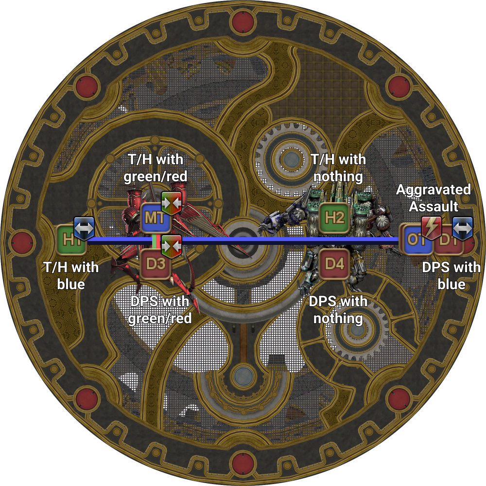

# Alexander Prime

## Summary

If you are already familiar with Alexander Prime, and just need a quick summary:

<table>
  <tr>
    <td><b>Temporal Stasis</b></td>
    <td><ul><li>Red/green tethers west</li><li>No debuffs east</li></ul></td>
  </tr>
  <tr>
    <td><b>Chastening Heat</b></td>
    <td><ul><li>1st: ST invuln</li><li>2nd: MT invuln</li></ul></td>
  </tr>
  <tr>
    <td><b>Inception Formation</b></td>
    <td><ul><li>Flarethrowers:<ul><li>MT south</li><li>ST middle</li></ul></li><li>Tanks + Shared Sentence left</li><li>ST baits Super Jump</li></ul></td>
  </tr>
</table>

We break down the mechanics below.

## Temporal Stasis

<table>
  <tr>
    <td><b>No debuff:</b> Go to the <b>east</b> boss.<ul><li><b>Tanks/Healers</b>: North</li><li><b>DPS:</b> South</li></ul><b>Red/Green tether:</b> Go to the <b>west</b> boss.<ul><li><b>Tanks/Healers:</b> North</li><li><b>DPS:</b> South</li></ul><b>Blue tether:</b><ul><li><b>Tanks/Healers:</b> West</li><li><b>DPS:</b> East</li></ul>
The blue-tethered player on Cruise Chaser's side takes a few steps towards Cruise Chaser.

<b>Aggravated Assault:</b> Far west/east on the same side as Brute Justice.
</td>
	<td></td>
  </tr>
</table>

To summarize:

* ST invulns first Chastening Heat.
* MT baits Flarethrower south, ST baits Flarethrower mid.
* Tanks + Shared Sentence left, everyone else right.
* ST baits Super Jump far-east.
* MT invulns second Chastening Heat.

## Inception Formation

<table>
  <tr>
    <td>
<b>1.</b> Alexander spawns either True North <em>or</em> True South.
<ul><li><b>Green tethers:</b>: Go towards Alexander, opposite your tethered orb. <b>Criss-cross the tethers</b>.</li><li><b>Crystal AoEs:</b>: Make a square formation directly opposite Alexander.</li></ul></td>
	  <td></td>
  </tr>
  <tr>
    <td>
<b>2.</b> Resolve the Crystal AoEs and the green orbs.

Note that the residual AoEs will be slightly <b>larger</b> than their telegraphed size.

The party wipes if any AoEs touch each other.

	  <td></td>
  </tr>
  <tr>
    <td>
<b>3.</b> Brute Justice then casts three consecutive Flarethrowers on the three closest people.
<ul><li><b>MT</b>: Bait a Flarethrower south</li><li><b>ST</b>: Bait a Flarethrower in the middle.</li><li><b>Everyone else</b>: Stay near the intercardinal edge, but not close to Brute Justice.</li></ul></td>
	  <td></td>
  </tr>
  <tr>
    <td>
<b>4.</b> The True Heart will now move to a random spot at the edge of the Arena, where Alexander will spawn and cast Sacrament.

Players will also get various debuffs to resolve.
<ul><li><b>Tanks:</b> Go left</li><li><b>Healers:</b> Go right</li><li><b>DPS:</b><ul><li><b>Shared Sentence:</b> Go left</li><li><b>Others:</b> Go right</li></ul></ul></td>
	  <td></td>
  </tr>
  <tr>
    <td>
<b>5.</b> Brute Justice will respawn West, and Cruise Chaser will respawn in the middle of the arena.
<ul><li><b>ST:</b> Far East.</li><li><b>H1:</b> North, near Cruise Chaser.</li><li><b>H2:</b> South, near Cruise Chaser.</li><li><b>DPS that had the blue tether</b>: West, near Cruise Chaser.</li><li><b>Everyone else:</b> East, between Cruise Chaser and the ST <em>(not too close to Cruise Chaser!)</em></li></ul></td>
	  <td></td>
  </tr>
  <tr>
    <td>
<b>6.</b> Cruise Chaser will then Alpha Sword the three closest players, which should be the two healers, and the DPS that had the blue tether.

When Cruise Chaser cleaves either the north or south player, the rest of the party can run behind that player to avoid the incoming Super Jump.
</td>
	  <td></td>
  </tr>
  <tr>
    <td>
<b>7.</b> Brute Justice Super Jumps on the furthest player, which should be the ST.

The impact AoE is quite large, so it's safe for all other players to run away from the ST by the third Alpha Sword.
</td>
	  <td></td>
  </tr>
</table>

## Wormhole Formation

Wormhole Formation will use 09STOP's method (highlighted by the [Korean simulator](https://drive.google.com/file/d/1sdo02A5GbNPA9B4HN-NOt-vnTPyv2elH/view)).

<table>
  <tr>
    <td>
<b>1.</b> Identify Limit Cut numbers, and stack in the middle of the arena to bait Chakrams.

Identify where Brute Justice is, as this will determine who baits Super Jump and Apocalyptic Ray (and thus have stricter positioning requirements).
</td>
	  <td></td>
  </tr>
  <tr>
    <td>
<b>2.</b> Move to positions.
<ul><li>The person diagonally opposite Brute Justice (3 or 4) should bait Super Jump in front of the red dot.</li><li>The person diagonally opposite Cruise Chaser (3 or 4) should go all the way to the edge to dodge Apocalyptic Ray.</li><li><b>1</b> and <b>2</b> use anti-knockback abilities.</li></ul></td>
	  <td></td>
  </tr>
  <tr>
    <td>
<b>3. </b>Chakrams fly. Brute Justice Super Jumps on the furthest player.

Cruise Chaser cleaves <b>1</b>.
</td>
	  <td></td>
  </tr>
  <tr>
    <td>
<b>4.</b> Brute Justice turns to face the furthest player (<b>1</b> or <b>2</b>) and casts Apocalyptic Ray.

Cruise Chaser dashes <b>2</b>.
<ul><li><b>3</b> and <b>4</b> use anti-knockback.</li><li><b>5</b> and <b>6</b> move inside the Void puddles.</li></ul></td>
	  <td></td>
  </tr>
  <tr>
    <td>
<b>5.</b> Players <b>5</b> and <b>6</b> resolve their Void puddles, then take up positions north (where <b>1</b> and <b>2</b> were).

Cruise Chaser cleaves <b>3</b>.

Alexander starts charging Sacrament. <em>(do not panic!)</em>
</td>
	  <td></td>
  </tr>
  <tr>
    <td>
<b>6.</b> Cruise Chaser dashes <b>4</b>.
<ul><li><b>3</b>, <b>4</b>: Move one notch north to dodge Sacrament.</li><li><b>5</b>, <b>6</b>: Use anti-knockback abilities.</li><li><b>7</b>, <b>8</b>: Move inside Void puddles.</li></ul></td>
	  <td></td>
  </tr>
  <tr>
    <td>
<b>7.</b> Cruise Chaser cleaves <b>5</b>. Sacrament resolves.
<ul><li><b>7</b>, <b>8</b>: Resolve Void puddles.</li></ul></td>
	  <td></td>
  </tr>
  <tr>
    <td>
<b>8.</b> Cruise Chaser dashes <b>6</b>.
<ul><li><b>1</b>, <b>2</b>: Move inside Void puddles.</li><li><b>7</b>, <b>8</b>: Use anti-knockback abilities.</li></ul></td>
	  <td></td>
  </tr>
  <tr>
    <td><b>9.</b> Cruise Chaser cleaves <b>7</b>.</td>
	  <td></td>
  </tr>
  <tr>
    <td><b>10.</b> Cruise Chaser dashes <b>8</b></td>
	  <td></td>
  </tr>
  <tr>
    <td><b>11.</b> Party stacks in the middle for Incinerating Heat (a loose stack to better see Enumeration targets helps).</td>
	  <td></td>
  </tr>
  <tr>
    <td>
<b>12.</b> Resolve Enumeration the same way as Brute Justice + Cruise Chaser.

    <ul><li><b>H1</b>, <b>D3</b>: Always west Enumeration.</li><li><b>H2</b>, <b>D4</b>: Always east Enumeration.</li><li><b>D1</b>: West Enumeration unless a swap is needed.</li><li><b>D2</b>: East Enumeration unless a swap is needed.</li></ul>If either side has both Enumerations (or equivalently, no Enumerations), <b>D1</b> and <b>D2</b> swap sides.</td>
	  <td></td>
  </tr>
</table>
