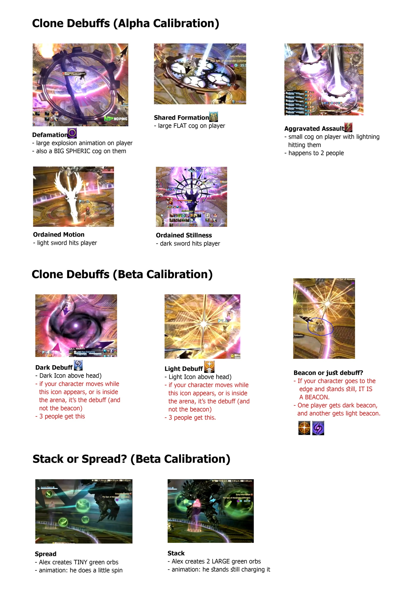

# Perfect Alexander

## Summary

If you are already familiar with Perfect Alexander, and just need a quick summary:

<table>
  <tr>
    <td><b>Forced March</b></td>
    <td><ul><li>East → west</li></ul></td>
  </tr>
  <tr>
    <td><b>Fate Calibration Alpha</b></td>
    <td><ul><li>Shared Sentence left, Aggravated Assault right</li></ul></td>
  </tr>
  <tr>
    <td><b>Ordained Capital Punishment</b></td>
    <td><ul><li>1st: 2x tank share (all buffs)</li><li>2nd: ST invuln</li><li>3rd: MT invuln</li></ul></td>
  </tr>
  <tr>
    <td><b>Exatrines</b></td>
    <td><ul><li>SW, S, SE, E spots <em>(N.B:</em> <b>not</b> <em>center)</em></li></ul></td>
  </tr>
</table>

## Forced March

This is the "tutorial" phase of Perfect Alex, where Ordained Stillness, Ordained Motion, and the Light/Dark mechanics are introduced.

<table>
  <tr>
    <td><b>Forced March:</b><ul><li><b>Light Beacon:</b> West</li><li><b>Dark Beacon:</b> East</li><li><b>Everyone else:</b> Just west of the Dark Beacon</li></ul></td>
	<td></td>
  </tr>
  <tr>
    <td><b>Stacks:</b><ul><li><b>West:</b> H1 > D3 > D1 > MT</li><li><b>East:</b> H2 > D4 > D2 > ST</li></ul><em>(N.B: <b>Not</b> Light vs. Dark stacks.)</em></td>
	<td></td>
  </tr>
</table>

## Fate Calibration Alpha

<table>
  <tr>
    <td><b>Fate Calibration Alpha:</b><ul><li><b>Shared Sentence:</b> Left</li><li><b>Nothing:</b> Left</li><li><b>Aggravated Assault:</b> Right</li></ul></td>
	<td></td>
  </tr>
</table>

After Fate Calibration Alpha, Perfect Alex will cast the first Ordained Capital Punishment, which will be shared between both tanks (ST Provokes to take hate).

## Fate Calibration Beta

It's not entirely obvious, but Fate Calibration Beta should be lightly mitigated prior to the forced march. Note that you will still need to plan mitigations for the upcoming Exatrines.

<table>
  <tr>
    <td><b>Fate Calibration Beta</b></td>
    <td>
ST 90s, H2 (strong) shields*

<em>(Deployed Adlo, or Zoe'd Eukrasian Prognosis)</em>
</td>
  </tr>
</table>

<table>
  <tr>
    <td><b>1. Initial positions</b><ul><li><b>Light Beacon:</b> Slightly west of North (NNW)</li><li><b>Dark Beacon:</b> East</li><li><b>Red/Green tether:</b> Slightly NW of the Dark Beacon</li><li><b>No debuff:</b> Slightly W of the Dark Beacon</li><li><b>Blue tether:</b> Slightly SW of the Dark Beacon</li></ul></td>
	<td></td>
  </tr>
  <tr>
    <td><b>2.</b> Forced March resolves.<ul><li><b>Light players + Dark with red/green:</b> Stack together north</li><li><b>Dark players (except red/green tether):</b> Move to the edge of the arena.</li></ul></td>
	<td></td>
  </tr>
  <tr>
    <td><b>3.</b> Light Shared Sentence and Super Jump resolves.</td>
	<td></td>
  </tr>
  <tr>
    <td>
<b>4.</b>Stack/Spread.

If Stacks:
<ul><li><b>Light players:</b> Stack around mid</li><li><b>Dark players:</b> Stack south</li></ul></td>
	<td></td>
  </tr>
  <tr>
    <td><b>5.</b> Radiant Sacrament resolves.</td>
	<td></td>
  </tr>
</table>

## Exatrines

Almighty Judgment *(also commonly referred to as "Exatrines", after Exaflare from UCoB and Trine from O8S)* are a series of three telegraphed ground AoEs before resolving for real.

The AoE locations are *not* entirely random- they spawn in a random order from the three diagrams shown below. The only positions the party considers are the ones marked in red:

<table>
  <tr>
    <td></td>
    <td></td>
    <td></td>
  </tr>
</table>

Note that there will *always* be an available 3-to-1 dodge.

Each Extrine is immediately followed by Irresistable Grace, an 8-man party stack that must be heavily mitigated. The recommended mitigation plan is:

<table>
  <tr>
    <td><b>Exatrine #1</b></td>
    <td>MT Reprisal, MT 90s, H1 120s, H2 shields, H2 30s, D1, D4</td>
  </tr>
  <tr>
    <td><b>Exatrine #2</b></td>
    <td>ST Reprisal, ST 90s, H2 120s, H2 shields, D2, D3</td>
  </tr>
</table>

## Debuff Effects

The effects from Fate Calibration Alpha and Beta do not come with debuff icons on the player list. All players will need to identify the debuffs based on their visual effects when they resolve.

*(Credit: Unknown)*

## Frequently Asked Questions

<b>[Forced March]</b> Why aren't the two stacks before Fate Calibration Alpha split Light/Dark players just like Fate Calibration Beta?

<table>
  <tr><td>
The two stacks follow different targeting rules.

The stacks in Fate Calibration Beta always target the Light Beacon and the Dark Beacon, which is why players group Light vs. Dark there.

In contrast, the stacks before Fate Calibration Alpha are <b>random</b>, hence the need for a priority order.
</td></tr>
</table>

<b>[Fate Calibration Beta]</b> Why does Fate Calibration Beta need to be mitigated?

<table>
  <tr><td>
This is to hedge against the worst case scenario, where the party has to spread (Individual Reprobation).

The Dark players will bait Super Jump and the Light players have the Shared Sentence stack that will deal damage.

The mitigations are to try and reduce this damage to let everybody survive the incoming spread damage, as there is no guarantee a healer will be nearby.
</td></tr>
</table>

<b>[Exatrines]</b> Why do we use the SW position instead of the center?

<table>
  <tr><td>
You <em>can</em> use the center, and some groups do. However, the center has two problems:<ul><li>Because the party is naturally south of the boss, someone calling out "center" <em>can</em> be misinterpreted as "center of the arena", or "center (from west-to-east)", which is the south position. Removing the center of the arena from play gets around this possibility.</li><li>If you use the center of the arena, there is a chance the party dodges from the center of the arena to the south position. As people's cameras may be facing north at that point (looking towards the boss), the pillar of light from the first set of Exatrines blocks the screen, making it harder to tell where to stop. By using the SW position, the movement now becomes lateral, so the light pillars are less likely to obstruct players' vision.</li></ul>
</td></tr>
</table>

