# Perfect Alexander

## Outline

The MT will take hate to start this phase. The outline to Perfect Alexander looks like this:

<table>
  <tr>
    <td><a href="#forced-march"><b>Forced March</b></a></td>
    <td><ul><li>East → west</li></ul></td>
  </tr>
  <tr>
    <td><a href="#fate-calibration-α"><b>Fate Calibration α</b></a></td>
    <td><ul><li>Shared Sentence left, Aggravated Assault right</li></ul></td>
  </tr>
  <tr>
    <td><b>Ordained Capital Punishment #1</b></td>
    <td><ul><li>2x tank share (all buffs) → tank swap</li></ul></td>
  </tr>
  <tr>
    <td><a href="#fate-calibration-β"><b>Fate Calibration β</b></a></td>
    <td><ul><li>Light Beacon NW</li><li>Party East</li></ul></td>
  </tr>
  <tr>
    <td><b>Ordained Capital Punishment #2</b></td>
    <td><ul><li>ST invuln → tank swap</li></ul></td>
  </tr>
  <tr>
    <td><a href="#exatrines"><b>Exatrine #1</b></a></td>
    <td><ul><li>SW, S, SE, E spots <em>(N.B:</em> <b>not</b> <em>center)</em></li><li>MT Reprisal, MT 90s, H1 120s, H2 shields, H2 30s, D1, D4</li></ul></td>
  </tr>
  <tr>
    <td><b>Ordained Capital Punishment #3</b></td>
    <td><ul><li>MT invuln → tank swap</li></ul></td>
  </tr>
  <tr>
    <td><a href="#exatrines"><b>Exatrine #2</b></a></td>
    <td><ul><li>ST Reprisal, ST 90s, H2 120s, H2 shields, H2 30s, D2, D3</li></ul></td>
  </tr>
  <tr>
    <td><a href="#temporal-prison"><b>Temporal Prison</b></a></td>
    <td><ul><li>H2 > H1 > ST > MT > D3 > D4 > D2 > D1</li></ul></td>
  </tr>
</table>

## Forced March

This is the "tutorial" phase of Perfect Alex, where Ordained Stillness, Ordained Motion, and the Light/Dark mechanics are introduced.

<table>
  <tr>
    <td></td>
    <td><p><b>Final Word: Contact Prohibition</b></p><p>More commonly referred to as just <b>"Light"</b>.</p></td>
  </tr>
  <tr>
    <td></td>
    <td><p><b>Final Word: Contact Regulation</b></p><p>More commonly referred to as the <b>"Light Beacon"</b>.</p></td>
  </tr>
</table>

When the mechanic resolves, all Light players will be forced to move **towards** the Light Beacon. If a Light player touches the Light Beacon, they are killed.

<table>
  <tr>
    <td></td>
    <td><p><b>Final Word: Escape Prohibition</b></p><p>More commonly referred to as just <b>"Dark"</b>.</p></td>
  </tr>
  <tr>
    <td></td>
    <td><p><b>Final Word: Escape Detection</b></p><p>More commonly referred to as the <b>"Dark Beacon"</b>.</p></td>
  </tr>
</table>

When the mechanic resolves, all Dark players will be forced to move **away** the Dark Beacon. If a Dark player moves too far away from the Dark Beacon, they are killed.

<table>
  <tr>
    <td><b>Forced March:</b><ul><li><b>Light Beacon:</b> West</li><li><b>Dark Beacon:</b> East</li><li><b>Everyone else:</b> Just west of the Dark Beacon</li></ul></td>
	<td>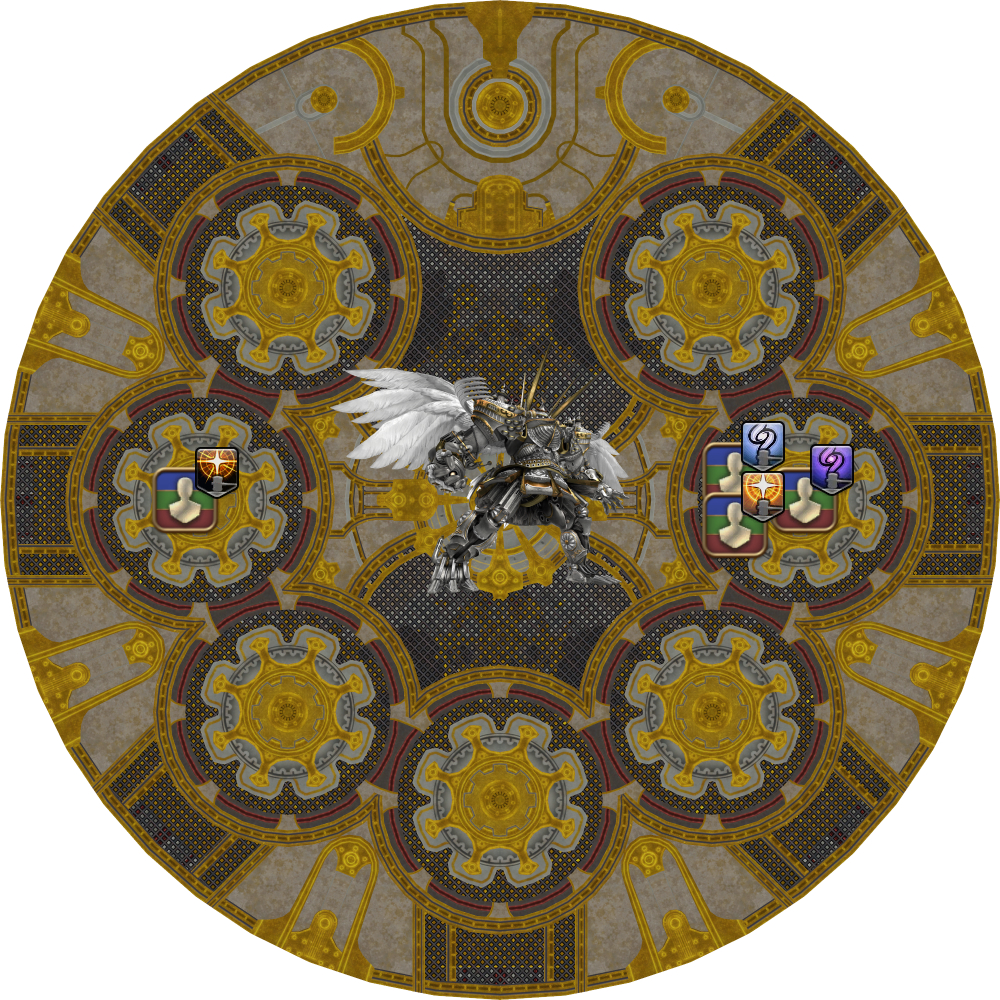</td>
  </tr>
  <tr>
    <td><p><b>Stacks:</b><ul><li><b>West:</b> H1 > D3 > D1 > MT</li><li><b>East:</b> H2 > D4 > D2 > ST</li></ul><em>(N.B: <b>Not</b> Light vs. Dark stacks.)</em></p><p>If a group has two stack markers, only <em>one</em> moves to the other group, and resolve the groups 5-3.</p></td>
	<td>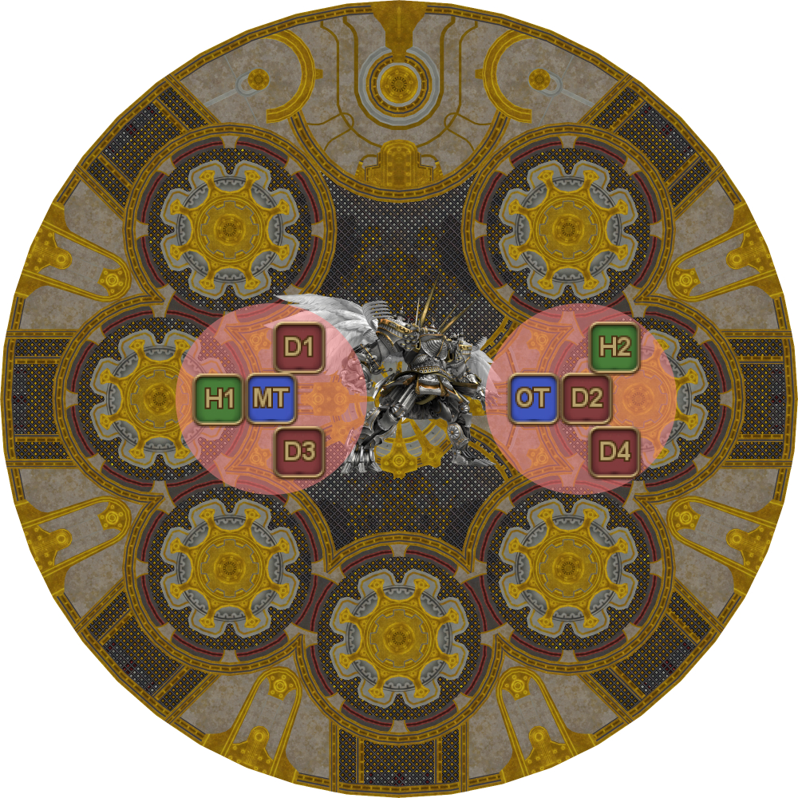</td>
  </tr>
</table>

Dark players need to pay attention to who the Dark Beacon is as they need to stay close to that player (so they don't stray too far), and on the correct side (so they don't get marched into the wall).

## Fate Calibration α

If the party has the Enigma Codex buff from the previous phase, clones will appear next to each player.

* An arrow from your character will point towards your clone.
* An arrow from your clone will point towards you.
* A faint tether will connect you to your clone.

The effects from Fate Calibration α and β <b>do not</b> come with debuff icons on the player list, or castbars.

Instead, the **clones** will telegraph the mechanics that will resolve. **Watch your clones** to see what debuffs they receive.

All players will need to identify the debuffs based on their visual effects when they resolve.

The debuffs will appear in the same order as they resolve:

1. Ordained Stillness/Motion #1
2. Defamation
3. Ordained Stillness/Motion #2 + Shared Sentence + Aggravated Assaults

<table>
  <tr>
    <td>
      <p><b>Ordained Stillness</b></p>
      <p><b>All</b> players in the party must keep still.</p>
      <p><ul><li>Autoattacks count as movement. Tanks and melee should sheathe their weapons to be safe.</li><li>If a player is <b>in the middle</b> of a channeled ability like Meditate or Improvisation, it <b>does not</b> count as movement.</li></ul></p>
      <p>Three players will get this.</p></td>
    <td></td>
  </tr>
  <tr>
    <td><p><b>Ordained Motion</b></p>
    <p><b>All</b> players in the party must be moving.</p>
    <p>
      <ul>
        <li>Casting counts as movement
          <ul>
            <li>The gap between when the cast finishes and the GCD is up does <b>not</b> count as movement.</li>
          </ul>
        </li>
        <li>If a player is <b>in the middle</b> of a channeled ability like Meditate or Improvisation, it <b>does not</b> count as movement.</li>
      </ul>
    </p>
    <p>Three players will get this.</p><p>You can either wiggle your character around, <em>or</em> continually jump up and down to trigger movement.<ul><li><b>Do not</b> wiggle around <em>and</em> jump, <em>especially</em> when near the edge of the arena in Fate Calibration α.</li></ul></p></td>
    <td>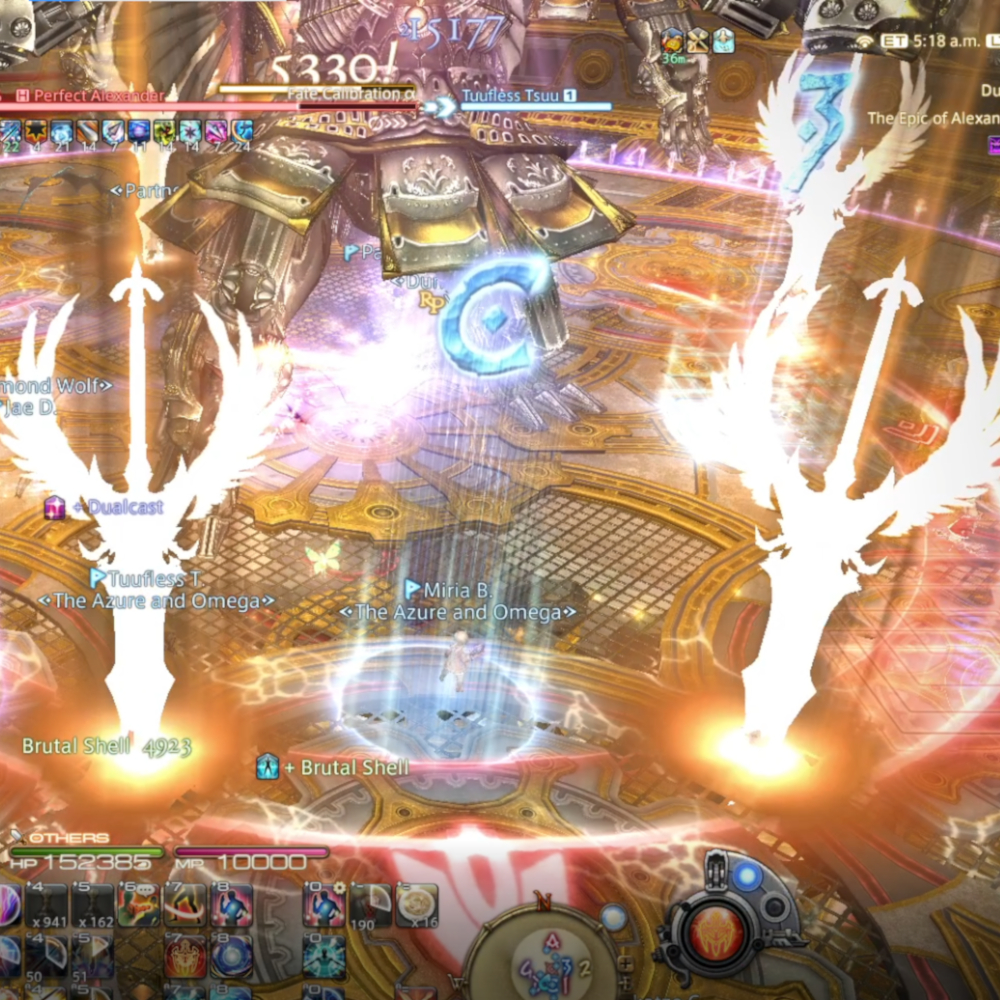</td>
  </tr>
  <tr>
    <td><p><b>Defamation</b></p>
    <p><ul><li><em>Giant</em> AoE centered on the targeted player.</li></ul></p>
    <p>Stand in front of the Alexander clone that <b>does not</b> cast Sacrament (the white laser beams). This will always be one of the two center Alexander clones.</p>
    <p>One player will get this.</p></td>
    <td></td>
  </tr>
  <tr>
    <td><p><b>Shared Sentence</b></p>
    <p><ul><li>Shared damage between the targeted player, and the three players that did not get any debuff.</li></ul></p>
    <p>Stack on the <b>west</b> side with the three players that did not get any debuff.</p>
    <p>One player will get this.</p></td>
    <td>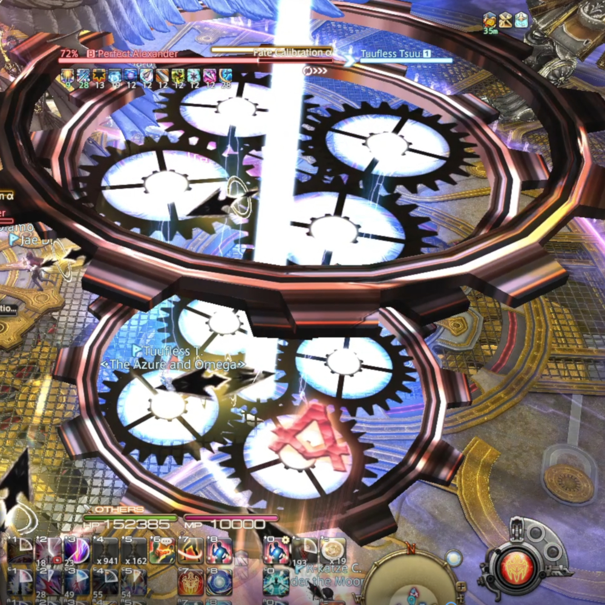</td>
  </tr>
  <tr>
    <td><p><b>Aggravated Assault</b></p>
    <p><ul><li>Single-target damage that applies a magic vulnerability debuff.</li></ul></p>
    <p>Stack together on the <b>east</b> side (away from the Shared Sentence)</p>
    <p>Three players will get this.</p></td>
    <td></td>
  </tr>
</table>

When Fate Calibration α finishes its cast, Perfect Alexander will disappear and the mechanics that were telegraphed earlier by the clones will now resolve for real.

The safe spots to resolve the mechanics will always be opposite one of the two *middle* Perfect Alexander clones.

<table>
  <tr>
    <td><b>Fate Calibration α:</b><ul><li><b>Shared Sentence:</b> Left</li><li><b>Nothing:</b> Left</li><li><b>Aggravated Assault:</b> Right</li></ul></td>
	<td>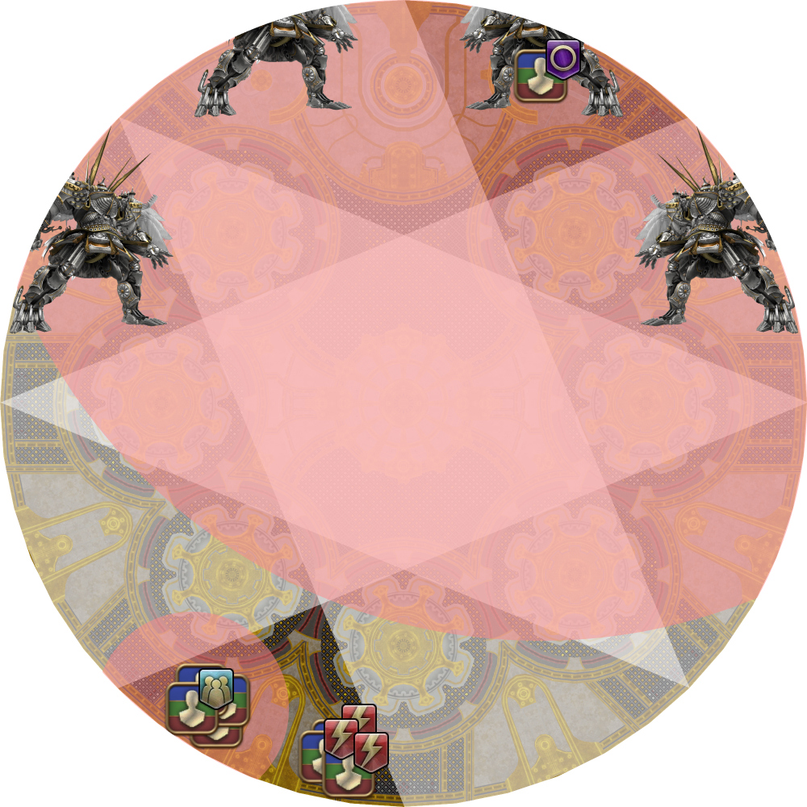</td>
  </tr>
</table>

After Fate Calibration α, Perfect Alex will cast the first Ordained Capital Punishment, which will be shared between both tanks (ST Provokes to take hate).

<table>
  <tr>
    <td><b>Ordained Capital Punishment #1</b></td>
    <td><p>MT + ST full buffs.</p><p>Tank swap from MT to ST.</p></td>
  </tr>
</table>

## Fate Calibration β

Just like Fate Calibration α, clones will appear next to each player that will telegraph the upcoming mechanics.

All players will need to identify the debuffs based on their visual effects when they resolve.

The debuffs will appear in the same order as they resolve:

1. Light/Dark + tethers
2. Shared Sentence + Super Jumps
3. Collective/Individual Reprobation (stack/spread)
4. Radiant Sacrament

<table>
  <tr>
    <td><p><b>Light</b></p>
    <p>Four players will be light, that can be further broken down.</p>
    <p>Light players just need to determine whether they are the Beacon or not.</p>
    <p><ul>
      <li>The player whose clone <b>does not move</b> is the Light Beacon.</li>
      <li>The Light Beacon stands a little bit West from <b>North</b>, away from the party.</li>
      <li>All other Light players join the party East.</li>
    </ul></p></td>
    <td></td>
  </tr>
  <tr>
    <td><p><b>Dark</b></p>
    <p>Four players will be dark, that can be further broken down.</p>
    <p>All four Dark players have different responsibilities, so they need to pay attention to their tethers.</p>
    <p><ul>
      <li>The player whose clone <b>does not move</b> is the Dark Beacon.</li>
      <li>The Dark Beacon stands <b>on</b> the East marker.</li>
      <li>All other Dark players position themselves relative to the Dark Beacon.</li>
    </ul></p></td>
    <td>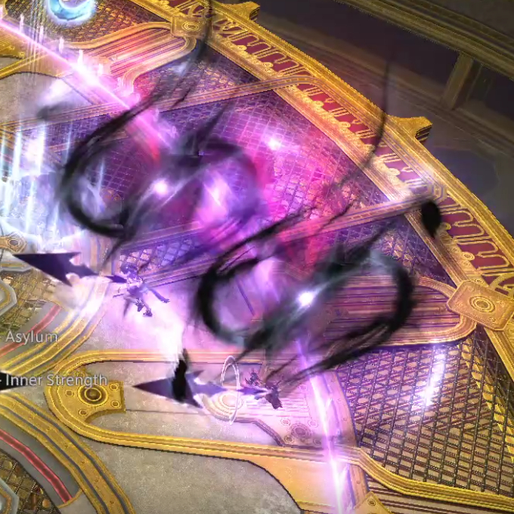</td>
  </tr>
</table>

It's not entirely obvious, but Fate Calibration β should be lightly mitigated prior to the forced march. Note that you will still need to plan mitigations for the upcoming Exatrines.

<table>
  <tr>
    <td><b>Fate Calibration β</b></td>
    <td><p>ST 90s, H2 (strong) shields*</p><p><em>(Deployed Adloquium, or Zoe'd Eukrasian Prognosis)</em></p></td>
  </tr>
</table>

Once again, Perfect Alexander will disappear when Fate Calibration β finishes its cast. The mechanics that were telegraphed earlier by the clones will now resolve for real.

<table>
  <tr>
    <td><b>1. Initial positions</b><ul><li><b>Light Beacon:</b> Slightly west of North (NNW)</li><li><b>Dark Beacon:</b> East</li><li><b>Red/Green tether:</b> Slightly NW of the Dark Beacon</li><li><b>No debuff:</b> Slightly W of the Dark Beacon</li><li><b>Blue tether:</b> Slightly SW of the Dark Beacon</li></ul></td>
	<td>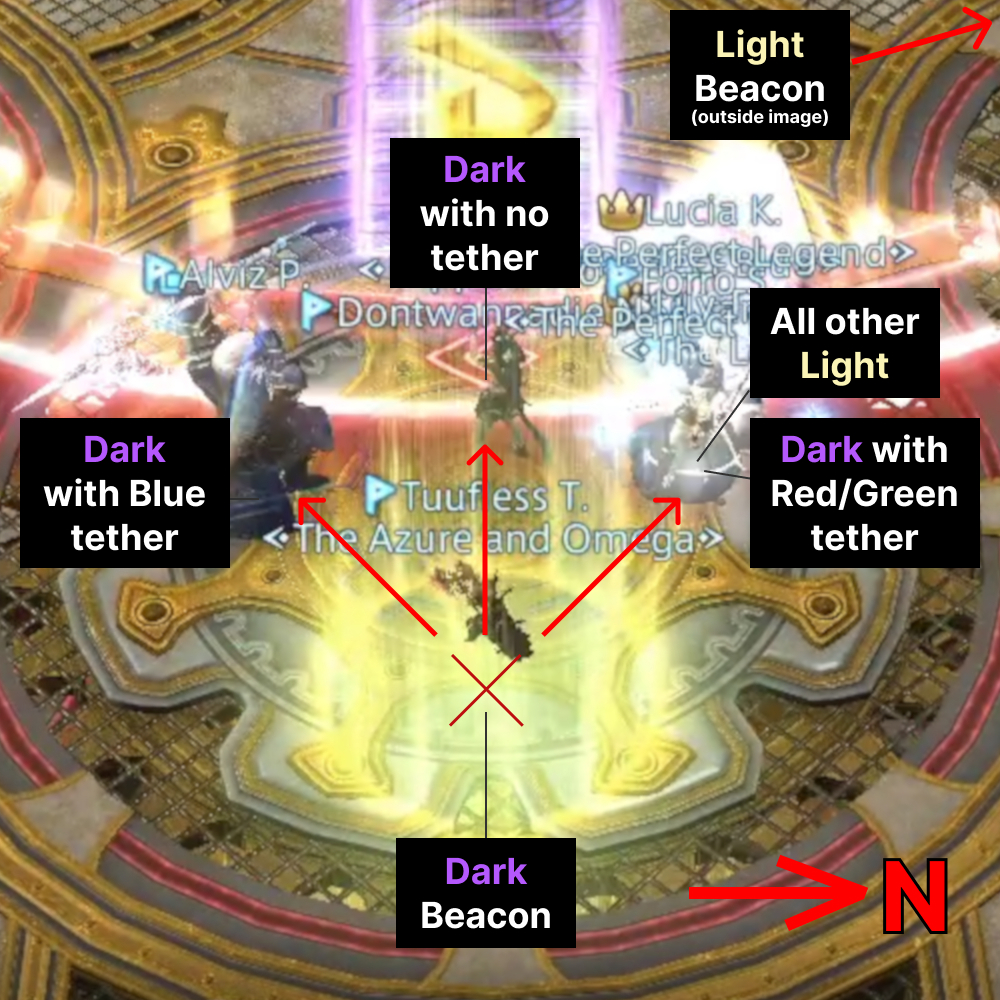</td>
  </tr>
  <tr>
    <td><b>2.</b> Forced March resolves.<ul><li><b>Light players + Dark with red/green:</b> Stack together north</li><li><b>Dark players (except red/green tether):</b> Move to the edge of the arena.</li></ul></td>
	<td></td>
  </tr>
  <tr>
    <td><b>3.</b> Light Shared Sentence and Super Jump resolves.</td>
	<td></td>
  </tr>
  <tr>
    <td><p><b>4.</b>Stack/Spread.</p><p>If Stacks:</p><ul><li><b>Light players:</b> Stack around mid</li><li><b>Dark players:</b> Stack south</li></ul></td>
	<td>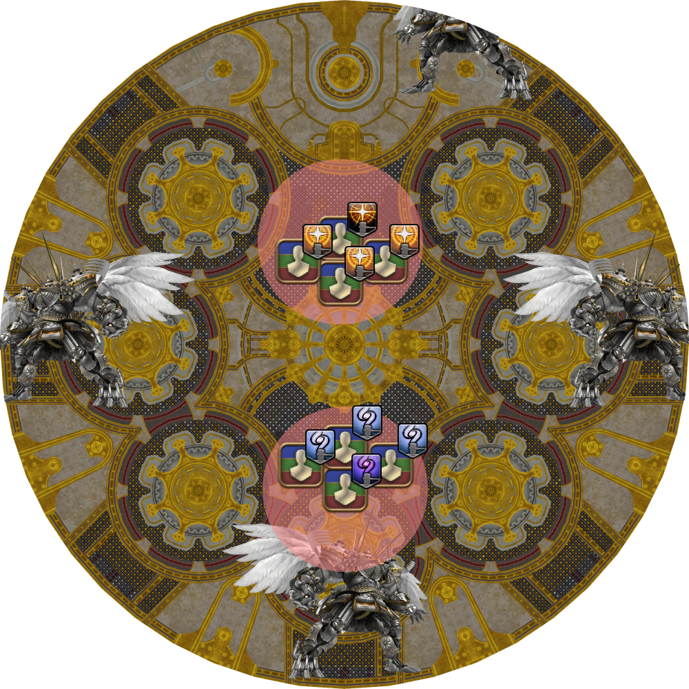</td>
  </tr>
  <tr>
    <td><b>5.</b> Radiant Sacrament resolves.</td>
	<td></td>
  </tr>
</table>

After Fate Calibration β, Perfect Alexander will cast the second Ordained Capitol Punishment (tankbuster).

<table>
  <tr>
    <td><b>Ordained Capital Punishment #2</b></td>
    <td><p>ST invuln (solo).</p><p>Tank swap from ST to MT.</p></td>
  </tr>
</table>

## Exatrines

Almighty Judgment *(also commonly referred to as "Exatrines", after Exaflare from UCoB and Trine from O8S)* are a series of three telegraphed ground AoEs before resolving for real.

The AoE locations are *not* entirely random- they spawn in a random order from the three diagrams shown below. The *only* positions the party will consider are the ones marked in red:

<table>
  <tr>
    <td>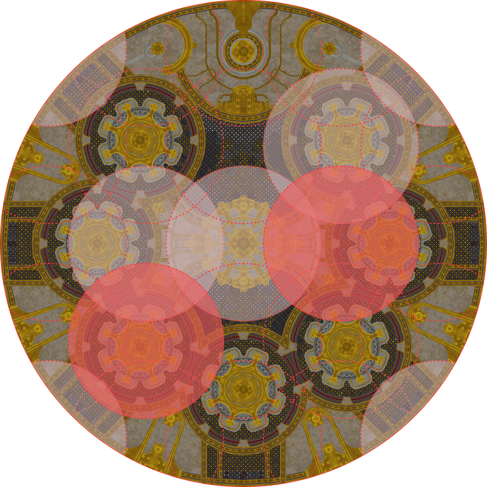</td>
    <td>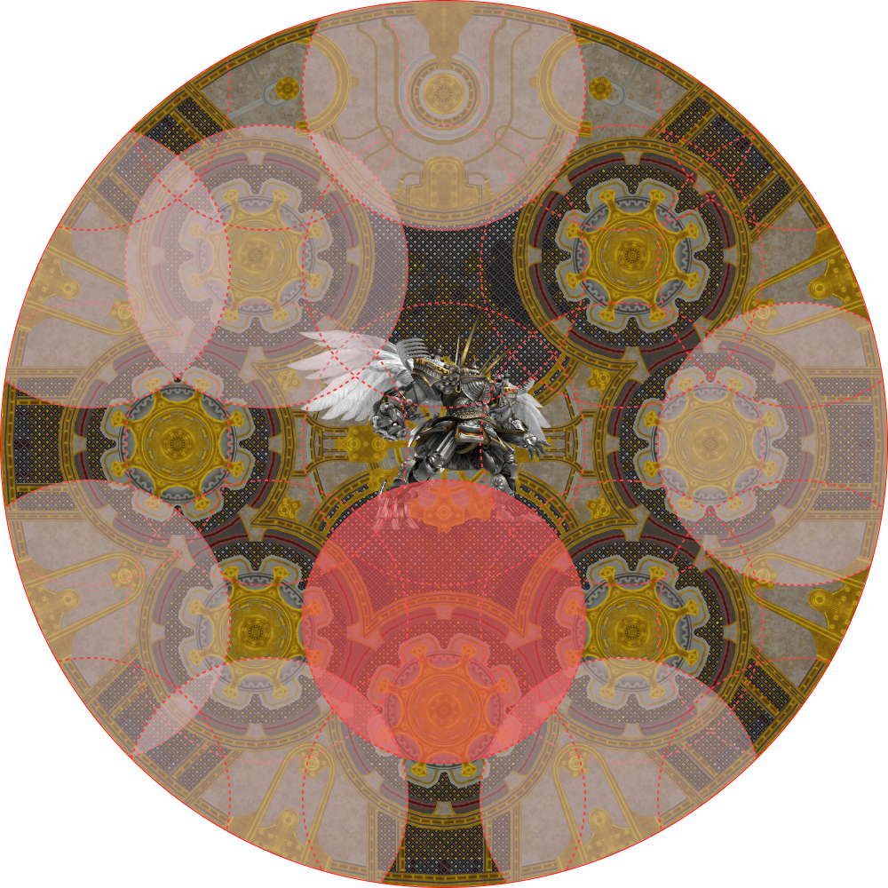</td>
    <td>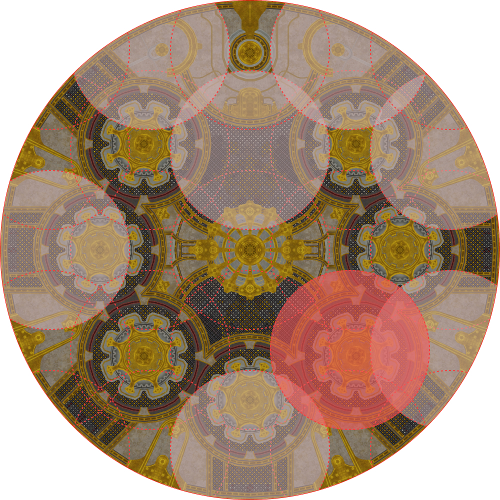</td>
  </tr>
</table>

Note that there will *always* be an available 3-to-1 dodge.

1. Look at the first set of telegraphs. This is where you will *end*.
2. Look at the second set of telegraphs that are adjacent to your ending point. You will start at the *remaining* adjacent position.
3. Look at the third (remaining) set of telegraphs that are adjacent to your ending point. This is where you will *start*.

Each Exatrine is immediately followed by Irresistable Grace, an 8-man party stack that must be heavily mitigated. The recommended mitigation plan is:

<table>
  <tr>
    <td><b>Exatrine #1</b></td>
    <td>MT Reprisal, MT 90s, H1 120s, H2 shields, H2 30s, D1, D4</td>
  </tr>
  <tr>
    <td><b>Exatrine #2</b></td>
    <td>ST Reprisal, ST 90s, H2 120s, H2 shields, H2 30s, D2, D3</td>
  </tr>
</table>

There will also be one last tankbuster after the first Exatrine.

<table>
  <tr>
    <td><b>Ordained Capital Punishment #3</b></td>
    <td><p>MT invuln (solo).</p><p>Tank swap from MT to ST.</p></td>
  </tr>
</table>

## Temporal Prison

After the second Irresistable Grace, Perfect Alexander will then proceed to cast Temporal Prison, the hard enrage for this fight.

Seven towers/jails appear and resolve, starting from the NE and going clockwise around Perfect Alexander.

The jails are resolved with the lowest DPS players going first.
```
H2 > H1 > ST > MT > D3 > D4 > D2 > D1
```
Note that DoTs will continue to tick even after the player has been imprisoned.

## Frequently Asked Questions

<details markdown=block>
<summary><b>[Forced March]</b> Why is the forced march east-to-west, instead of south-to-north? Don't melee get positionals?</summary>
<table>
  <tr><td><p>This is done to keep the Dark Beacon's position consistent with Fate Calibration β.</p><p>If you <em>really</em> want positionals, you can always have the MT tank Perfect Alexander facing West, although that's rather janky.</p></td></tr>
</table>
</details>
<details markdown=block>
<summary><b>[Forced March]</b> Why aren't the two stacks before Fate Calibration α split Light/Dark players just like Fate Calibration β?</summary>
<table>
  <tr><td><p>The two stacks follow different targeting rules.</p><p>The stacks in Fate Calibration β always target the Light Beacon and the Dark Beacon, which is why players group Light vs. Dark there.</p><p>In contrast, the stacks before Fate Calibration α are <b>random</b>, hence the need for a priority order.</p></td></tr>
</table>
</details>
<details markdown=block>
<summary><b>[Collective Reprobation (stacks)]</b> Why did the party wipe? What is "Faithlessness"?</summary>
<table>
  <tr><td><p>The stacks have an anti-cheese mechanic built into them, and cannot be taken solo.</p><p>When a stack is solo'ed (even with invuln), raid-wide damage called "Faithlessness" is triggered, which wipes the raid.</p></td></tr>
</table>
</details>
<details markdown=block>
<summary><b>[Fate Calibration β]</b> Why does Fate Calibration β need to be mitigated?</summary>
<table>
  <tr><td><p>This is to hedge against the worst case scenario, where the party has to spread (Individual Reprobation).</p><p>The Dark players will bait Super Jump and the Light players have the Shared Sentence stack that will deal damage.</p><p>The mitigations are to try and reduce this damage to let everybody survive the incoming spread damage, as there is no guarantee a healer will be nearby.</p></td></tr>
</table>
</details>
<details markdown=block>
<summary><b>[Exatrines]</b> Why do we use the SW position instead of the center?</summary>
<table>
  <tr><td><p>You <em>can</em> use the center, and some groups do. However, the center has two problems:<ul><li>Because the party is naturally south of the boss, someone calling out "center" <em>can</em> be misinterpreted as "center of the arena", or "center (from west-to-east)", which is the south position. Removing the center of the arena from play gets around this possibility.</li><li>If you use the center of the arena, there is a chance the party dodges from the center of the arena to the south position. As people's cameras may be facing north at that point (looking towards the boss), the pillar of light from the first set of Exatrines blocks the screen, making it harder to tell where to stop. By using the SW position, the movement now becomes lateral, so the light pillars are less likely to obstruct players' vision.</li></ul></p></td></tr>
</table>
</details>
<details markdown=block>
<summary><b>[Perfect Alexander]</b> Is Perfect Alexander really impossible without the Enigma Codex? Didn't <a href="https://youtu.be/VG2M2bozu2M">a Chinese group clear without it?</a></summary>
<table>
  <tr><td>
  <p>That group super-shielded Divine Judgment to the point where they didn't need to Tank LB3, which let them cheese Fate Calibration α with a Healer LB3 instead.</p>
  <p>More importantly, the group abused two exploits to clear Fate Calibration β without the codex:
    <ol>
      <li>There was a priority to how tethers are assigned; if, at a certain point in time, there are only 7 players around, the blue tether would simply not be assigned.</li>
      <li>If a player jumps and is mid-air when the forced march from the Light/Dark beacons start, the forced movement time would continue to tick, but the player would not be able to move while they are mid-air, thus shortening the distance travelled from 20 yalms to 17 yalms.</li>
    </ol>
  </p>
  <p>Without knowing who the Beacons are, they had their PLD suicide at a specific time, placed a group in the center of the arena, and spread other players around the outer edge.
    <ul>
      <li>
        <p>The first exploit where the blue tether doesn't get assigned when only 7 people are alive at a specific time let the group nullify the blue tether.</p>
      </li>
      <li><p>Under normal circumstances, the Light players would run into the Light Beacon, and the Dark players would be repelled away from the Dark Beacon and out of the arena.</p><p>However, because the march distance is shortened by jumping, they were able to survive.</p>
      </li>
    </ul>
  </p>
  <p><a href="https://na.finalfantasyxiv.com/lodestone/topics/detail/c73cd284013587066d8f9e697fab1db9f007372c/">Patch 6.1</a> fixed this by adding a delay from when players lose control of their character, to when the forced march starts. Now, if you try to jump, this delay will cause the forced march to begin only after your character lands, and you will march the full distance out of the arena.</p></td></tr>
</table>
</details>