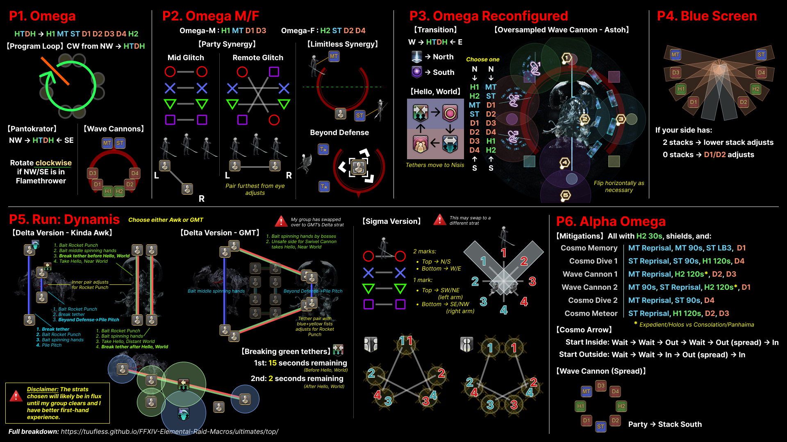
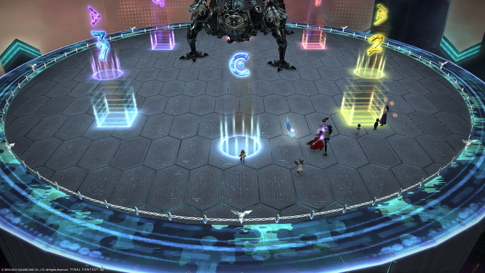

# The Omega Protocol (Ultimate)

The PF strat is starting to settle.

### BiS Notes

- Use your i630 BiS.

Looking towards the future:

- The Omega Protocol will not be outgeared until **i760** gear is available.
- Relic weapons (when they arrive) will have their substats capped at **287**.


*(Shortened link: [https://cutt.ly/EleDC_TOP_summary](images/top_cheatsheet.jpg))*

## Markers


<details markdown=block>
<summary>XIVLauncher WaymarkPresetPlugin positions</summary>

```json
{
  "Name":"TOP",
  "MapID":908,
  "A":{"X":100.0,"Y":0.0,"Z":87.0,"ID":0,"Active":true},
  "B":{"X":113.0,"Y":0.0,"Z":100.0,"ID":1,"Active":true},
  "C":{"X":100.0,"Y":0.0,"Z":113.0,"ID":2,"Active":true},
  "D":{"X":87.0,"Y":0.0,"Z":100.0,"ID":3,"Active":true},
  "One":{"X":109.192,"Y":0.0,"Z":90.808,"ID":4,"Active":true},
  "Two":{"X":109.192,"Y":0.0,"Z":109.192,"ID":5,"Active":true},
  "Three":{"X":90.808,"Y":0.0,"Z":109.192,"ID":6,"Active":true},
  "Four":{"X":90.808,"Y":0.0,"Z":90.808,"ID":7,"Active":true}
}
```

</details>

## English
```

```

## Frequently Asked Questions

<details markdown=block>
<summary><b>[Damage Down]</b> How strong is the damage down debuff in this fight?</summary>
<table>
  <tr><td><p>The Damage Down debuff in this phase lowers a player's damage by <b>90%</b>.</p>
  <p><em>(Yes, this is </em>worse<em> than double-weakness!)</em></p></td></tr>
</table>
</details>