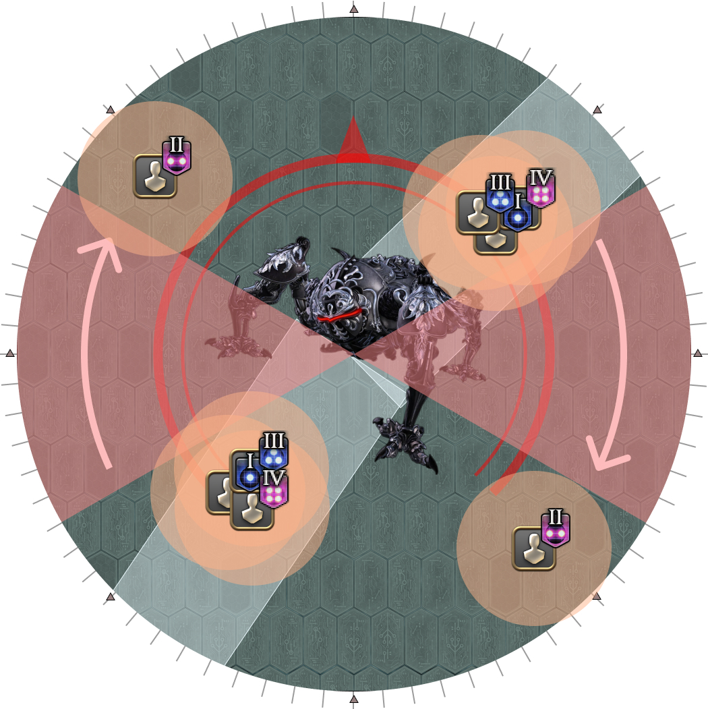

# Omega

<div style="background-color: #200 ; padding: 10px; border: 1px solid;">
<b>The following strats have not been decided, and will likely change.</b>
</div>

## Program Loop

<div style="background-color: #200 ; padding: 10px; border: 1px solid;">
<b>UNDER CONSTRUCTION!</b>
</div>

To summarize:

- **Towers** are resolved in the order of the numbered debuffs (1 > 2 > 3 > 4)
- **Tethers** are resolved two steps away from the towers (3 > 4 > 1 > 2)

<table>
  <tr>
    <td><p>There are eight possible tower spawn points.</p><p>Two towers will always spawn at a time, and they will always be either 90 degrees, or 180 degrees from one another.</p><p>Towers will not spawn in the same position twice in a row.</p></td>
    <td></td>
  </tr>
</table>

A priority to determine who takes which tower/tether might look something like this:
```
CW from NW (11 o'clock):
  MT > ST > H1 > D1 > D2 > D3 > D4 > H2
```
<div style="background-color: #002 ; padding: 10px; border: 1px solid;">
<b>In PF:</b><ul>
  <li>Check the priority order. There are multiple variants at the moment.</li>
</ul>
</div>

<table>
  <tr>
    <td><p><b>1.</b> First set of towers spawn</p><ul><li><b>3s:</b> Stand in front of the group to take tethers.</li><li><b>Everyone else:</b> Stack together to make the tethers easy to get.</li></ul></td>
    <td></td>
  </tr>
  <tr>
    <td><p><b>1.</b> First set of towers/tethers</p><ul><li><b>1s:</b> Take your towers.</li><li><b>3s:</b> Take your tethers.</li></ul></td>
    <td></td>
  </tr>
  <tr>
    <td><p><b>2.</b> Second set of towers/tethers</p><ul><li><b>2s:</b> Take your towers.</li><li><b>4s:</b> Take your tethers.</li></ul></td>
    <td></td>
  </tr>
  <tr>
    <td><p><b>3.</b> Third set of towers/tethers</p><ul><li><b>3s:</b> Take your towers.</li><li><b>1s:</b> Take your tethers.</li></ul><p>The max-HP down debuff will wear off on the number 3 players shortly after the previous set of towers. They will need to be healed up to take their towers.</p></td>
    <td></td>
  </tr>
  <tr>
    <td><p><b>4.</b> Fourth set of towers/tethers</p><ul><li><b>4s:</b> Take your towers.</li><li><b>2s:</b> Take your tethers.</li></ul><p>The max-HP down debuff will wear off on the number 4 players shortly after the previous set of towers. They will need to be healed up to take their towers.</p></td>
    <td></td>
  </tr>
</table>

## Pantokrator

Once again, the party will be given random pairs of numbers, from 1-4.

<table>
  <tr>
    <td><p>We need to split the party into two groups of four such that:</p>
    <ul><li>Each group has one of each number.</li><li>Each group has one healer.</li></ul></td>
    <td></td>
  </tr>
</table>

To do this, we use the following priority:
```
NW: MT > ST > H1 > D1 > D2 > D3 > D4 > H2: SE
```

We start by tanking Omega facing **45-degrees from these two positions**. If the first set of Flamethrowers is on the party, rotate **clockwise** to the next safe sector.

<table>
  <tr>
    <td></td>
    <td></td>
    <td></td>
    <td></td>
  </tr>
</table>

We decided to take the stacks **in front** for now.

<div style="background-color: #002 ; padding: 10px; border: 1px solid;">
<b>In PF:</b><ul>
  <li>
    <p>Check how the party is being split into the two groups.</p>
    <ul>
      <li><p>Some adjust the groups based on roles:</p>
        <ul><li>H1 > MT > D3 > D1 > D2 > D4 > ST > H2</li></ul>
      </li>
      <li><p>Some risk not having a healer on each side.</p>
        <ul><li>MT > ST > H1 > H2 > D1 > D2 > D3 > D4</li></ul>
      </li>
    </ul>
  </li>
  <li>
    <p>Check how the party assigns safe sectors if the Flamethrowers point at the party.</p>
    <ul>
      <li>Some will have each group rotate clockwise to the safe sector</li><li>Some will have each group go to the nearest safe sector.</li>
    </ul>
  </li>
  <li>
    <p>Check where the party will resolve the Wave Cannon stacks.</p>
    <ul>
      <li>Some will have the stack at the front of the sector.</li>
      <li>Some will have the stack at the back of the sector.</li>
    </ul>
  </li>
</ul>
</div>

### Condensed Waves and Guided Missiles

<table>
  <tr>
    <td><p><b>6.</b> Numbers appear and the first set of flame telegraphs appear.</p><p>Split the party into the two groups, and move to the safe sectors.</p></td>
    <td></td>
  </tr>
  <tr>
    <td><p><b>7.</b> The flame telegraphs start rotating.</p><p>The players numbered 1 move to the back of the sector (in front of the rear AoE), while the other players group at the front of the sector (behind the front AoE).</p></td>
    <td></td>
  </tr>
  <tr>
    <td><p><b>8.</b> Third set of flame telegraphs.</p></td>
    <td></td>
  </tr>
  <tr>
    <td><p><b>9.</b> First set of baited AoEs.</p></td>
    <td></td>
  </tr>
  <tr>
    <td><p><b>10.</b> Second set of baited AoEs.</p><p>The first set of debuffs expire.</p><ul><li>The player with the Guided Missile Kyrios debuff takes their AoE at the back of the sector.</li><li>The other three players share a Condensed Wave Cannon Kyrios beam at the front.</li></ul></td>
    <td></td>
  </tr>
  <tr>
    <td><p><b>11.</b> Third set of baited AoEs.</p><ul><li>The next player to bait the Guided Missile Kyrios moves backwards along the <b>outside</b> of the arena.</li><li>The player that just finished their missile catches up to the party by using the <b>inside</b> of the arena.</li></ul></td>
    <td></td>
  </tr>
  <tr>
    <td><p><b>12.</b> Fourth set of baited AoEs.</p></td>
    <td></td>
  </tr>
  <tr>
    <td><p><b>13.</b> Fifth set of baited AoEs.</p><p>The second set of debuffs expire.</p><ul><li>The player with the Guided Missile Kyrios debuff takes their AoE at the back of the sector.</li><li>The other three players share a Condensed Wave Cannon Kyrios beam at the front.</li></ul></td>
    <td></td>
  </tr>
</table>

This loop repeats until all four players have resolved their Condensed Wave Cannon Kyrios and Guided Missile Kyrios debuffs.

### Diffuse Wave Cannons

<div style="background-color: #200 ; padding: 10px; border: 1px solid;">
<b>UNDER CONSTRUCTION!</b>
</div>

## Frequently Asked Questions

<details markdown=block>
<summary><b>[Pantokrator]</b> Why do you tank the boss 45 degrees from the two stack points before Pantokrator starts?</summary>
<table>
  <tr><td><p>The set of Flamethrowers are <em>not</em> based on true North, but are instead based on Omega's orientation.</p><p>The problem with facing Omega at the party is that the Flamethrowers are 60-degree cones that move in multiples of 30 degrees.</p><p>This means that you can have a scenario like the following, where it's now ambiguous whether the N/S parties count as getting hit.</p><p>This is especially problematic when the agreed movement is "always rotate clockwise to the safe sector", which is clearly not ideal in this scenario.</p><p>By pointing Omega at a 45 degree angle from the two assigned points, you guarantee that Omega will <em>never</em> point directly at the party, removing said ambiguity.</p></td>
  <td></td></tr>
</table>
</details>
<details markdown=block>
<summary><b>[Pantokrator]</b> Stack in front or the back?</summary>
<table>
  <tr><td><p>I'm currently undecided on which, as each have their pros and cons and this might just come down to personal preference.</p><p>Stacking at the front means that a player who is late to realise they are next in line to bait the missile AoE can easily split away from the group, which is much harder if the stack is at the back. The player rejoining the group will also have an easier time going into the hitbox to take the stack when it's their turn to catch up.</p><p>However, stacking at the back means you can bait almost all puddles on top of the Flamethrower telegraphs, and you have time to wait at the beginning for the Flamethrowers to catch up before moving.</p></td></tr>
</table>
</details>