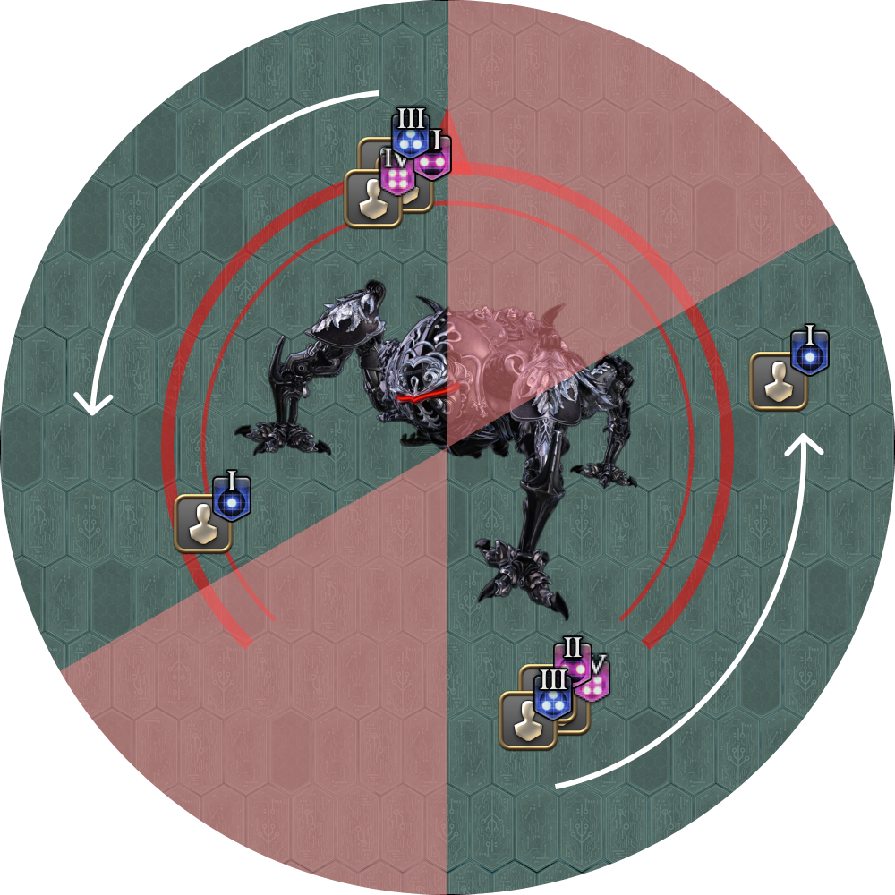

# Omega

<b>The following strats have not been decided, and will likely change.</b>

## Program Loop

<b>UNDER CONSTRUCTION!</b>

## Pantokrator

The following is an adaptation of HaruGlory's (OneAce's) Pantokrator strat.

In particular, they resolve the Condensed Wave Cannon Kyrios (group stack) at the back of the sector, and Guided Missile Kyrios (solo AoE) at the front of the sector.

### Condensed Waves and Guided Missiles

<table>
  <tr>
    <td>
<b>1.</b> Numbers appear and the first set of flame telegraphs appear.

We want to split the party into two groups such that:
<ul><li>Each group comprises of a 1, 2, 3, and 4-numbered player.</li><li>Each group contains one healer.</li></ul>
<b>@TODO:</b> What's the scheme?
</td>
    <td></td>
  </tr>
  <tr>
    <td>
<b>2.</b> The flame telegraphs start rotating.

The players numbered 1 move to the front of the sector (behind the front AoE), while the other players group at the back of the sector (in front of the rear AoE).
</td>
    <td></td>
  </tr>
  <tr>
    <td>
<b>3.</b> Third set of flame telegraphs.
</td>
    <td></td>
  </tr>
  <tr>
    <td>
<b>4.</b> First set of baited AoEs.
</td>
    <td></td>
  </tr>
  <tr>
    <td>
<b>5.</b> Second set of baited AoEs.

The first set of debuffs expire.
<ul><li>The player with the Guided Missile Kyrios debuff takes their AoE at the front of the sector.</li><li>The other three players share a Condensed Wave Cannon Kyrios beam at the back.</li></ul></td>
    <td></td>
  </tr>
  <tr>
    <td>
<b>6.</b> Third set of baited AoEs.
<ul><li>The player who just resolved the Guided Missile Kyrios moves backwards along the <b>outside</b> of the arena.</li><li>The next player in line to bait their Guided Missile Kyrios moves ahead of the group along the <b>inside</b> of the arena.</li></ul></td>
    <td></td>
  </tr>
  <tr>
    <td>
<b>7.</b> Fourth set of baited AoEs.
</td>
    <td></td>
  </tr>
  <tr>
    <td>
<b>8.</b> Fifth set of baited AoEs.

The second set of debuffs expire.
<ul><li>The player with the Guided Missile Kyrios debuff takes their AoE at the front of the sector.</li><li>The other three players share a Condensed Wave Cannon Kyrios beam at the back.</li></ul></td>
    <td></td>
  </tr>
</table>

This loop repeats until all four players have resolved their Condensed Wave Cannon Kyrios and Guided Missile Kyrios debuffs.

### Diffuse Wave Cannons

<b>UNDER CONSTRUCTION!</b>

