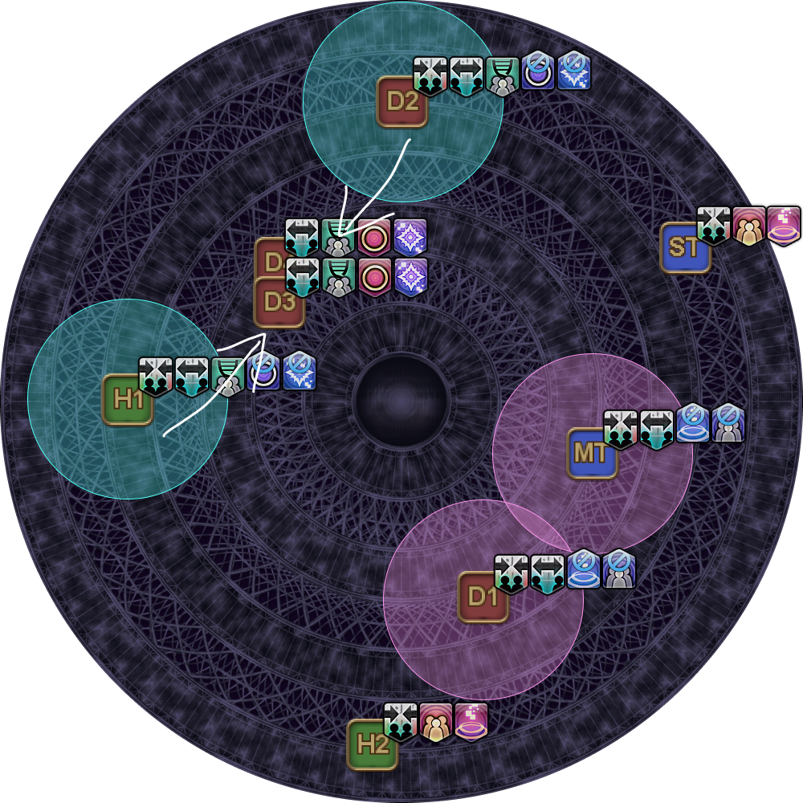

# Omega Reconfigured

<b>UNDER CONSTRUCTION!</b>

## Hello, World

Some things to note:

- Tethers and towers are mutually exclusive.
- Once the debuffs go out, which coloured tower goes with Defamation will be fixed for the entire sequence.
- Green/red tethers will always go with Defamation.
- Blue tethers will always go with the non-Defamation towers.

### Debuffs appear

<table>
  <tr>
    <td>
<b>1.</b> When Omega casts Hello, World, players get their debuffs.
<ul><li><b>Check which coloured-debuffs go with Defamations.</b></li></ul>
<em>In this example:</em>
<ul><li><em>Defamations (and thus red/green tethers) will go with blue towers.</em></li><li><em>Critical Synchronization (and blue tethers) will go with red towers.</em></li></ul></td>
    <td></td>
  </tr>
</table>

### First iteration

<table>
  <tr>
    <td>
<b>2.</b> Pair up and move to your towers.
<ul><li>Critical Overflow and red/green tethered players pair up and move to their towers <em>(blue in this example).</em></li><li>Critical Synchronization and blue tethered players pair up and move to their towers <em>(red in this example)</em></li></ul>
Note the red/green tethered players are on the outside of their coloured towers, while the blue tethered players are between their coloured towers.
</td>
    <td></td>
  </tr>
  <tr>
    <td>
<b>3.</b> The first set of tethers manifest.

Towers, Critical Overflow Bugs, and Critical Synchronization Bugs resolve.
<ul><li>Critical Overflow Bugs transfer to the red/green tethered players.</li><li>Critical Synchronisations transfer to the blue tethered players.</li></ul></td>
    <td></td>
  </tr>
  <tr>
    <td>
<b>4.</b> Pass Critical Underflow and Critical Performance Bugs.

Blue-tethered players also break their tether in the process.
</td>
    <td></td>
  </tr>
  <tr>
    <td>
<b>5.</b> Red/green tethered players move together to break their tether.

Avoid the Nisi explosions.
</td>
    <td></td>
  </tr>
</table>

### Second iteration

All players rotate their roles for the second iteration.

Red/green tethers are now Defamation.
Defamations are now taking towers.

<table>
  <tr>
    <td>
<b>6.</b> Pair up and move to your towers.
<ul><li>Critical Overflow and red/green tethered players pair up and move to their towers.</li><li>Critical Synchronization and blue tethered players pair up and move to their towers.</li></ul></td>
    <td></td>
  </tr>
  <tr>
    <td>
<b>7.</b> The next set of tethers manifest.

Towers, Critical Overflow Bugs, and Critical Synchronization Bugs resolve.
</td>
    <td></td>
  </tr>
  <tr>
    <td>
<b>8.</b> Pass Critical Underflow and Critical Performance Bugs.

Blue-tethered players also break their tether in the process.
</td>
    <td></td>
  </tr>
  <tr>
    <td>
<b>9.</b> Red/green tethered players move together to break their tether.

Avoid the Nisi explosions.
</td>
    <td></td>
  </tr>
</table>

### Third iteration

All players rotate their roles again for the third iteration.

<table>
  <tr>
    <td>
<b>10.</b> Pair up and move to your towers.
<ul><li>Critical Overflow and red/green tethered players pair up and move to their towers.</li><li>Critical Synchronization and blue tethered players pair up and move to their towers.</li></ul></td>
    <td></td>
  </tr>
  <tr>
    <td>
<b>11.</b> The third set of tethers manifest.

Latent Defect, Towers, Critical Overflow Bugs, and Critical Synchronization Bugs resolve.
</td>
    <td></td>
  </tr>
  <tr>
    <td>
<b>12.</b> Pass Critical Underflow and Critical Performance Bugs.

Blue-tethered players also break their tether in the process.
</td>
    <td></td>
  </tr>
  <tr>
    <td>
<b>13.</b> Red/green tethered players move together to break their tether.

Avoid the Nisi explosions.
</td>
    <td></td>
  </tr>
</table>

## Fourth iteration

All players rotate their roles again for the fourth (and final) iteration.

This time around, there are two differences:

1. Red/green tethers will **avoid** getting hit by Critical Overflow.
2. Players will **not** pass Critical Underflow and Critical Performance.

<table>
  <tr>
    <td>
<b>14.</b> Pair up and move to your towers.
<ul><li><b>Red/green tethered players will move <u>away</u> from the Critical Overflows this time.</b></li><li>Critical Synchronization and blue tethered players pair up and move to their towers.</li></ul></td>
    <td></td>
  </tr>
  <tr>
    <td>
<b>15.</b> The last set of tethers manifest.

Latent Defect, Towers, Critical Overflow Bugs, and Critical Synchronization Bugs resolve.
</td>
    <td></td>
  </tr>
  <tr>
    <td>
<b>16.</b> <b>Do not</b> pass Critical Underflow and Critical Performance Bugs.

Blue-tethered players break their tether.
</td>
    <td></td>
  </tr>
  <tr>
    <td>
<b>17.</b> Red/green tethered players move together to break their tether.

Avoid the Nisi explosions.
</td>
    <td></td>
  </tr>
  <tr>
    <td>
<b>18.</b> All players have resolved their debuffs, and there are no more bugs remaining.

Importantly, all players still have the Overflow Debugger buffs so Omega's Critical Error will not apply another round of Critical Overflows on the party.
</td>
    <td></td>
  </tr>
</table>