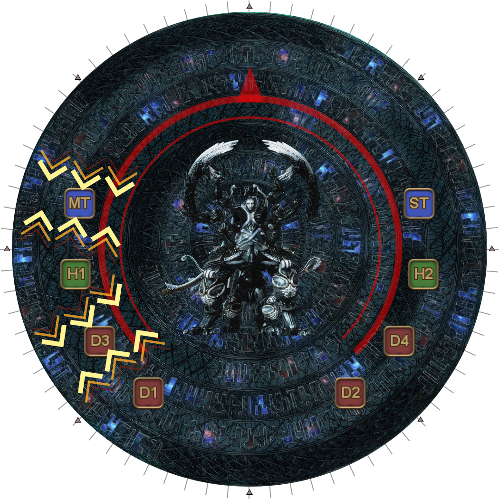
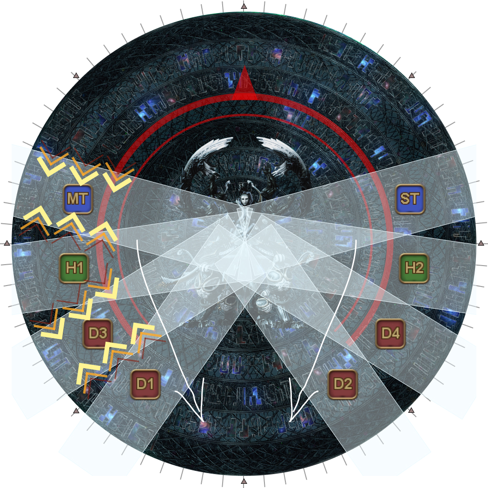
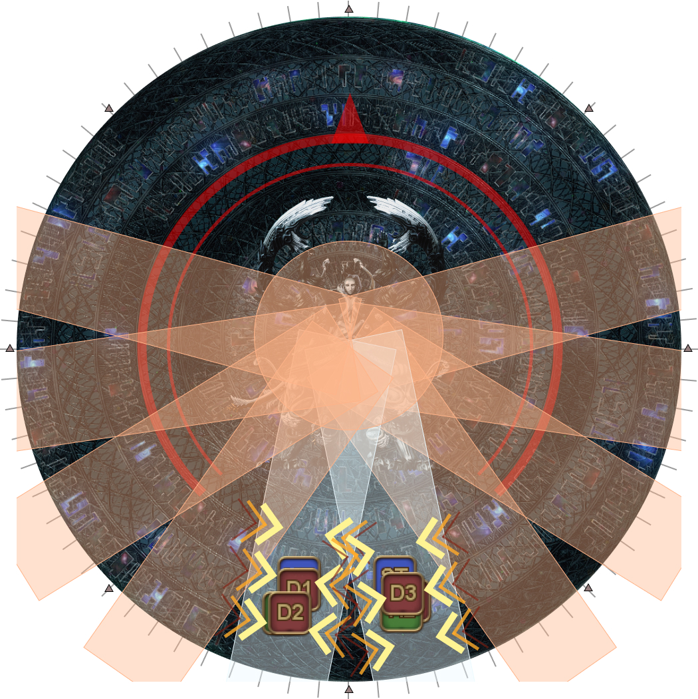
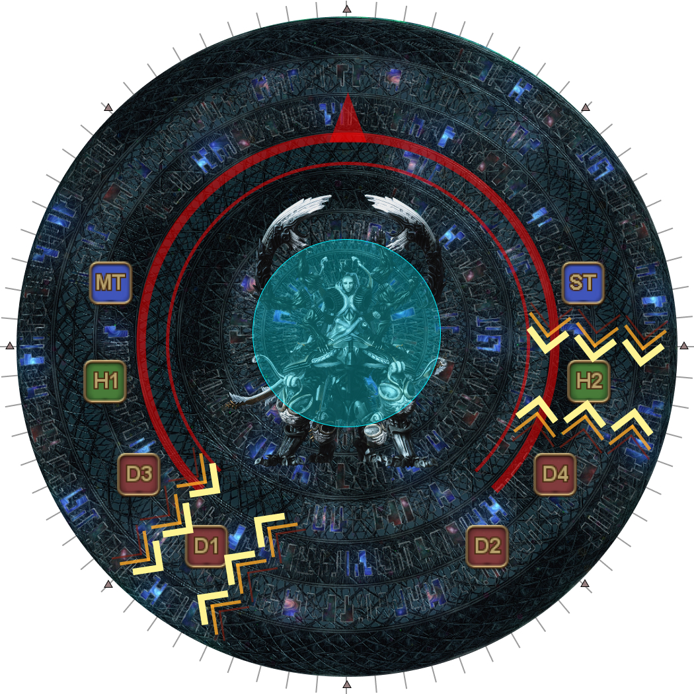
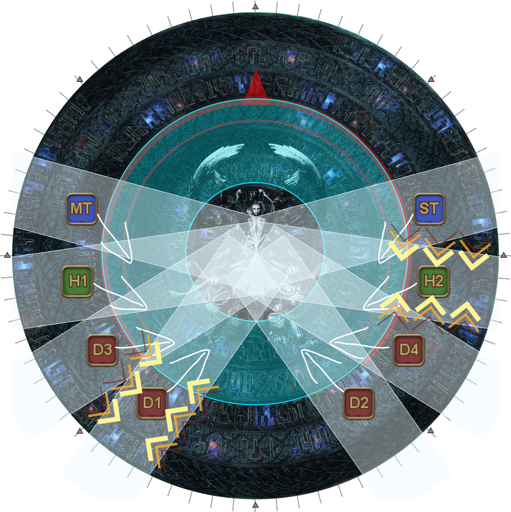
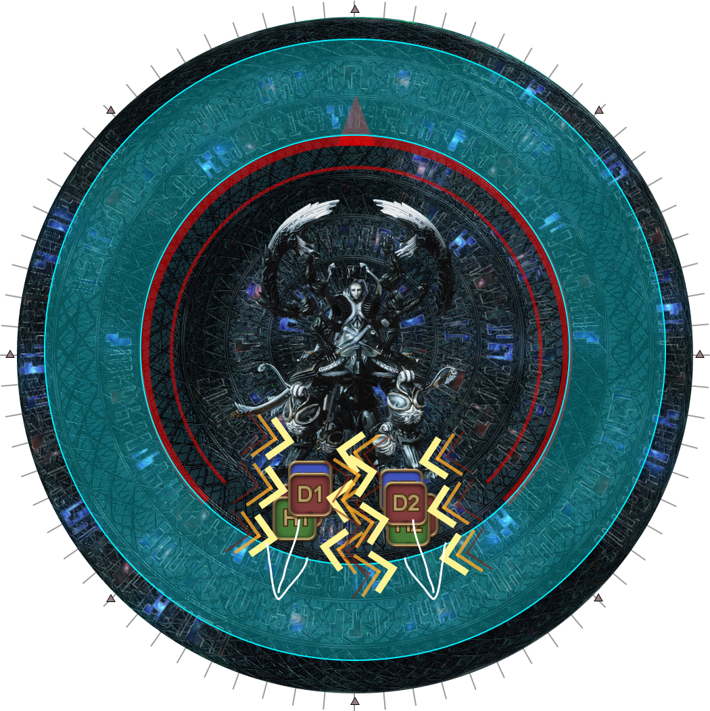
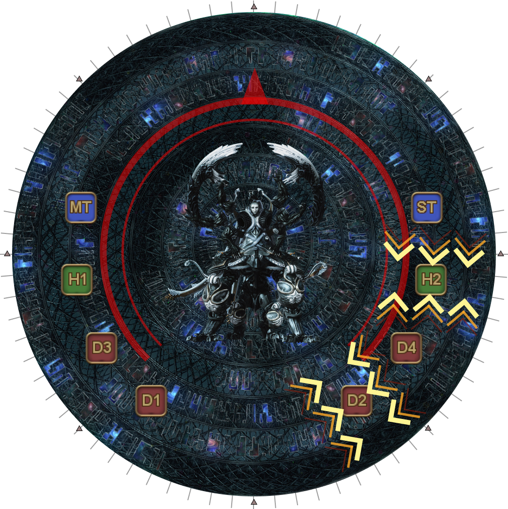
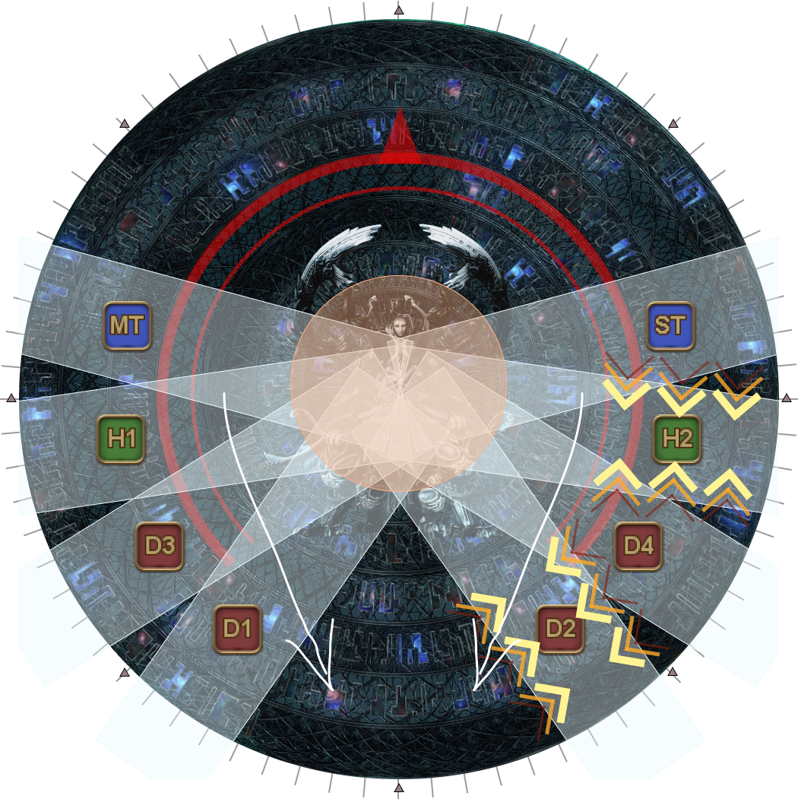
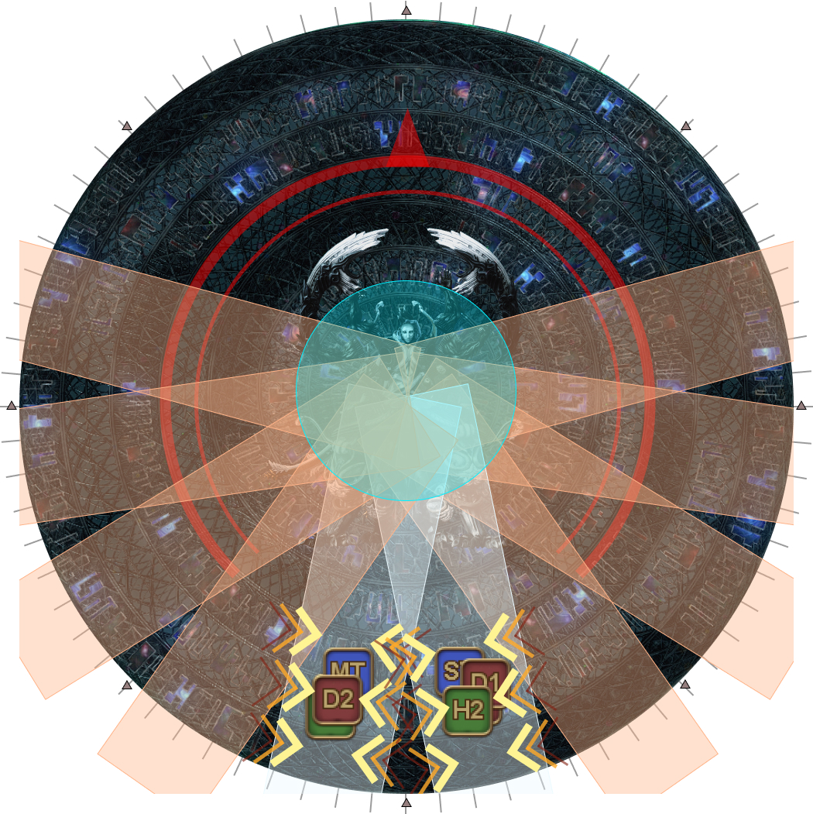
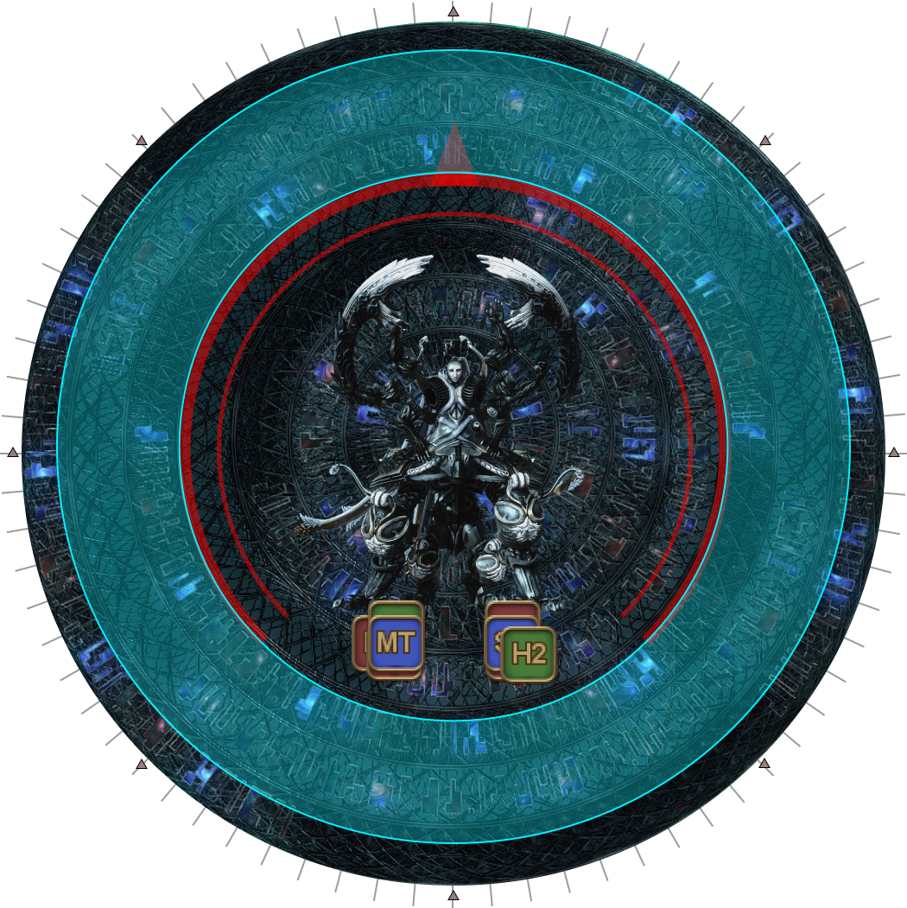

# Blue Screen

After defeating Omega in the previous phase, Omega will "reboot", resetting its HP to 100% and begin the phase.

This phase is a short, 55-second race to bring Omega's HP below 20% before Omega's enrage (Blue Screen) goes off.

In the meantime, the party will need to deal with simple stack/spread mechanics while dodging the expanding donut AoEs from the earlier transition phase.

<b>Tip:</b> The stack deals more damage than the spread.

Mitigations that last 15-seconds are best used after the spread beams in order to cover two stacks.

---

## First Wave

<table>
  <tr>
    <td width="50%">
<b>1.</b> Spread out along Omega's sides, leaving a space in the south.

From north-to-south, we have:
<ul><li><b>Tanks > Ranged > Healers > Melee</b></li></ul>
Omega will target two random players with Wave Cannon stack markers.
<ul><li><b>If your side has both stack markers:</b> The <b>lower</b> stack marker will swap to the other side.</li><li><b>If your side has no stack markers:</b> Your <b>melee</b> will swap to the other side.</li></ul>
<em>In this example, MT and H1 are targeted, so H1 and D2 will swap sides later.</em>
</td>
    <td></td>
  </tr>
  <tr>
    <td>
<b>2.</b> First set of Wave Cannons go out.

Move to the south positions and stack in groups of 4, swapping if necessary.
</td>
    <td></td>
  </tr>
  <tr>
    <td>
<b>3.</b> Stack markers resolve.

Return to your <b>original</b> positions.

    

    <b>Tip:</b> This is a good place to use Sprint, especially for tanks
</td>
    <td></td>
  </tr>
</table>

---

## Second Wave

The following sets of Wave Cannons now come with the expanding Wave Repeater AoE from the center.

<table>
  <tr>
    <td width="50%">
<b>4.</b> Omega targets two random players for Wave Cannon stacks.

The first hit from the Wave Repeater resolves in the center.

<em>In this example, each side has one stack marker, so no swaps will be needed.</em>
</td>
    <td></td>
  </tr>
  <tr>
    <td>
<b>5.</b> The second ring of the Wave Repeater resolves together with the first set of Wave Cannons.

Dodge <b>into</b> the ring AoE and gather south, swapping if necessary.
</td>
    <td></td>
  </tr>
  <tr>
    <td>
<b>6.</b> Dodge into the outer ring AoE when it resolves.
</td>
    <td></td>
  </tr>
  <tr>
    <td>
<b>7.</b> Wave Cannon stacks resolve.

Return to your original positions.
</td>
    <td></td>
  </tr>
</table>

---

## Third Wave

<table>
  <tr>
    <td width="50%">
<b>8.</b> Omega targets two random players with Wave Cannon stacks.

<em>In this example, D2 and D4 are targeted, so D1 and D2 will swap groups later.</em>
</td>
    <td></td>
  </tr>
  <tr>
    <td>
<b>9.</b> First set of Wave Cannons go off.

Gather south to stack in groups of 4, swapping if necessary.
</td>
    <td></td>
  </tr>
  <tr>
    <td>
<b>10.</b> Wave Cannon stacks resolve.

<b>Wait where you are</b> for the Wave Repeater to go off.
</td>
    <td></td>
  </tr>
  <tr>
    <td>
<b>11.</b> Dodge into the Wave Repeater's AoE.
</td>
    <td></td>
  </tr>
  <tr>
    <td>
<b>12.</b> Omega casts Blue Screen, the hard enrage for this phase.

Omega must be brought down to <b>below 20% HP</b> to clear this DPS check.
</td>
    <td></td>
  </tr>
</table>
