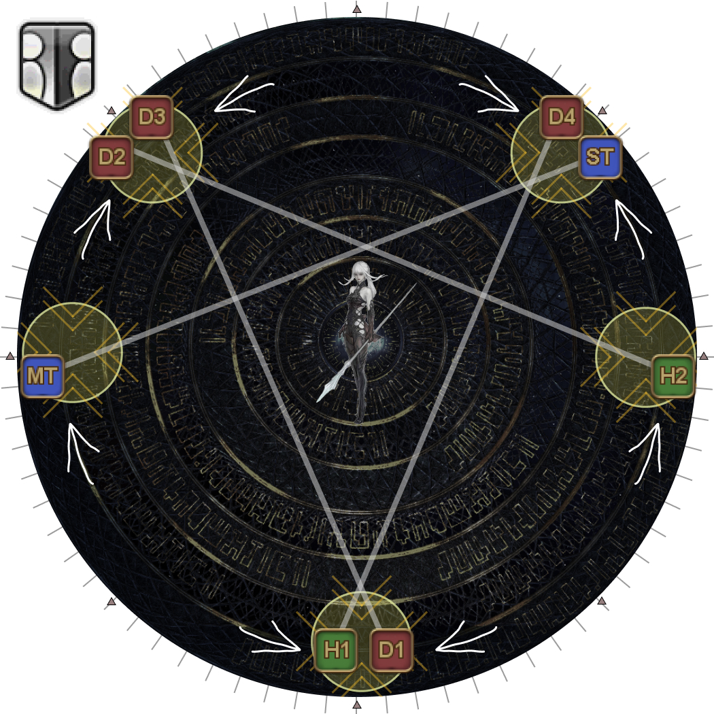
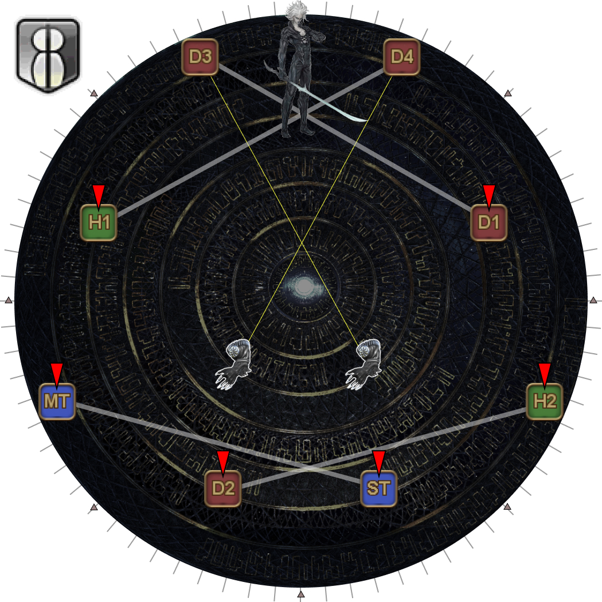
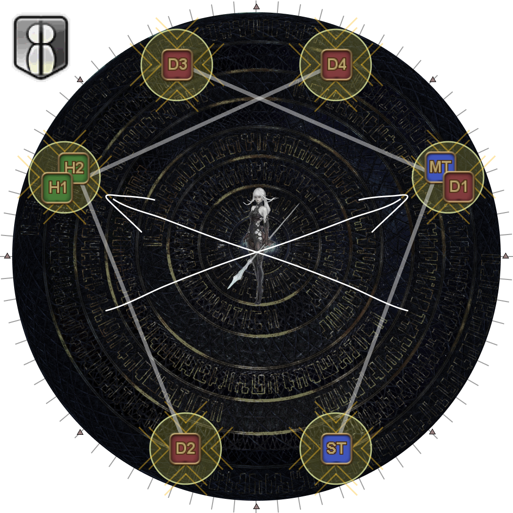
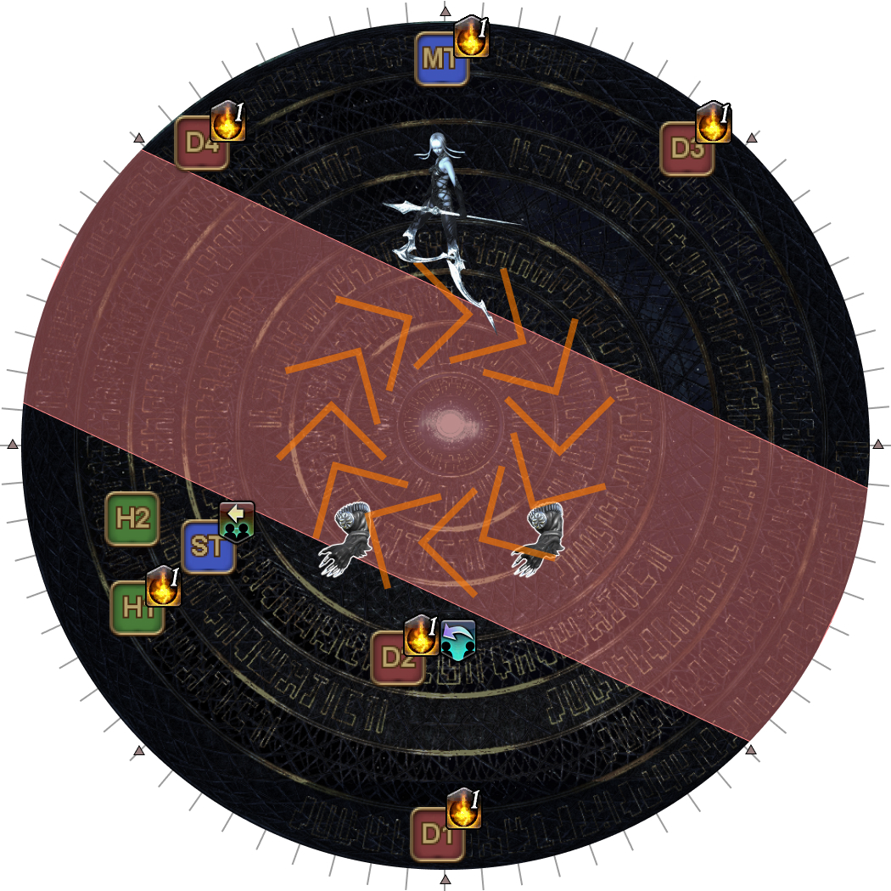
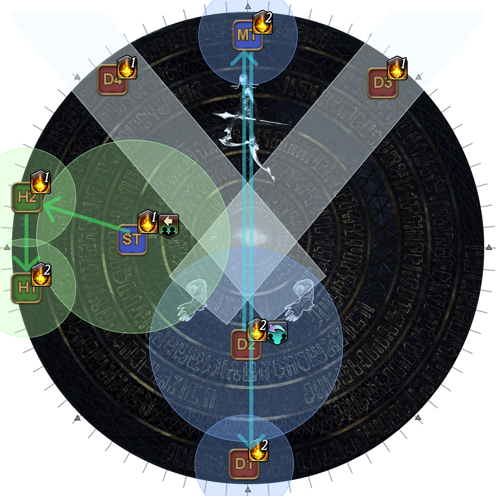

# Run: Dynamis

Notably, all players must *end* this phase with three stacks of Dynamis in order to clear the next phase.

## Run: Dynamis (Delta Version)

- Two pairs of players will be tethered with the red/green tether.
  - Red/green tethered players will be **taking monitor hits**.
- Two pairs of players will be tethered with the blue tether.
  - Blue tethered players will be handling **Pile Pitch**.
  - Hello, Near World and Hello, Distant World will appear on two players with a blue tether.

<b>UNDER CONSTRUCTION!</b>

The strats are still in testing, and are <b>likely</b> to change.

The following is the Kinda Awk strat:

<table>
  <tr>
    <td><b>Outer blue tethers</b></td>
    <td><ol>
      <li><b>When fists appear:</b> Stay put and break tethers as soon as they activate. Stack with your partner in the other tether when the tether breaks.</li>
      <li><b>When fist AoEs appear:</b> Bait spinning arms by beetle Omega.</li>
      <li><b>When spinning fists are baited:</b> Move in to soak Pile Pitch/point monitor.</li>
      <li><b>After monitors go off:</b> Look at beetle Omega and move to the safe side to either dodge or start Hello, Near/Distant World depending on your debuff.</li>
    </ol></td>
  </tr>
  <tr>
    <td><b>Inner blue tethers</b></td>
    <td><ol>
      <li><b>When fists appear:</b> Swap positions for blue/yellow fists if needed.</li>
      <li><b>When fist AoEs appear:</b> Break tethers and move to center bait Beyond Defense.</li>
      <li><b>After Beyond Defense:</b> Stack/avoid Pile Pitch and/or point monitor.</li>
      <li><b>After monitors go off:</b> Look at beetle Omega and move to the safe side to either dodge or start Hello, Near/Distant World depending on your debuff.</li>
    </ol></td>
  </tr>
  <tr>
    <td><b>Inner red/green tethers</b></td>
    <td><ol>
      <li><b>When fists appear:</b> Swap positions for blue/yellow fists if needed.</li>
      <li><b>When fist AoEs appear:</b> Move to bait side spinning arms.</li>
      <li><b>When spinning fists are baited:</b> Stay at the sides to take monitor hits.</li>
      <li><b>After monitors go off:</b> Look at beetle Omega and move to the safe side to prepare to take Hello, Near World. Break your tether in the process.</li>
    </ol></td>
  </tr>
  <tr>
    <td><b>Outer red/green tethers</b></td>
    <td><ol>
        <li><b>When fist AoEs appear:</b> Bait spinning arms by Reconfigured Omega.</li>
        <li><b>When spinning fists are baited:</b> Move to the sides to take monitor hits.</li>
        <li><b>After monitors go off:</b> Look at beetle Omega and move to the safe side to prepare to take Hello, Distant World.</li>
    </ol></td>
  </tr>
</table>

<table>
  <tr>
    <td width="50%">
<b>1.</b> Split off into your initial positions:

    <ul>
      <li>Blue tethers go towards the "beetle-form" Omega. The "longer" tether should be long enough to immediately break once the tethers are activated.</li>
      <li>Red/green tethers go towards the reconstructed Omega.</li>
    </ul></td>
    <td></td>
  </tr>
  <tr>
    <td>
<b>2.</b> Blue and yellow fists appear above each player.

    
Identify whether you and the player standing next to you from the other tether have the different-coloured fists.

If both fists are the same colour, then the inner tether pair swaps positions.

<em>In this example, since H2 and D3 share the same-coloured fists, H2 and D2 will swap sides. There is no swap needed for the bottom group.</em>
</td>
    <td></td>
  </tr>
  <tr>
    <td>
<b>3.</b> Arms appear on the outside of the arena, and telegraph which direction they will spin.
</td>
    <td></td>
  </tr>
  <tr>
    <td>
<b>4.</b> The tethers activate. This will break the outer blue-tether.

Stack with your fist partner.
</td>
    <td></td>
  </tr>
  <tr>
    <td>
<b>5.</b> The fist telegraphs will appear together with the Eye's beam.

The Reconstructed Omega will telegraph monitors on one side. One of the blue-tethered players will also get Monitors.

Move to your assigned spinning fist.
<ul><li><b>Outer blue pair:</b> Bait the arms at the beetle's side.</li><li><b>Inner blue-pair:</b> Break your tether, then go to the middle to bait Beyond Defense.</li><li><b>Green-pair nearer  the center:</b> Bait the side arms.</li><li><b>Green-pair at the edge:</b> Bait the arms at the Reconstructed Omega's side.</li></ul></td>
    <td></td>
  </tr>
  <tr>
    <td>
<b>6.</b> The Omega-M clone hits one of the two players with Beyond Defense.
</td>
    <td></td>
  </tr>
  <tr>
    <td>
<b>7.</b> The other three blue-tethered players stack together to share Pile Pitch (including the Monitor player).

The player that was struck with Beyond Defense moves out of the way, but between the two monitors (Omega's and the player's).
</td>
    <td></td>
  </tr>
  <tr>
    <td>
<b>8.</b> The "beetle" Omega lights up to cleave one side of the arena.

Move in to the safe side, breaking the middle red/green tether in the process.
</td>
    <td></td>
  </tr>
  <tr>
    <td>
<b>9.</b> The cleave resolves, along with Hello, Near World and Hello, Distant World.

Wait a couple seconds before breaking the last red/green tether.
</td>
    <td></td>
  </tr>
</table>

## Run: Dynamis (Sigma Version)

<b>UNDER CONSTRUCTION!</b>

The strat is still in testing, and it is <b>likely</b> to change.

(I also highly doubt that it will <em>actually</em> be picked up by PF when PF reaches this point, but I think the payoff is worth at least trying.)

The following is the [ETO strat](https://youtu.be/lYVRUeyVfDs) used to resolve towers. The strat frontloads some of the processing in exchange for making the tower assignments very simple.

The first part is rather unusual, but it means that resolving the towers can be broken down into three rules:

1. Take the tower at, or next to your position.
2. If you are between two towers, move to the tower that needs two players (these will be the most north, or the most south towers).
3. If there are no towers either at, or next to your position, take the tower directly opposite.

### Setup

<table>
  <tr>
    <td width="50%">
<b>1.</b> Two arms will spawn. Line up in two rows of four.

      <ul>
        <li><b>Left:</b> 〇 > × > △ > □ <b>:Right</b></li>
      </ul>
      
<em>(All tethers should be vertical)</em>
</td>
    <td></td>
  </tr>
  <tr>
    <td>
<b>2.</b> Six random players get marked, with each tether pair getting at least one marker.

    
If your pair only has one marker, swap if needed to have the <b>non-marker</b> player towards the hands.

<em>(In this example, H1 and D4 swapped rows.)</em>
</td>
    <td></td>
  </tr>
  <tr>
    <td>
<b>3.</b> The top row takes up their positions at the edge of the arena.

    
<em>All these positions will be between two markers.</em>

    <ul>
      <li>The <b>left-most</b> player <b>without a marker</b> goes NNW.</li>
      <li>The <b>right-most</b> player <b>without a marker</b> goes NNE.</li>
      <li>The <b>left-most</b> player <b>with a marker</b> goes WSW.</li>
      <li>The <b>right-most</b> player <b>with a marker</b> goes ESE.</li>
    </ul></td>
    <td></td>
  </tr>
</table>

With the top row in position, the bottom row now takes up their positions, depending on whether the debuff is Remote, or Mid Glitch.

- The bottom row will **always** go to the opposite E/W side as their tether partner
  - i.e: if you're in the left tether pair, you will go right (and vice versa).
- The bottom row will go N/S, depending on whether the party has Mid or Remote Glitch.

### Remote Glitch

<table>
  <tr>
    <td width="50%">
<b>4a.</b> The bottom row takes up their positions <b>opposite</b> their tether partner.

<em>The players at the north side (at the WNW and ENE sectors) are far enough to resolve Remote Glitch, but not so far that they steal the tethers from the arms.</em>
</td>
    <td></td>
  </tr>
  <tr>
    <td>
<b>5a.</b> Lasers and Wave Cannons resolve.
</td>
    <td></td>
  </tr>
  <tr>
    <td>
<b>6a.</b> Move into the center as Omega-F will teleport into the middle and knockback all players into their towers.
</td>
    <td></td>
  </tr>
  <tr>
    <td>
<b>7a.</b> The tower rules are as such:
<ol><li>Get knocked back to the <b>nearest</b> tower from you.</li><li>If there are two towers next to you, choose the tower that requires two players (these will be the two towers closest to the N/S poles).</li></ol></td>
    <td></td>
  </tr>
</table>

### Mid Glitch

<table>
  <tr>
    <td width="50%">
<b>4b.</b> The bottom row takes up their positions on the same north/southern half of the arena, across from their tether partner. The tethers should look criss-crossed.

<em>These player will need to move in and out as needed to satisfy the Mid Glitch requirements (about two rings in from the edge)</em>
</td>
    <td></td>
  </tr>
  <tr>
    <td>
<b>5b.</b> Lasers and Wave Cannons resolve.
</td>
    <td></td>
  </tr>
  <tr>
    <td>
<b>6b.</b> Move into the center as Omega-F will teleport into the middle and knockback all players into their towers.
</td>
    <td></td>
  </tr>
  <tr>
    <td>
<b>7b.</b> The tower rules are as such:
<ol><li>Get knocked back to the tower you came from.</li><li>If there is no tower at your position, take the tower <b>directly opposite</b>.</li></ol></td>
    <td></td>
  </tr>
</table>

### Sigma Dynamis Jumps

<table>
  <tr>
    <td width="50%">
<b>8.</b> Omega-F will spawn opposite two Right Arm Units and Omega's Rear Power Unit in the center.

Use Omega-F as North, and note whether Omega-F is in her blade-legs stance or not.

    
The party needs to organise themselves into three groups:

    <ul>
      <li>A group of three goes to Omega-F's side.
        <ul><li>None of these players can have either Hello, World.</li>
        <li>Two players will take the Right Arm Units' tethers. These two players <b>must</b> have a stack of Dynamis</li>
        <li>The remaining player will group with Hello, Distant World.</li></ul>
      </li>
      <li>The remaining five players go opposite Omega-F.
        <ul>
          <li>The two players with Hello, World debuffs stand a little towards the center of the arena to separate themselves from the remaining three.</li>
          <li>The remaining three players briefly line up along the edge
            <ul>
              <li>The two players in front will follow the Hello, Near World player.</li>
              <li>The player at the back will stay behind with the Hello, Distant World player.</li>
            </ul>
          </li>
        </ul>
      </li>
    </ul></td>
    <td></td>
  </tr>
  <tr>
    <td>
<b>9.</b> The Rear Power Unit will start firing a straight-line AoE while slowly rotating.
Depending on whether Omega-F has her blade-legs or not, either wait and stay outside <b>or</b> follow the Rear Power Unit's AoE.

</td>
    <td></td>
  </tr>
  <tr>
    <td>
<b>10.</b> After rotating and firing fourteen times, the Rear Power Unit will fire its last laser in this orientation.

Use this time to move into position to resolve Hello, World.
</td>
    <td></td>
  </tr>
  <tr>
    <td>
<b>11.</b> Hello, World debuffs resolve along with the Right Arm Unit's lasers.

Done correctly:
<ul><li>Four players will have one stack of Dynamis</li><li>The other four players will have two stacks of Dynamis.</li></ul></td>
    <td></td>
  </tr>
</table>

## Run: Dynamis (Omega Version)

<b>UNDER CONSTRUCTION!</b>

### Part One

<table>
  <tr>
    <td width="50%">
<b>1.</b> Unlike Delta and Sigma, Omega-F will stay on the arena during this part of Omega.

Omega Reconfigured will spawn in the center, and a Omega-M/F pair will spawn at opposite intercardinal positions, again with a random Sword/Shield and Staff/Blade-Legs combo.
</td>
    <td></td>
  </tr>
  <tr>
    <td>
<b>2.</b> A second Omega-M/F pair will spawn at the remaining two intercardinal positions, again with a random Sword/Shield and Staff/Blade-Legs combo.
</td>
    <td></td>
  </tr>
  <tr>
    <td>
<b>3.</b> Omega will channel a Diffuse Wave Cannon ("lights") at two opposite cardinal directions.

This must be resolved together with the first Omega-M/F pair's AoEs.
</td>
    <td></td>
  </tr>
  <tr>
    <td>
<b>4.</b> The Omega Reconfigured will then repeat this at the other two cardinal directions, which must be resolved together with the second Omega-M/F pair's AoEs.
</td>
    <td></td>
  </tr>
</table>

<b>[Click to Expand] Safe spots</b>

<table>
  <tr>
    <td width="50%">
      
<b>M Sword, F Blade-legs:</b>

      
    </td>
    <td>
      
<b>M Sword, F Spear:</b>

      
    </td>
  </tr>
  <tr>
    <td>
      
<b>M Shield, F Blade-legs:</b>

      
    </td>
    <td>
      
<b>M Shield, F Spear:</b>

      
    </td>
  </tr>
</table>

### Part Two

<table>
  <tr>
    <td width="50%">
<b>5.</b> Omega will then present a single monitor set, to be resolved together with the first set of Hello, World debuffs.<ul><li>Two players with two Dynamis stacks take Omega's monitor hits.<ul><li>If there are player(s) with two Dynamis stacks <b>and</b> a second Hello, World debuff, they <b>must</b> take the monitors here.</li></ul></li></ul>
</td>
    <td></td>
  </tr>
  <tr>
    <td>
<b>6.</b> Hello, World debuffs resolve.

Done correctly, there should be:
<ul><li>Two players with three Dynamis stacks.<ul><li>These players should <em>not</em> have the second set of Hello, World debuffs.</li></ul></li><li>The other six players should all have two Dynamis stacks.</li></ul></td>
    <td></td>
  </tr>
  <tr>
    <td>
<b>7.</b> Omega then spawns at the edge of the arena, and tethers to two players.
<ul><li><b>Players with 3 stacks:</b> Take the tethers and stand beside Omega.</li><li><b>Everybody else:</b> Form up opposite Omega to resolve Hello, Worlds.</li></ul></td>
    <td></td>
  </tr>
  <tr>
    <td>
<b>8.</b> Hello, World debuffs resolve.

All players should now have three Dynamis stacks each.
</td>
    <td></td>
  </tr>
</table>

Omega-F then does one more set of Solar Ray tankbusters before casting Blind Faith.

Like Blue Screen, Omega-F **must** be brought to under 20% HP by the end of Blind Faith's cast to proceed onto the final phase of the fight.