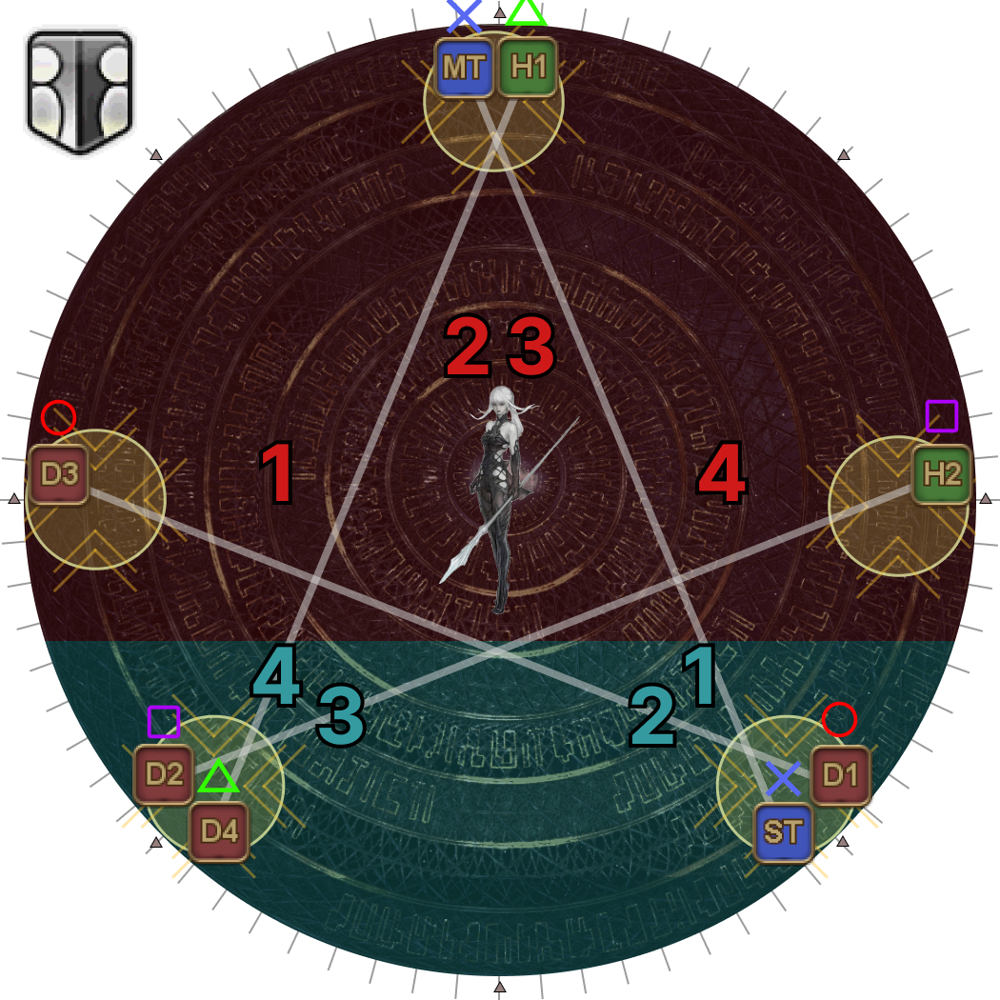
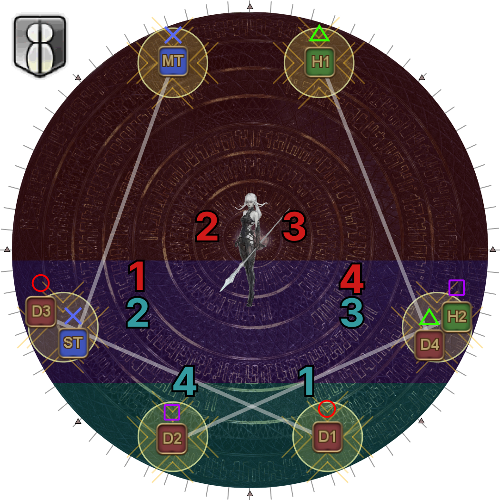
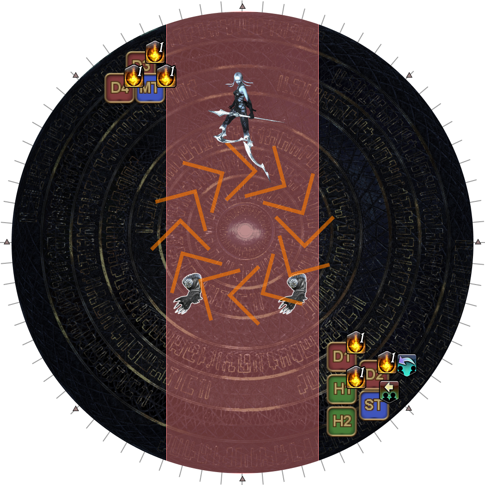
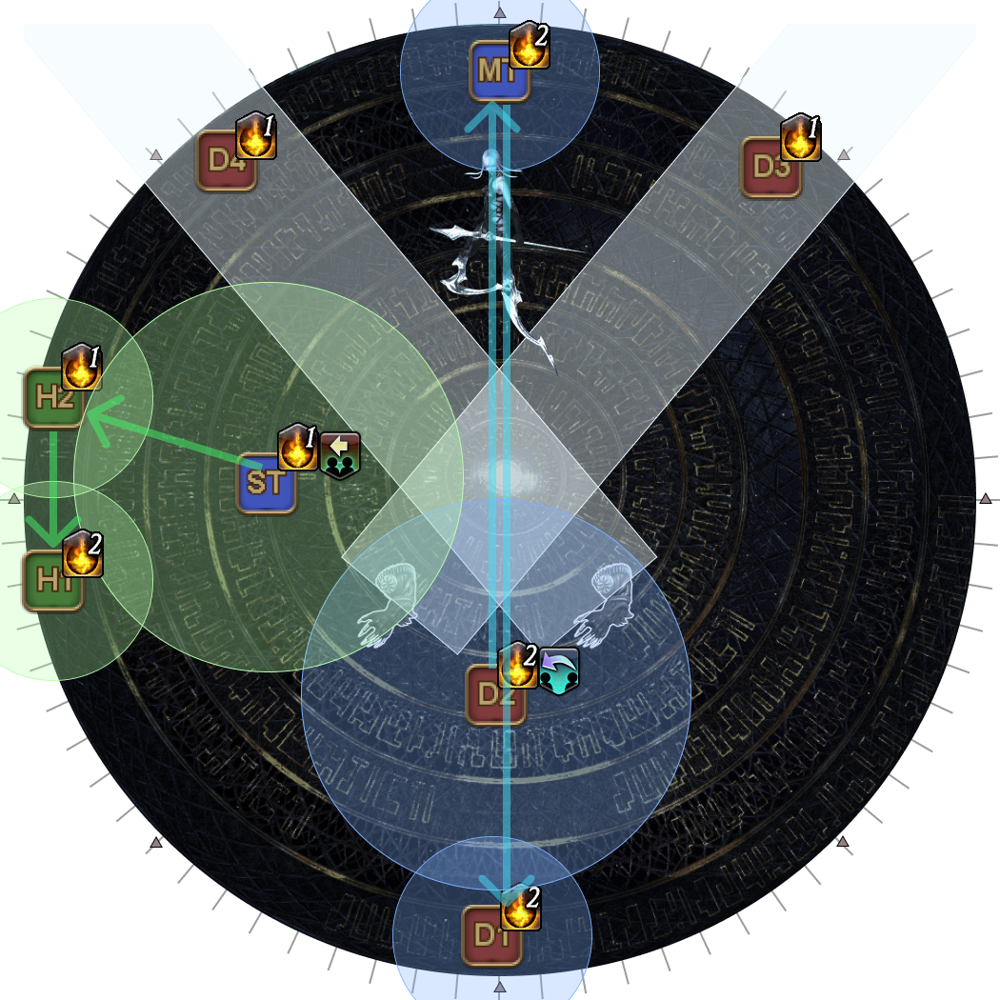

# Run: Dynamis

Notably, all players must *end* this phase with three stacks of Dynamis in order to clear the next phase.

## Run: Dynamis (Delta Version)

- Two pairs of players will be tethered with the red/green tether.
  - Red/green tethered players will be **taking monitor hits**.
- Two pairs of players will be tethered with the blue tether.
  - Blue tethered players will be handling **Pile Pitch**.
  - Hello, Near World and Hello, Distant World will appear on two players with a blue tether.

<b>UNDER CONSTRUCTION!</b>

The strat is still in testing, and it is <b>likely</b> to change.

The following is the Kinda Awk strat:

<table>
  <tr>
    <td><b>Outer blue tethers</b></td>
    <td><ol>
      <li><b>When fists appear:</b> Stay put and break tethers as soon as they activate. Stack with your partner in the other tether when the tether breaks.</li>
      <li><b>When fist AoEs appear:</b> Bait spinning arms by beetle Omega.</li>
      <li><b>When spinning fists are baited:</b> Move in to soak Pile Pitch/point monitor.</li>
      <li><b>After monitors go off:</b> Look at beetle Omega and move to the safe side to either dodge or start Hello, Near/Distant World depending on your debuff.</li>
    </ol></td>
  </tr>
  <tr>
    <td><b>Inner blue tethers</b></td>
    <td><ol>
      <li><b>When fists appear:</b> Swap positions for blue/yellow fists if needed.</li>
      <li><b>When fist AoEs appear:</b> Break tethers and move to center bait Beyond Defense.</li>
      <li><b>After Beyond Defense:</b> Stack/avoid Pile Pitch and/or point monitor.</li>
      <li><b>After monitors go off:</b> Look at beetle Omega and move to the safe side to either dodge or start Hello, Near/Distant World depending on your debuff.</li>
    </ol></td>
  </tr>
  <tr>
    <td><b>Inner red/green tethers</b></td>
    <td><ol>
      <li><b>When fists appear:</b> Swap positions for blue/yellow fists if needed.</li>
      <li><b>When fist AoEs appear:</b> Move to bait side spinning arms.</li>
      <li><b>When spinning fists are baited:</b> Stay at the sides to take monitor hits.</li>
      <li><b>After monitors go off:</b> Look at beetle Omega and move to the safe side to prepare to take Hello, Near World. Break your tether in the process.</li>
    </ol></td>
  </tr>
  <tr>
    <td><b>Outer red/green tethers</b></td>
    <td><ol>
        <li><b>When fist AoEs appear:</b> Bait spinning arms by Reconfigured Omega.</li>
        <li><b>When spinning fists are baited:</b> Move to the sides to take monitor hits.</li>
        <li><b>After monitors go off:</b> Look at beetle Omega and move to the safe side to prepare to take Hello, Distant World.</li>
    </ol></td>
  </tr>
</table>

<table>
  <tr>
    <td width="50%">
<b>1.</b> Split off into your initial positions:

    <ul>
      <li>Blue tethers go towards the "beetle-form" Omega. The "longer" tether should be long enough to immediately break once the tethers are activated.</li>
      <li>Red/green tethers go towards the reconstructed Omega.</li>
    </ul></td>
    <td></td>
  </tr>
  <tr>
    <td>
<b>2.</b> Blue and yellow fists appear above each player.

    
Identify whether you and the player standing next to you from the other tether have the different-coloured fists.

If both fists are the same colour, then the inner tether pair swaps positions.

<em>In this example, since H2 and D3 share the same-coloured fists, H2 and D2 will swap sides. There is no swap needed for the bottom group.</em>
</td>
    <td></td>
  </tr>
  <tr>
    <td>
<b>3.</b> Arms appear on the outside of the arena, and telegraph which direction they will spin.
</td>
    <td></td>
  </tr>
  <tr>
    <td>
<b>4.</b> The tethers activate. This will break the outer blue-tether.

Stack with your fist partner.
</td>
    <td></td>
  </tr>
  <tr>
    <td>
<b>5.</b> The fist telegraphs will appear together with the Eye's beam.

The Reconstructed Omega will telegraph monitors on one side. One of the blue-tethered players will also get Monitors.

Move to your assigned spinning fist.
<ul><li><b>Outer blue pair:</b> Bait the arms at the beetle's side.</li><li><b>Inner blue-pair:</b> Break your tether, then go to the middle to bait Beyond Defense.</li><li><b>Green-pair nearer  the center:</b> Bait the side arms.</li><li><b>Green-pair at the edge:</b> Bait the arms at the Reconstructed Omega's side.</li></ul></td>
    <td></td>
  </tr>
  <tr>
    <td>
<b>6.</b> The Omega-M clone hits one of the two players with Beyond Defense.
</td>
    <td></td>
  </tr>
  <tr>
    <td>
<b>7.</b> The other three blue-tethered players stack together to share Pile Pitch (including the Monitor player).

The player that was struck with Beyond Defense moves out of the way, but between the two monitors (Omega's and the player's).
</td>
    <td></td>
  </tr>
  <tr>
    <td>
<b>8.</b> The "beetle" Omega lights up to cleave one side of the arena.

Move in to the safe side, breaking the middle red/green tether in the process.
</td>
    <td></td>
  </tr>
  <tr>
    <td>
<b>9.</b> The cleave resolves, along with Hello, Near World and Hello, Distant World.

Wait a couple seconds before breaking the last red/green tether.
</td>
    <td></td>
  </tr>
</table>

## Run: Dynamis (Sigma Version)

<b>UNDER CONSTRUCTION!</b>

The strat is still in testing, and it is <b>likely</b> to change.

The following is an adaptation of the GMT Sigma strat, tweaked to better fit some of the conventions done in other phases.

Run: Dynamis (Sigma Version) can be subdivided into three sub-phases.

### Part One

<table>
  <tr>
    <td width="50%">
<b>10.</b> Two arms will spawn, followed by an Omega-M clone.

    
<b>Use the Omega-M clone as North</b>. The two hands will always spawn south-west, and south-east.

    
Line up in two rows of four.

If your row has duplicate Playstation symbols, the <b>right-most</b> player swaps.

<em>(Equivalently, if your tether is going to the left, swap groups.)</em>

<em>In this example, the ST and D3 will swap groups.</em>
</td>
    <td></td>
  </tr>
  <tr>
    <td>
<b>11.</b> Arrange each row in order:
<ul><li><b>Left:</b> 〇 > × > △ > □ <b>:Right</b></li></ul>
<em>(All tethers should now be vertical)</em>

<b>Remember your group (upper/lower), and your Playstation symbol.</b>

The Playstation symbols will disappear.
</td>
    <td></td>
  </tr>
  <tr>
    <td>
<b>12.</b> Six random players get marked.

    
Check how many marks your pair has, and find the other pair that has the same number of marks.

    <ul>
      <li>The <b>left-most pair with both players marked</b> takes N/S:
        <ul>
          <li>Upper player goes north.</li>
          <li>Lower player goes south.</li></ul>
      </li>
      <li>The <b>right-most pair with both players marked</b> takes E/W:
        <ul>
          <li>Upper player goes west.</li>
          <li>Lower player goes east.</li></ul>
      </li>
      <li>The <b>left-most pair with only one player marked</b> resolves the left hand:
        <ul>
          <li>Marked player goes south-west.</li>
          <li>Unmarked player goes north-east.</li></ul>
      </li>
      <li>The <b>right-most pair with only one player marked</b> resolves the right hand:
        <ul>
          <li>Marked player goes south-east.</li>
          <li>Unmarked player goes north-west.</li></ul>
      </li>
    </ul></td>
    <td></td>
  </tr>
  <tr>
    <td>
<b>13.</b> Move to your positions and resolve Mid/Remote Glitch.

<em>In this example, players have Mid Glitch.</em>
</td>
    <td></td>
  </tr>
  <tr>
    <td>
<b>14.</b> Marks and arm beams resolve.
</td>
    <td></td>
  </tr>
</table>

### Part Two

<table>
  <tr>
    <td width="50%">
<b>15.</b> Move to the center of the arena.

Towers will spawn in the formation corresponding to Mid/Remote Glitch.
<ul><li><b>Remote Glitch:</b> Five towers will spawn.</li><li><b>Mid Glitch:</b> Six towers will spawn.</li></ul>
The towers will spawn using the same North from before <b>or be flipped vertically</b>.

Identify the tower orientation, and position yourself in the center to get knocked back into your tower (see below).
</td>
    <td><b>Remote Glitch:</b><b>Mid Glitch:</b>
    </td>
  </tr>
  <tr>
    <td>
<b>16.</b> Omega-F will teleport into the middle and knockback all players into their towers.

Your tower is determined by your Playstation symbol from earlier, and whether you were in the upper or lower group.

    
<b>Remote Glitch:</b>

    <ul>
      <li>The upper group will take the upper part of the arena (highlighted in red):
        <ul>
          <li><b>West:</b> 1 > 2 > 3 > 4<b> :East</b>
            <ul>
              <li>〇 : West tower.</li>
              <li>× and △ : North tower.</li>
              <li>□ : East tower.</li>
            </ul>
          </li>
        </ul>
      </li>
      <li>The lower group will take the lower part of the arena (highlighted in blue):
        <ul>
          <li><b>West:</b> 4 > 3 > 2 > 1<b> :East</b>
            <ul>
              <li>〇 and ×: South-east tower.</li>
              <li>△ and □: South-west tower.</li>
            </ul>
          </li>
        </ul>
      </li>
    </ul>
    
<b>Mid Glitch:</b>

    <ul>
      <li>The upper group will take the upper part of the arena (highlighted in red and purple):
        <ul>
          <li><b>West:</b> 1 > 2 > 3 > 4<b> :East</b>
            <ul>
              <li>〇 : WSW tower.</li>
              <li>× : NNW tower.</li>
              <li>△ : NNE tower.</li>
              <li>□ : ESE tower.</li>
            </ul>
          </li>
        </ul>
      </li>
      <li>The lower group will take the lower part of the arena (highlighted in blue and purple):
        <ul>
          <li><b>West:</b> 2 > 4 > 1 > 3<b> :East</b>
            <ul>
              <li>〇 : SSE tower.</li>
              <li>× : WSW tower.</li>
              <li>△ : ESE tower.</li>
              <li>□ : SSW tower.</li>
            </ul>
          </li>
        </ul>
      </li>
    </ul></td>
    <td><b>Remote Glitch:</b><b>Mid Glitch:</b>
    </td>
  </tr>
</table>

### Part Three

<table>
  <tr>
    <td width="50%">
<b>17.</b> Omega-F will spawn opposite two Right Arm Units and Omega's Rear Power Unit in the center.

Use Omega-F as North, and note whether Omega-F is in her blade-legs stance or not.

    
The party needs to organise themselves into three groups:

    <ul>
      <li>A group of three goes to Omega-F's side.
        <ul><li>None of these players can have either Hello, World.</li>
        <li>Two players will take the Right Arm Units' tethers. These two players <b>must</b> have a stack of Dynamis</li>
        <li>The remaining player will group with Hello, Distant World.</li></ul>
      </li>
      <li>A group of three goes opposite Omega-F.
        <ul><li>This group contains the player with Hello, Near World.</li></ul>
      </li>
      <li>A group of two goes opposite Omega-F.
        <ul><li>This group contains the player with Hello, Distant World.</li></ul>
      </li>
    </ul></td>
    <td></td>
  </tr>
  <tr>
    <td>
<b>18.</b> The Rear Power Unit will start firing a straight-line AoE while slowly rotating.
Depending on whether Omega-F has her blade-legs or not, either wait and stay outside <b>or</b> follow the Rear Power Unit's AoE.

</td>
    <td></td>
  </tr>
  <tr>
    <td>
<b>19.</b> After rotating and firing fourteen times, the Rear Power Unit will fire its last laser in this orientation.

Use this time to move into position to resolve Hello, World.
</td>
    <td></td>
  </tr>
  <tr>
    <td>
<b>20.</b> Hello, World debuffs resolve along with the Right Arm Unit's lasers.

Done correctly:
<ul><li>Four players will have one stack of Dynamis</li><li>The other four players will have two stacks of Dynamis.</li></ul></td>
    <td></td>
  </tr>
</table>

## Run: Dynamis (Omega Version)

<b>UNDER CONSTRUCTION!</b>

