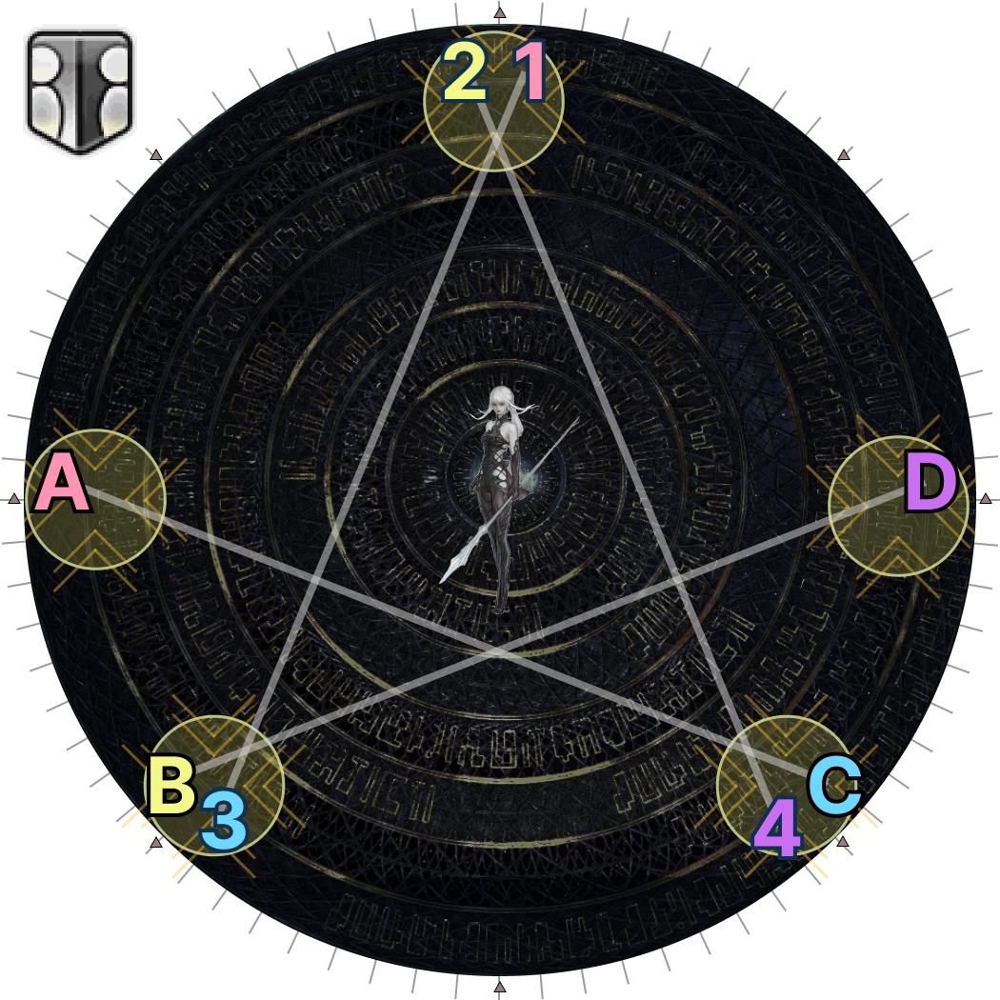
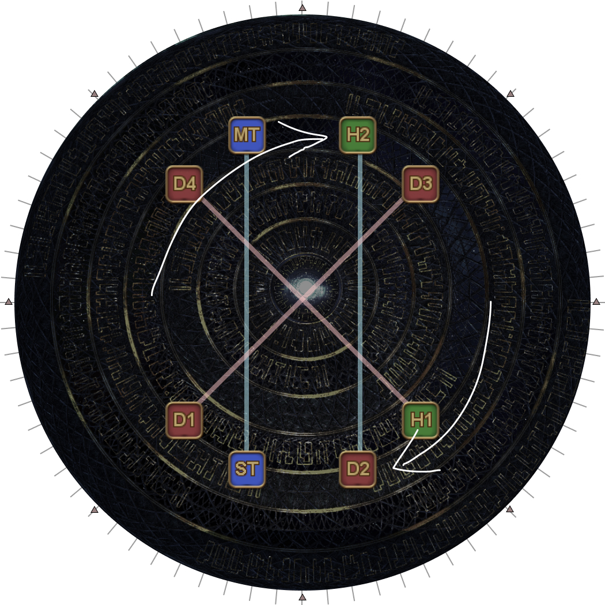
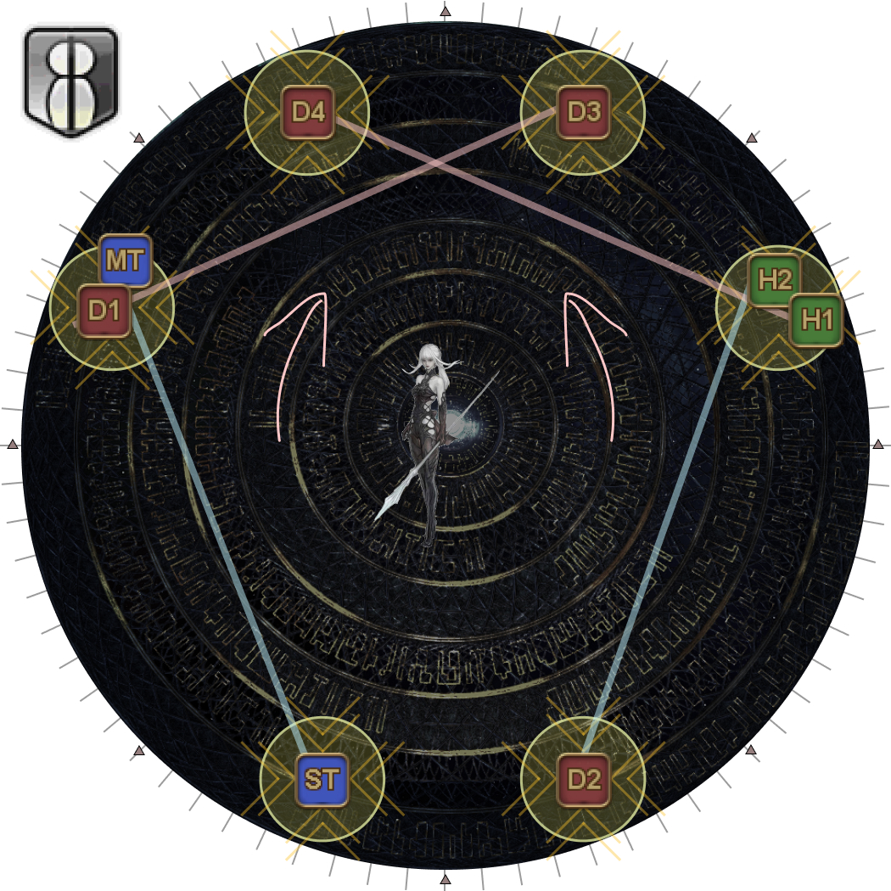
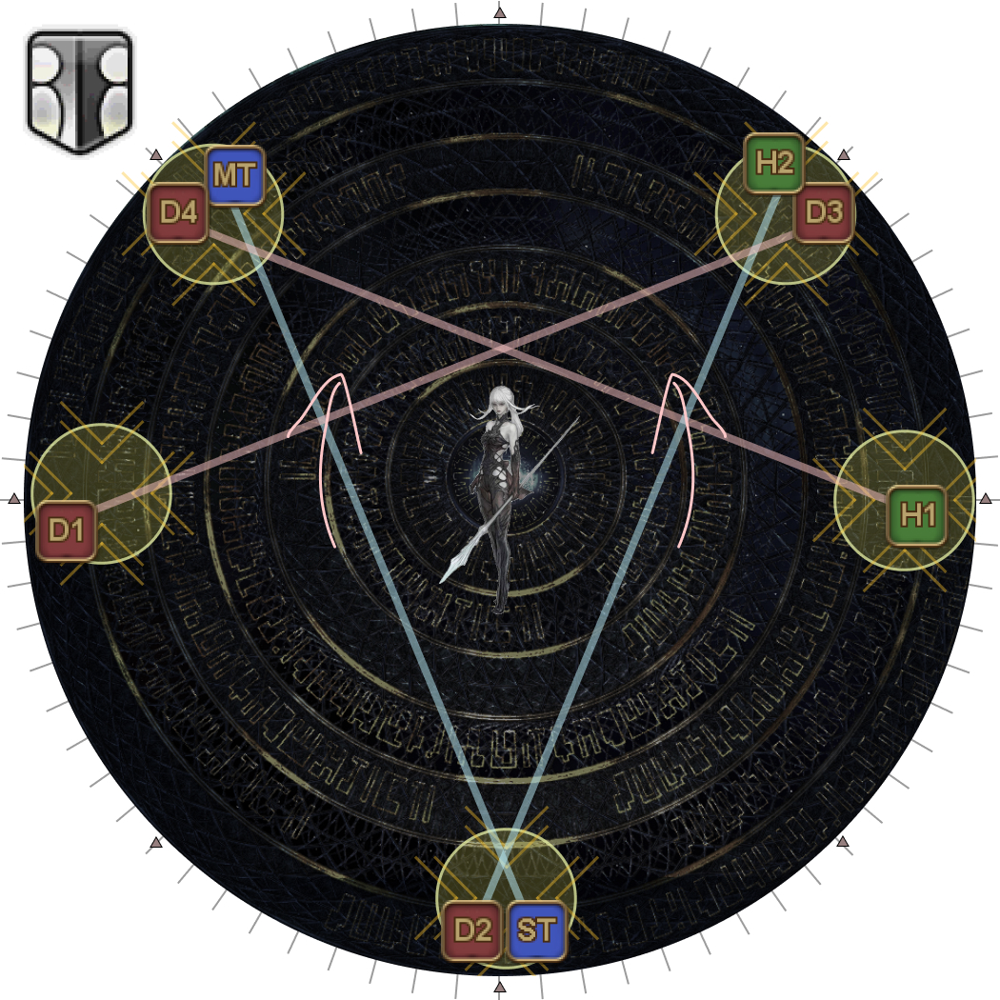
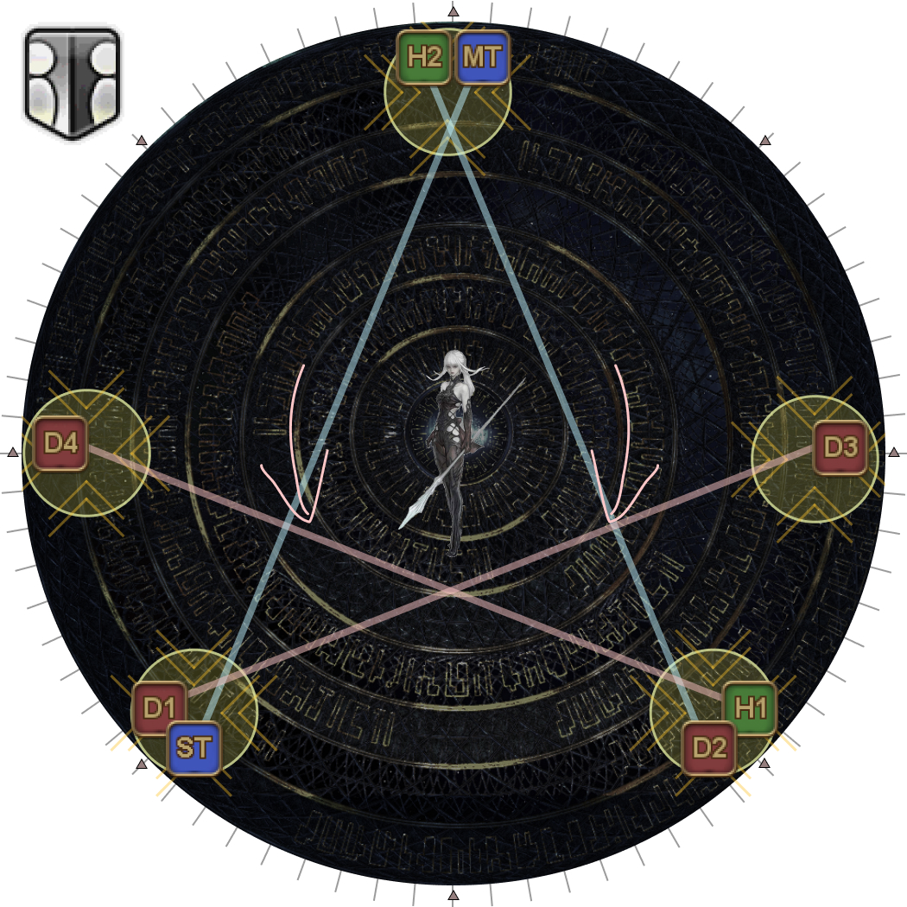
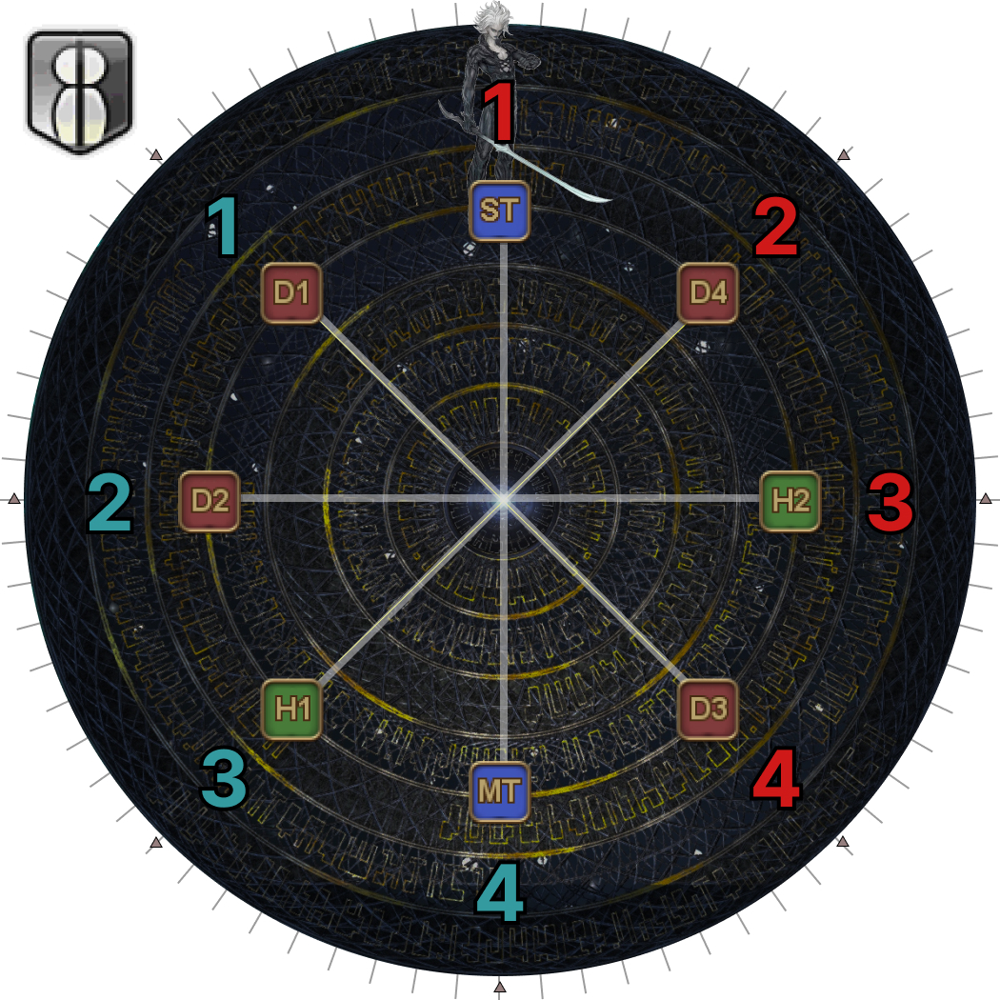
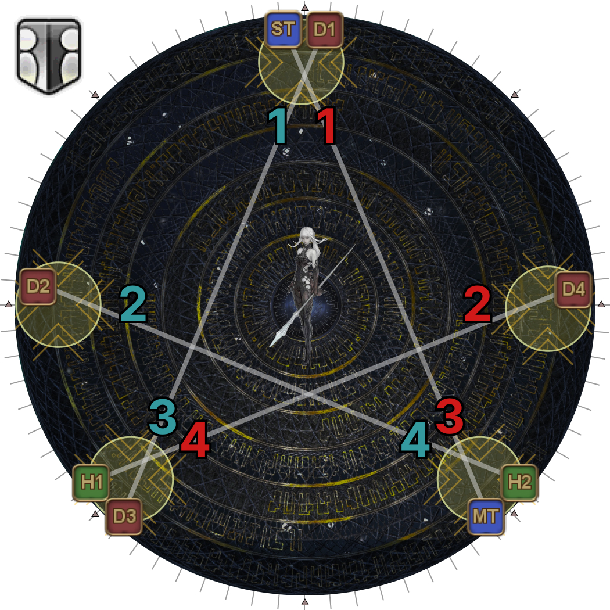

# Run: Dynamis (Sigma Version)

Sigma is split into three parts:

1. Wave Cannons and Lasers
2. Mid/Remote Glitch and Towers
3. Hello, World

## 1. Wave Cannons and Lasers

<table>
  <tr>
    <td width="50%">
<b>1.</b> Two arms will spawn followed by Omega-M.

The arms will always spawn SW and NE relative to Omega-M, who will serve as "north" for this part.

Line up in two columns of four between the two arms.

      <ul>
        <li><b>Top:</b> 〇 × △ □ <b>:Bottom</b></li>
      </ul>
      
<em>(All tethers should be horizontal)</em>

This establishes where "North" will be for this first part of the mechanic.
</td>
    <td></td>
  </tr>
  <tr>
    <td>
<b>2.</b> Six random players get marked, with each tether pair getting at least one marker.

    
As a result, two pairs will have two markers, and two pairs will only have one marker.

    
Identify whether your pair has one or two markers, and whether it is the top or bottom pair (compared to the other pair with the same number of markers).

<em>In this example:</em>

    <ul>
      <li>
<em>Pairs with two markers:</em>

        <ul>
          <li><em>ST and MT are the top pair.</em></li>
          <li><em>D2 and H2 are the bottom pair.</em></li>
        </ul>
      </li>
      <li>
<em>Pairs with one marker:</em>

        <ul>
          <li><em>D3 and D1 are the top pair.</em></li>
          <li><em>H1 and D4 are the bottom pair.</em></li>
        </ul>
      </li>
    </ul></td>
    <td></td>
  </tr>
  <tr>
    <td>
<b>3.</b> Spread out based on your positions.

    <ul>
      <li>
Pairs with two markers:

        <ul>
          <li>The top pair goes N/S <em>(left-side player goes N)</em>.</li>
          <li>The bottom pair goes E/W <em>(left-side player goes W)</em>.</li>
        </ul>
      </li>
      <li>
Pairs with one marker:

        <ul>
          <li>The top pair goes NW/SE <em>(player without a marker goes NW)</em>.</li>
          <li>The bottom pair goes NE/SW <em>(player without a marker goes NE)</em>.</li>
        </ul>
      </li>
    </ul>
    
Spread apart as needed to satisfy Mid or Remote Glitch. <em>(Mid Glitch is shown in the example.)</em>
</td>
    <td></td>
  </tr>
  <tr>
    <td><b>4.</b> Lasers and Wave Cannons resolve.</td>
    <td></td>
  </tr>
</table>

## 2. Knockback Towers

From here, the next step are the towers with Mid/Remote Glitch.

There are **three** different strategies to resolve this.

### Waymark strat

This strat is probably the simplest to explain- it assigns players to towers based on the waymark they were standing at during the previous segment with the cone AoEs and hand lasers.

<table>
  <tr>
    <td width="50%"></td>
    <td></td>
  </tr>
</table>

### Nukemaru's strat

My group is currently going with Nukemaru's strat to resolve the knockback towers. It resolves fairly similarly to the Waymark assignment, except which tower players take depend on whether the towers flipped.



<table>
  <tr>
    <td width="50%">
<b>5.</b> After the Wave Cannons and lasers go off, the players E/W rotate clockwise to stand N/S.

These four players (the players that were originally at the cardinal positions) will be responsible for taking the N/S towers.
<ul><li>The players that started N/S will be responsible for the <b>west-side</b> towers.</li><li>The players that started W/E will be responsible for the <b>east-side</b> towers.</li></ul>
This effectively splits the party into two- four players making the <b>cross</b> (tethers marked in red), and four players going <b>north-to-south</b> (tethers marked in blue).
</td>
    <td></td>
  </tr>
  <tr>
    <td colspan="2">
    
<b>6.</b> Towers spawn relative to either North or South, with four towers together on one side.

    
The four players at intercardinal positions <b>maintain their formation</b> and take the side with four towers, "squashing" their "X-shaped tethers" (tethers drawn in red).

    
The two cardinal players at the star's "point" take the tower(s) there.

    
The remaining two cardinal players (which will be on the side with four towers) take either the mid-range, or far-range towers, depending on whether you have Mid or Remote Glitch (tethers drawn in blue).

    
This process works regardless of whether the towers flipped.
</td>
  </tr>
  <tr>
    <td></td>
    <td></td>
  </tr>
  <tr>
    <td></td>
    <td></td>
  </tr>
  <tr><td colspan="2">
Note in these examples, D3 and D4 are always on the "more north" side, while D1 and H1 are "more south" side of the four towers.

MT and H2 also stay on the north side, relative to ST and D2, so players do not need to reorient themselves in the event the towers flip.
</td></tr>
</table>

### Heavensfall-style

The third method for resolving towers sort of mirrors how Heavensfall Trio is resolved in the Unending Coil of Bahamut.

<table>
  <tr>
    <td width="50%">
<b>5.</b> Identify your clockwise (red numbers) or anti-clockwise (blue numbers) position relative to North (where Omega-M is).
<ul><li>Clockwise players <b>include</b> North</li><li>Anti-clockwise players <b>exclude</b> North.</li></ul>
    </td>
    <td></td>
  </tr>
  <tr>
    <td>
<b>6.</b> Towers spawn relative to <b>either North or South</b>.

    <ul>
      <li>If players have Mid Glitch, six towers will spawn.</li>
      <li>If players have Remote Glitch, five towers will spawn.</li>
    </ul>
    
Come back to the center of the arena, and <b>orient yourself so that the "tip" of the star points upwards.</b>

Omega-F teleports into the center of the arena and knocks back all players.

    <ul>
      <li>
        
If the party has <b>Remote Glitch</b>:

        <ul>
          <li><b>Including the tip</b>, players take the 1st, 2nd, 3rd, and 4th clockwise and anti-clockwise towers in-order from the tip of the star.</li>
          <li>Stand at the edge of the arena.</li>
        </ul>
      </li>
      <li>
        
If the party has <b>Mid Glitch</b>:

        <ul>
          <li>Players take the 1st, 2nd, 3rd, and <b>5th</b> towers clockwise and anti-clockwise towers in-order from the tip of the star.</li>
          <li>Stand in the middle of the towers.</li>
        </ul>
      </li>
    </ul>
    </td>
    <td></td>
  </tr>
</table>

## 3. Hello, World (Sigma)

From here, we finally reach the last part of Run, Dynamis: Sigma which is the part where we resolve Hello, World.

<table>
  <tr>
    <td width="50%">
<b>7.</b> Omega-F will spawn at any cardinal or intercardinal position, with two Right Arm Units opposite, and Omega's Rear Power Unit in the center.

Use Omega-F as North, and note whether Omega-F is in her blade-legs stance or not.

    
Identify three players to go to Omega-F with the following priority:

    
<b>Omega-F:</b> H1 MT ST D1 D2 D3 D4 H2<b>:Opposite</b>

    
These players must:

    <ul>
      <li>Each have one stack of Dynamis.</li>
      <li>Must not have a Hello, World debuff.</li>
    </ul>
    
The remaining five players go opposite Omega-F.

    <ul>
      <li>The two players with Hello, World debuffs stand a little towards the center of the arena to separate themselves from the remaining three.</li>
      <li>The remaining three players briefly line up along the edge
        <ul>
          <li>The two players in front will follow the Hello, Near World player.</li>
          <li>The player at the back will stay behind with the Hello, Distant World player.</li>
        </ul>
      </li>
    </ul></td>
    <td></td>
  </tr>
  <tr>
    <td>
<b>8.</b> The Rear Power Unit will start firing a straight-line AoE while slowly rotating.
Depending on whether Omega-F has her blade-legs or not, either wait and stay outside <b>or</b> follow the Rear Power Unit's AoE.

</td>
    <td></td>
  </tr>
  <tr>
    <td>
<b>9.</b> After rotating and firing fourteen times, the Rear Power Unit will fire its last laser in this orientation.

Use this time to move into position to resolve Hello, World.
</td>
    <td></td>
  </tr>
  <tr>
    <td>
<b>10.</b> Hello, World debuffs resolve along with the Right Arm Unit's lasers.

If there are any tanks that started by Omega-F, they should bait the Arm lasers if possible.

Done correctly:
<ul><li>Four players will have one stack of Dynamis</li><li>The other four players will have two stacks of Dynamis.</li></ul></td>
    <td></td>
  </tr>
</table>

## Frequently Asked Questions

<b>[Hello, World (Sigma)]</b> Why the HTDH priority, and why should tanks take the Arm lasers if possible?

<table>
  <tr><td>
The goal is to avoid a scenario where tanks are the ones taking Beetle Omega's tethers during the last set of Hello, Worlds in Run: Dynamis (Omega Version).

  
This is because if a tank ends up taking a tether, the Max HP debuff will wear off, and the tank will need to be topped up for the last set of Solar Ray tankbusters. While doable, it is rather annoying to deal with.

  
To ensure a tank will not take a tether at the end of Omega, that player must enter Omega with just one stack of Dynamis, which means they must miss <em>either</em> the Dynamis stack from Delta, <em>or</em> the Dynamis stack from Sigma.

  
If a tank is going to Omega-F, that implies that they <em>already</em> have a Dynamis stack from Delta, so we want them to miss getting a Dynamis stack from Sigma (baiting the Arm lasers) to guarantee they will not take the tethers at the end of Omega.

  
While you cannot <em>guarantee</em> that a tank will <em>never</em> take the tethers (since a tank can be extremely unlucky and be assigned three Hello, World debuffs), this at least greatly reduces the chance of that happening.
</td></tr>
</table>

