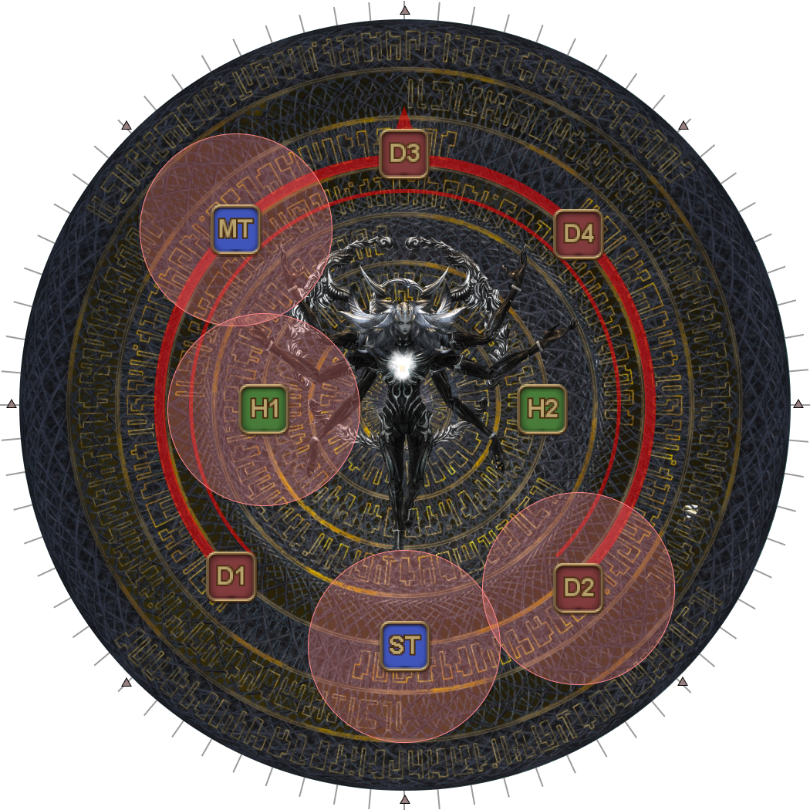
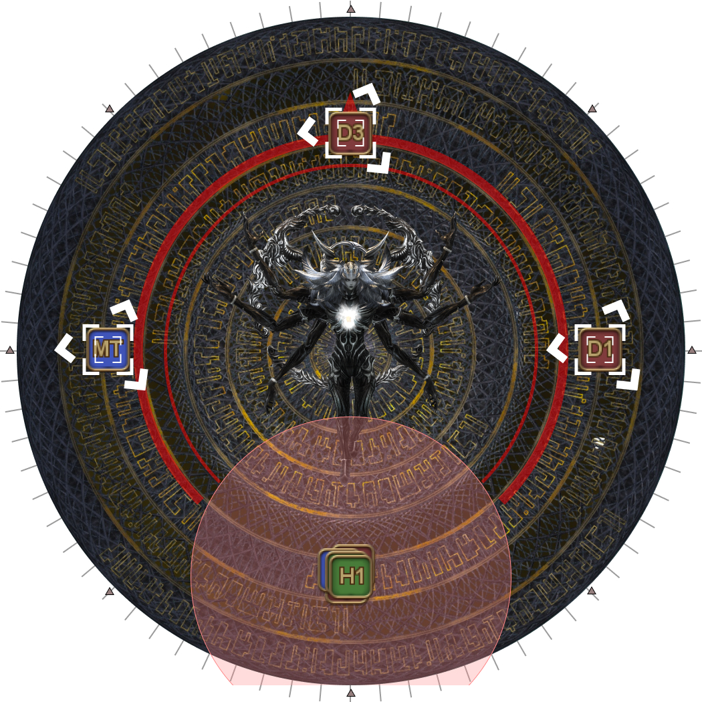
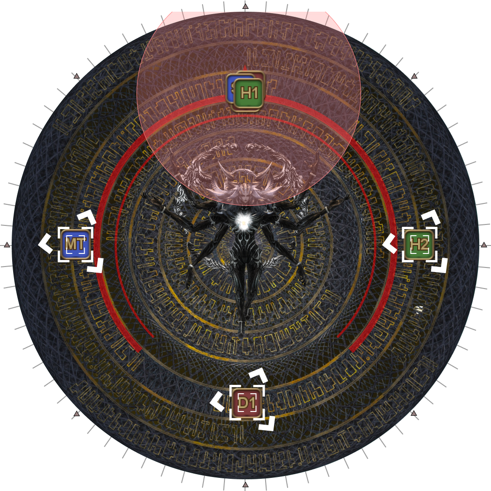
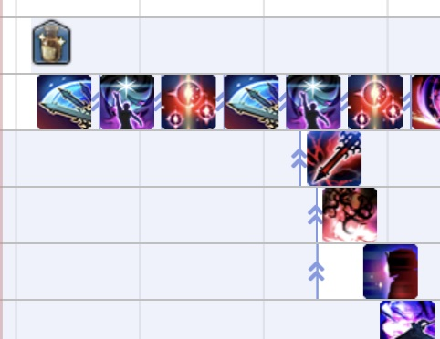

# Alpha Omega

## Mitigations

This phase requires planning out and coordinating mitigations. One such
mitigation plan is:

<table>
  <tr>
    <td colspan="2">All with H2 shields, H2 30s, and:</td>
  </tr>
  <tr>
    <td><b>Cosmo Memory</b></td>
    <td>
      
Tank LB3, MT 90s, ST Reprisal, D1

      
<em>(Tank LB priority: WAR > PLD > DRK > GNB)</em>

    </td>
  </tr>
  <tr>
    <td><b>Cosmo Dive #1</b></td>
    <td>MT Reprisal, H1 120s, D2, D4</td>
  </tr>
  <tr>
    <td><b>Wave Cannon #1</b></td>
    <td>
      
(Invuln) PLD > GNB > DRK > WAR (Mitigate)

      
ST Reprisal, ST 90s, D3

    </td>
  </tr>
  <tr>
    <td><b>Wave Cannon #2</b></td>
    <td>
      
(Invuln) WAR > DRK > GNB > PLD (Mitigate)

      
MT Reprisal, MT 90s, H2 120s, D1

    </td>
  </tr>
  <tr>
    <td><b>Cosmo Dive #2</b></td>
    <td>
ST Reprisal, D2, D4
</td>
  </tr>
  <tr>
    <td><b>Cosmo Meteor</b></td>
    <td>MT Reprisal, ST 90s, H1 120s, D3</td>
  </tr>
</table>

The above mitigation plan was made in the *absence* of jobs that provide more
than one sort of mitigation such as PLD's Passage of Arms, AST's Collective
Unconsciousness, MCH's Dismantle, or RDM's Magick Barrier.

Also note that the tank invuln/mitigation sequence is determined by the tank
*jobs*, and not their *roles*. Keep that in mind if your tank composition does
not follow the standard order (MT: WAR > DRK > GNB > PLD :ST).

---

## Cosmo Memory

Cosmo Memory is a Tank LB3 check- its damage *still* needs to be mitigated in
addition to the Tank LB3.

As far as priorities go, the tank that LB3s should go:

WAR > PLD > DRK > GNB

This will also convert everyone with three stacks of Quickening Dynamis into a
stack of Brilliant Dynamis.

<table>
  <tr>
    <td></td>
    <td>
      
<b>Brilliant Dynamis</b>

      
<em>Burning with dynamis inspired by Omega's passion and exceeding own
      limits.</em>

      <ul>
        <li>When a player with Brilliant Dynamis uses an LB3, the limit break
        gauge will be refilled, and Brilliant Dynamis will turn to Spark of
        Dynamis.</li>
        <li>Mitigates a large portion of damage from Omega.</li>
      </ul>
    </td>
  </tr>
  <tr>
    <td></td>
    <td>
      
<b>Spark of Dynamis</b>

      
<em>Burning with dynamis inspired by Omega's passion.</em>

      <ul>
        <li>Mitigates a large portion of damage from Omega.</li>
      </ul>
    </td>
  </tr>
</table>

The Dynamis buffs are lost when a player dies, which will end up killing that
player for all of Alpha's Omega's mechanics thereafter.

---

## Auto-attacks

Before each mechanic combo starts, Alpha Omega will autoattack twice.

<table>
  <tr>
    <td width="50%">
Alpha Omega's autoattack hit <b>two</b> players:

      <ol>
        <li>Whoever is holding aggro (the MT).</li>
        <li>The <em>furthest</em> player.</li>
      </ol>
      
Ensure the ST is the furthest player taking the autoattacks by having
      them stand outside the targeting circle, while the party stays inside.

    </td>
    <td></td>
  </tr>
</table>

<b>Note:</b> Alpha Omega's auto-attacks <em>ignore</em> tank invulns. Tanks
whose invuln leaves them at 1HP will need to be healed to survive incoming
auto-attacks.

---

## Cosmo Arrow → Cosmo Dive

Alpha Omega autoattacks twice before starting its first mechanic combination.

The first combination of mechanics is Alpha Omega's version of the BRD and DRG
LBs.

Cosmo Arrow fires two sets of line AoEs that travel sideways with each hit. How
the party dodges these is determined by which set of AoEs appeared first.

Cosmo Dive targets the two closest players with a high-damage AoE (which should
be taken by the tanks), and the furthest player with a shared-damgae AoE (the
rest of the party).

<table>
  <th colspan="2" style="text-align:center">Inside first</th>
  <th colspan="2" style="text-align:center">Outside first</th>
  <tr>
    <td width="20%">
<b>1.</b> Inside telegraphs appear.
</td>
    <td width="30%"></td>
    <td width="20%">
<b>1.</b> Outside telegraphs appear.
</td>
    <td></td>
  </tr>
  <tr>
    <td>
<b>2.</b> Outside telegraphs appear.
</td>
    <td></td>
    <td>
<b>2.</b> Inside telegraphs appear.
</td>
    <td></td>
  </tr>
  <tr>
    <td>
<b>3.</b> Inside AoEs resolve.

      <ol>
        <li><b>In</b></li>
        <li style="color:grey">Wait</li>
        <li style="color:grey">Out</li>
        <li style="color:grey">Wait</li>
        <li style="color:grey">Out (spread)</li>
        <li style="color:grey">In</li>
      </ol>
    </td>
    <td></td>
    <td>
<b>3.</b> Outside AoEs resolve.

      <ol>
        <li><b>Out</b></li>
        <li style="color:grey">Wait</li>
        <li style="color:grey">In</li>
        <li style="color:grey">Out (spread)</li>
        <li style="color:grey">In</li>
      </ol>
    </td>
    <td></td>
  </tr>
  <tr>
    <td>
<b>4.</b> Dodge AoEs.

      <ol>
        <li style="color:grey">In</li>
        <li><b>Wait</b></li>
        <li style="color:grey">Out</li>
        <li style="color:grey">Wait</li>
        <li style="color:grey">Out (spread)</li>
        <li style="color:grey">In</li>
      </ol>
    </td>
    <td></td>
    <td>
<b>4.</b> Dodge AoEs.

      <ol>
        <li style="color:grey">Out</li>
        <li><b>Wait</b></li>
        <li style="color:grey">In</li>
        <li style="color:grey">Out (spread)</li>
        <li style="color:grey">In</li>
      </ol>
    </td>
    <td></td>
  </tr>
  <tr>
    <td>
<b>5.</b> Dodge AoEs.

      <ol>
        <li style="color:grey">In</li>
        <li style="color:grey">Wait</li>
        <li><b>Out</b></li>
        <li style="color:grey">Wait</li>
        <li style="color:grey">Out (spread)</li>
        <li style="color:grey">In</li>
      </ol>
    </td>
    <td></td>
    <td>
<b>5.</b> Dodge AoEs.

      <ol>
        <li style="color:grey">Out</li>
        <li style="color:grey">Wait</li>
        <li><b>In</b></li>
        <li style="color:grey">Out (spread)</li>
        <li style="color:grey">In</li>
      </ol>
    </td>
    <td></td>
  </tr>
  <tr>
    <td>
<b>6.</b> Dodge AoEs.

      <ol>
        <li style="color:grey">In</li>
        <li style="color:grey">Wait</li>
        <li style="color:grey">Out</li>
        <li><b>Wait</b></li>
        <li style="color:grey">Out (spread)</li>
        <li style="color:grey">In</li>
      </ol>
    </td>
    <td></td>
    <td>
<b>6.</b> Dodge AoEs.

      <ol>
        <li style="color:grey">Out</li>
        <li style="color:grey">Wait</li>
        <li style="color:grey">In</li>
        <li><b>Out (spread)</b></li>
        <li style="color:grey">In</li>
      </ol>
    </td>
    <td></td>
  </tr>
  <tr>
    <td>
<b>7.</b> Dodge AoEs.

Alpha Omega will start casting Cosmo Dive.

      <ol>
        <li style="color:grey">In</li>
        <li style="color:grey">Wait</li>
        <li style="color:grey">Out</li>
        <li style="color:grey">Wait</li>
        <li><b>Out (spread)</b></li>
        <li style="color:grey">In</li>
      </ol>
    </td>
    <td></td>
    <td>
<b>7.</b> Dodge AoEs.

Alpha Omega will start casting Cosmo Dive.

      <ol>
        <li style="color:grey">Out</li>
        <li style="color:grey">Wait</li>
        <li style="color:grey">In</li>
        <li style="color:grey">Out (spread)</li>
        <li><b>In</b></li>
      </ol>
    </td>
    <td></td>
  </tr>
  <tr>
    <td>
<b>8.</b> Dodge AoEs.

      <ol>
        <li style="color:grey">In</li>
        <li style="color:grey">Wait</li>
        <li style="color:grey">Out</li>
        <li style="color:grey">Wait</li>
        <li style="color:grey">Out (spread)</li>
        <li><b>In</b></li>
      </ol>
    </td>
    <td></td>
    <td>
<b>8.</b> Dodge AoEs.

      <ol>
        <li style="color:grey">Out</li>
        <li style="color:grey">Wait</li>
        <li style="color:grey">In</li>
        <li style="color:grey">Out (spread)</li>
        <li><b>In</b></li>
      </ol>
    </td>
    <td></td>
  </tr>
  <tr>
    <td>
<b>9.</b> Take up Cosmo Dive positions.

    </td>
    <td></td>
    <td>
<b>9.</b> Last AoEs.

Take up Cosmo Dive positions.

    </td>
    <td></td>
  </tr>
  <tr>
    <td>
<b>10.</b> Last AoEs.

Cosmo Dive resolves shortly after.

    </td>
    <td></td>
    <td>
<b>10.</b> Cosmo Dive resolves.

    </td>
    <td></td>
  </tr>
</table>

---

## Unlimited Wave Cannon → Wave Cannon

Alpha Omega autoattacks twice before starting its second combination.

The next combination are two different Wave Cannons.

Unlimited Wave Cannon spawns four staggered "Exaflare" AoEs along an arc
outside the arena in combination to six (large) baited AoEs under each player.

This is resolved by stacking together in the middle of the arena, and observing
where the Exaflare arc begins. The party moves 1.5 waymarks (67 degrees) from
the first Exaflare- this Exaflare would have passed the party by the time they
reach its position, making movement simple.

Wave Cannon is the hard-hitting mechanic with this combination- the party needs
to spread for two sets of four beams before stacking together to share one
hard-hitting beam.

In particular, this final beam deals extra damage to the two front players,
which should be the tanks.

<table>
  <tr>
    <td width="50%">
      
<b>1.</b> Four consecutive Exaflare AoE telegraphs will appear on the
      outside of the arena.

      
The first Exaflare telegraph will appear just before the castbar
      finishes.

      
Stack in the middle to bait AoEs, before moving out, 1.5 markers
      before the first Exaflare telegraph.

    </td>
    <td></td>
  </tr>
  <tr>
    <td>
      
<b>2.</b> Stagger-step on your way out.

      
By the time the third baited AoE appears, the first Exaflare would
      have passed and you should be just outside the boss's targeting circle.

      
Turn and continue baiting AoEs in the same direction that the
      Exaflares spawned.

    </td>
    <td></td>
  </tr>
  <tr>
    <td>
<b>3.</b> There will be six baited AoEs in total.
</td>
    <td></td>
  </tr>
  <tr>
    <td>
      
<b>4.</b> Spread out as Alpha Omega casts Wave Cannon, targeting
      four random players.

    </td>
    <td></td>
  </tr>
  <tr>
    <td>
      
<b>5.</b> Alpha Omega's second set of waves hit the other four
      players.

    </td>
    <td></td>
  </tr>
  <tr>
    <td>
      
<b>6.</b> Stack together East, with both tanks in front to take the
      final shared beam.

      
This is an extremely hard-hitting tankbuster.

      <ul>
        <li><b>MT:</b> Heavy mitigation</li>
        <li><b>ST:</b> Invuln</li>
      </ul>
    </td>
    <td></td>
  </tr>
</table>

---

## Cosmo Arrow → Wave Cannon

 Alpha Omega autoattacks twice before starting its third mechanic combination.

 This Cosmo Arrow is *independent* to the first Cosmo Arrow at the start of the
 phase- it will *not* necessarily be the "opposite" to the first.

 The catch this time as the Wave Cannon in the middle, as the party will now
 need to spread for the two sets of four beams while dodging the Cosmo Arrow.

 The final Wave Cannon beam resolves shortly after Cosmo Arrow finishes.

 <table>
  <th colspan="2" style="text-align:center">Inside first</th>
  <th colspan="2" style="text-align:center">Outside first</th>
  <tr>
    <td width="20%">
<b>1.</b> Inside telegraphs appear.
</td>
    <td width="30%"></td>
    <td width="20%">
<b>1.</b> Outside telegraphs appear.
</td>
    <td></td>
  </tr>
  <tr>
    <td>
<b>2.</b> Outside telegraphs appear.
</td>
    <td></td>
    <td>
<b>2.</b> Inside telegraphs appear.
</td>
    <td></td>
  </tr>
  <tr>
    <td>
<b>3.</b> Inside AoEs resolve.

      <ol>
        <li><b>In</b></li>
        <li style="color:grey">Wait</li>
        <li style="color:grey">Out</li>
        <li style="color:grey">Wait</li>
        <li style="color:grey">Out (spread)</li>
        <li style="color:grey">In</li>
      </ol>
    </td>
    <td></td>
    <td>
<b>3.</b> Outside AoEs resolve.

      <ol>
        <li><b>Out</b></li>
        <li style="color:grey">Wait</li>
        <li style="color:grey">In</li>
        <li style="color:grey">Out (spread)</li>
        <li style="color:grey">In</li>
      </ol>
    </td>
    <td></td>
  </tr>
  <tr>
    <td>
<b>4.</b> Dodge AoEs.

      <ol>
        <li style="color:grey">In</li>
        <li><b>Wait</b></li>
        <li style="color:grey">Out</li>
        <li style="color:grey">Wait</li>
        <li style="color:grey">Out (spread)</li>
        <li style="color:grey">In</li>
      </ol>
    </td>
    <td></td>
    <td>
<b>4.</b> Dodge AoEs.

      <ol>
        <li style="color:grey">Out</li>
        <li><b>Wait</b></li>
        <li style="color:grey">In</li>
        <li style="color:grey">Out (spread)</li>
        <li style="color:grey">In</li>
      </ol>
    </td>
    <td></td>
  </tr>
  <tr>
    <td>
<b>5.</b> Dodge AoEs.

      <ol>
        <li style="color:grey">In</li>
        <li style="color:grey">Wait</li>
        <li><b>Out</b></li>
        <li style="color:grey">Wait</li>
        <li style="color:grey">Out (spread)</li>
        <li style="color:grey">In</li>
      </ol>
    </td>
    <td></td>
    <td>
<b>5.</b> Dodge AoEs.

      <ol>
        <li style="color:grey">Out</li>
        <li style="color:grey">Wait</li>
        <li><b>In</b></li>
        <li style="color:grey">Out (spread)</li>
        <li style="color:grey">In</li>
      </ol>
    </td>
    <td></td>
  </tr>
  <tr>
    <td>
<b>6.</b> Dodge AoEs.

Alpha Omega starts casting Wave Cannon.

      <ol>
        <li style="color:grey">In</li>
        <li style="color:grey">Wait</li>
        <li style="color:grey">Out</li>
        <li><b>Wait</b></li>
        <li style="color:grey">Out (spread)</li>
        <li style="color:grey">In</li>
      </ol>
    </td>
    <td></td>
    <td>
<b>6.</b> Dodge AoEs.

Alpha Omega starts casting Wave Cannon.

      <ol>
        <li style="color:grey">Out</li>
        <li style="color:grey">Wait</li>
        <li style="color:grey">In</li>
        <li><b>Out (spread)</b></li>
        <li style="color:grey">In</li>
      </ol>
    </td>
    <td></td>
  </tr>
  <tr>
    <td>
<b>7.</b> Dodge AoEs.

      <ol>
        <li style="color:grey">In</li>
        <li style="color:grey">Wait</li>
        <li style="color:grey">Out</li>
        <li style="color:grey">Wait</li>
        <li><b>Out (spread)</b></li>
        <li style="color:grey">In</li>
      </ol>
    </td>
    <td></td>
    <td>
<b>7.</b> Dodge AoEs.

      <ol>
        <li style="color:grey">Out</li>
        <li style="color:grey">Wait</li>
        <li style="color:grey">In</li>
        <li style="color:grey">Out (spread)</li>
        <li><b>In</b></li>
      </ol>
    </td>
    <td></td>
  </tr>
  <tr>
    <td>
<b>8.</b> Dodge AoEs.

First set of Wave Cannons resolve.

      <ol>
        <li style="color:grey">In</li>
        <li style="color:grey">Wait</li>
        <li style="color:grey">Out</li>
        <li style="color:grey">Wait</li>
        <li style="color:grey">Out (spread)</li>
        <li><b>In</b></li>
      </ol>
    </td>
    <td></td>
    <td>
<b>8.</b> Dodge AoEs.

First set of Wave Cannons resolve.

      <ol>
        <li style="color:grey">Out</li>
        <li style="color:grey">Wait</li>
        <li style="color:grey">In</li>
        <li style="color:grey">Out (spread)</li>
        <li><b>In</b></li>
      </ol>
    </td>
    <td></td>
  </tr>
  <tr>
    <td>
<b>9.</b> Dodge AoEs.

Second set of Wave Cannons resolve.

      <ol>
        <li style="color:grey">In</li>
        <li style="color:grey">Wait</li>
        <li style="color:grey">Out</li>
        <li style="color:grey">Wait</li>
        <li style="color:grey">Out (spread)</li>
        <li><b>In</b></li>
      </ol>
    </td>
    <td></td>
    <td>
<b>9.</b> Last AoEs.

Second set of Wave Cannons resolve.

      <ol>
        <li style="color:grey">Out</li>
        <li style="color:grey">Wait</li>
        <li style="color:grey">In</li>
        <li style="color:grey">Out (spread)</li>
        <li style="color:grey">In</li>
      </ol>
    </td>
    <td></td>
  </tr>
  <tr>
    <td>
<b>10.</b> Last AoEs.

Move to prepare for the last shared Wave
    Cannon.

    </td>
    <td></td>
    <td>
<b>10.</b> Move to prepare for the last shared Wave Cannon.

    </td>
    <td></td>
  </tr>
  <tr>
    <td colspan="2">
      
<b>11.</b> Stack together East (tanks in front) for the Wave Cannon

      <ul>
        <li><b>MT:</b> Invuln</li>
        <li><b>ST:</b> Heavy mitigations</li>
      </ul>
    </td>
    <td colspan="2"></td>
  </tr>
</table>

---

## Unlimited Wave Cannon → Cosmo Dive

Alpha Omega autoattacks twice before starting its fourth mechanic combination.

This is probably the simplest of all four combinations- dodge Unlimited Wave
Cannon the same way as before, only this time, the party will stay where they
are after dodging the sixth baited AoE to share the Cosmo Dive stack.

The tanks will move forward into the boss's hitbox, with the MT going to the
left, and the ST to the right.

<table>
  <tr>
    <td width="50%">
      
<b>1.</b> Just like before, four consecutive Exaflare AoE telegraphs
      will appear on the outside of the arena.

      
The first Exaflare telegraph will appear just before the castbar
      finishes.

      
Stack in the middle to bait AoEs, before moving out, 1.5 markers
      before the first Exaflare telegraph.

    </td>
    <td></td>
  </tr>
  <tr>
    <td>
      
<b>2.</b> Stagger-step on your way out.

      
By the time the third baited AoE appears, the first Exaflare would
      have passed and you should be just outside the boss's targeting circle.

      
Turn and continue baiting AoEs in the same direction that the
      Exaflares spawned.

    </td>
    <td></td>
  </tr>
  <tr>
    <td>
      
<b>3.</b> There will be six baited AoEs in total.

    </td>
    <td></td>
  </tr>
  <tr>
    <td>
      
<b>4.</b> The party stays where they are outside the boss's targeting
      circle to share one of Cosmo Dive's AoEs, while the MT and ST move
      forward to take the other two.

      <ul>
        <li><b>MT</b>: Go forward and to the left.</li>
        <li><b>ST:</b> Go forward and to the right.</li>
      </ul>
    </td>
    <td></td>
  </tr>
</table>

At this point, the party *should* have rebuilt LB3 from the start of the phase.

This is where the two melee DPS will take turns LB3'ing the boss before the
final major mechanic. The third melee LB3 doesn't happen until the enrage cast.

As a general rule, the DPS LB order goes something like the following, although
this **should be confirmed between the two melee** either at the start of the
encounter, or during the cutscene before P6.

*(Who does the final LB3 during the enrage cast will obviously be
different if either melee is partnered with a DNC.)*

<table>
  <tr>
    <td width="10%" style="text-align:center"></td>
    <td style="text-align:center"><b>DRG</b></td>
    <td style="text-align:center"><b>MNK</b></td>
    <td style="text-align:center"><b>NIN</b></td>
    <td style="text-align:center"><b>RPR</b></td>
    <td style="text-align:center"><b>SAM</b></td>
  </tr>
  <tr>
    <td style="text-align:center"><b>DRG</b></td>
    <td style="text-align:center">X</td>
    <td style="text-align:center">MNK > DRG > DRG</td>
    <td style="text-align:center">NIN > DRG > NIN</td>
    <td style="text-align:center">RPR > DRG > DRG</td>
    <td style="text-align:center">SAM > DRG > DRG</td>
  </tr>
  <tr>
    <td style="text-align:center"><b>MNK</b></td>
    <td style="text-align:center">MNK > DRG > DRG</td>
    <td style="text-align:center">X</td>
    <td style="text-align:center">MNK > NIN > NIN</td>
    <td style="text-align:center">MNK > RPR > MNK</td>
    <td style="text-align:center">SAM > MNK > MNK</td>
  </tr>
  <tr>
    <td style="text-align:center"><b>NIN</b></td>
    <td style="text-align:center">NIN > DRG > NIN</td>
    <td style="text-align:center">MNK > NIN > NIN</td>
    <td style="text-align:center">X</td>
    <td style="text-align:center">NIN > RPR > NIN</td>
    <td style="text-align:center">NIN > SAM > SAM</td>
  </tr>
  <tr>
    <td style="text-align:center"><b>RPR</b></td>
    <td style="text-align:center">RPR > DRG > DRG</td>
    <td style="text-align:center">MNK > RPR > MNK</td>
    <td style="text-align:center">NIN > RPR > NIN</td>
    <td style="text-align:center">X</td>
    <td style="text-align:center">SAM > RPR > SAM</td>
  </tr>
  <tr>
    <td style="text-align:center"><b>SAM</b></td>
    <td style="text-align:center">SAM > DRG > DRG</td>
    <td style="text-align:center">SAM > MNK > MNK</td>
    <td style="text-align:center">NIN > SAM > SAM</td>
    <td style="text-align:center">SAM > RPR > SAM</td>
    <td style="text-align:center">X</td>
  </tr>
</table>

---

## Cosmo Meteor

Alpha Omega autoattacks twice before casting Cosmo Meteor.

This is the final mechanic of the fight, and marks the start to the LB3 rush
this fight is known for.

<table>
  <tr>
    <td width="50%">
      
<b>1.</b> Stack in the center of the arena to bait AoEs.

    </td>
    <td></td>
  </tr>
  <tr>
    <td>
      
<b>2.</b> When the telegraphed AoE appears, spread out to your
      waymarked positions, and Caster LB3 targeting the center after
      dodging the telegraphed AoE.

    </td>
    <td></td>
  </tr>
  <tr>
    <td>
      
<b>3.</b> Two large Cosmo Meteors will spawn North and South, and five
      small Cosmo Comets will spawn around the edge of the boss's hitbox.

      
The Caster LB3 will destroy all the Cosmo Comets, and damage the
      Meteors.

      
<b>Do not attack the Comets and Meteors</b> during this period,
      focusing on Alpha Omega instead.

      
Four random players get an untelegraphed AoE on them. Healers can move
      back in closer to the center to heal the party.

    </td>
    <td></td>
  </tr>
  <tr>
    <td>
      
<b>4.</b> The four players that weren't hit by the untelegraphed AoEs
      now get hit.

    </td>
    <td></td>
  </tr>
  <tr>
    <td>
      
<b>5.</b> After the Caster LB3 resolves, the party will take a second
      set of Cosmo Meteor AoEs, targeting players four at a time.

    </td>
    <td></td>
  </tr>
  <tr>
    <td>
      
<b>6.</b> Like the previous set of Cosmo Meteor AoEs, the four players
      that weren't hit before now get hit.

    </td>
    <td></td>
  </tr>
  <tr>
    <td>
      
<b>7.</b> When the Limit Break bar replenishes, use a Ranged LB3 from
      North (or south) to finish off the two Cosmo Meteors.

      
Around the same time, three Flare markers will appear on three random
      players.

      
Because D3 is in the middle of their LB3, <b>they will not be able to
      move</b>, and the party will need to adjust around D3 depending on
      whether D3 has a Flare marker.

    </td>
    <td></td>
  </tr>
  <tr>
    <td>
      
<b>8.</b> Have the three Flare markers move to cardinal locations. One
      of the remaining five players will be targeted for an untelegraphed
      shared damage AoE.

      <ul>
        <li><b>If D3 has a Flare:</b> Flare players go N (D3), W, and E. The
        party stacks S.</li>
        <li><b>If D3 does not have a Flare:</b> Flare players go S, W, and E.
        The party stacks N.</li>
      </ul>
    </td>
    <td>
      
      
    </td>
  </tr>
</table>

---

## Magic Number

From here, Alpha Omega will cast Magic Number, which *must* be mitigated with
a Tank LB3. Magic Number will also apply a debuff by the same name on all
members of the party, which must be dispelled with a Healer LB3.

<table>
  <tr>
    <td></td>
    <td>
      
<em>Affected by a factor that Omega previously considered meaningless.
      This effect can be dispelled via healer limit break.</em>

      <ul>
        <li>Kills the player when the debuff timer (6s) expires.</li>
        <li>This debuff can only be removed via Healer LB3.</li>
      </ul>
    </td>
  </tr>
</table>

Alpha Omega will do a second Magic Number (requiring another Tank into Healer
LB3) before casting Run: \*\*\*\*mi\* (which is a 30-second cast) as the hard
enrage of the fight.

The tanks and healers will typically follow a *"MT group" > "ST group"*
priority, although this is affected by whether a DRK is going to do the
"suicide strat" (see the [FAQ](#frequently-asked-questions)).

<table>
  <tr>
    <td><b>Tanks</b></td>
    <td>DRK > MT > ST</td>
  </tr>
  <tr>
    <td><b>Healers</b></td>
    <td>H1 > H2</td>
  </tr>
</table>

Note that after the second healer LB3, the Limit Gauge will refill, giving one
final melee LB3 during the enrage cast.

---

## Buff windows

There are three buff windows in P6, and each player can use a potion once.

However, because players will be taking turns LB3'ing, some players will prefer
not to use their potions at certain buff windows.

<table>
  <tr>
    <td>
      <b>1. Opener</b>
    </td>
    <td>
      
The tank that LB3s <b>should not</b> use potions here.

      
If you did not use potions immediately at the end of Delta, they will
      not be available here.

    </td>
  </tr>
  <tr>
    <td>
      <b>2. Immediately after Wave Cannon #2</b>
    </td>
    <td>
      
If 2-minute buffs are delayed here, the next 2-minute window will be
      cut short by the enrage.

      
Healers and Casters <b>should not</b> use potions here because of
      upcoming movement.

      
Melee DPS <em>can</em> use potions here, but be careful as both melees
      will need to LB3 after dodging Exaflares, and have them finish before
      Cosmo Meteor starts.

    </td>
  </tr>
  <tr>
    <td>
      <b>3. Halfway into the enrage cast</b>
    </td>
    <td>
      
The melee that will LB3 after the Healer LB3s <b>should not</b> use
      potions here.

      
Potions should be used immediately after the second Healer LB3 (when
      Run: ****mi* starts) to get the full use before the enrage resolves.

      
2-minute buffs will come up <em>halfway</em> into the pot duration and
      may be clipped by the enrage depending on their duration, and how much
      they were delayed after Wave Cannon #2.

    </td>
  </tr>
</table>

---

## Frequently Asked Questions

  <b>[Death Wall]</b> Will the Death Wall kill you if you use an ability while
  still in it (similar to resurrection invulnerability)?

<table>
  <tr>
    <td>
      
No, it won't. The death wall activates based on time, not player
      activity.

    </td>
  </tr>
</table>

  <b>[Cosmo Memory]</b> Why is the tank LB3 priority WAR > PLD > DRK > GNB?

<table>
  <tr>
    <td>
      
Which tank should LB3 is determined by who loses the least from doing
      so.

      
Because a WAR's and a DRK's burst is based on stacks with a very
      lenient timer (Inner Release and Delirium), it is very flexible.

      
WAR and DRK get to use their 1m cooldowns on time with the rest of the
      party and still get the full benefit of their cooldowns, losing only a
      couple of filler GCDs.

      
In contrast, PLD and GNB have their bursts on a timer (Fight or Flight
      and No Mercy), and their rotation revolves around getting as many attacks
      in that buff window as they can.

      
As a result, a PLD or GNB either has to desynchronise with the party
      raid buffs, or give up GCDs in their own window, neither of which are
      attractive choices.

    </td>
  </tr>
</table>

  <b>[Cosmo Memory]</b> Isn't this overmitigated?

<table>
  <tr>
    <td>
      
It is- you really only need two pieces of mitigation in addition to
      the Tank LB3 to survive Cosmo Memory.

      
However, doing so means that it's okay to drop one of the tank
      mitigations (whoever LBs) and still survive. You can also save the H2 a
      GCD putting up shields.

      
The MT90s here is because you can use it here and have it back up for
      Wave Cannon 2. More importantly, it puts the 90s on cooldown so it's
      <em>not</em> available in Wave Cannon 1 (so it's not accidentally used at
      the wrong place).

    </td>
  </tr>
</table>

  <b>[Wave Cannon]</b> Does it matter which tank is in front?

<table>
  <tr>
    <td>
      
No, the player in front does not take extra damage compared to the
      second player.

      
<em>(Of course, if a PLD is using Passage of Arms, they should be in
      front.)</em>

    </td>
  </tr>
</table>

  <b>[Wave Cannon]</b> Why does the ST invuln first and not the MT?

<table>
  <tr>
    <td>
      
If you happen to have a GNB (MT) + PLD (ST) for tanks, PLD must
      Hallowed Ground the first Solar Ray (before Delta) for them to get a
      Hallowed Ground use in P6.

      
This then means the GNB would have to Superbolide the second Solar
      Ray (before Sigma), and if so, Superbolide won't be up in time for
      Wave Cannon #1.

    </td>
  </tr>
</table>

  <b>[Magic Number]</b> What is the DRK suicide strat?

<table>
  <tr>
    <td>
      
The DRK suicide strat involves the DRK <b>cancelling</b> the Tank LB3s
      at Magic Number.

      
This results in the DRK dying, but quickly getting revived by the
      follow-up Healer LB3, <em>with full MP</em>, resulting in a
      <em>slight</em> DPS gain, assuming the DRK was able to empty out their MP
      bar before.

      
The DRK can do this for both Magic Numbers (and generate enough Blood
      for Living Shadow in time for the last 2-minute window).

      
Note that in order for this to work, the <b>DRK must LB3 first</b>, as
      dying will remove the Brilliant Dynamis buff that refills the LB gauge.

      
You can use a macro to help instead of manually cancelling the Tank LB:

      <pre>/merror off
/statusoff "Dark Force"
/statusoff "Gunmetal Soul"
/statusoff "Land Waker"
/statusoff "Last Bastion"</pre>
    </td>
    <td></td>
  </tr>
</table>

---

## Troubleshooting

  <b>[Limit Break]</b> We only have LB2 at the end of Cosmo Dive 2- what happened?

<table>
  <tr>
    <td>
      
If you have a MCH in your party, check where they are using <em>Dismantle</em>.

      
The reason behind this is due to how LB is generated.- LB is generated
      whenever someone survives damage that is equal to or greater than their
      current HP due to mitigation or shields.

      
However, there is some fine print- the order of operations are:

      <ol>
        <li>Apply debuffs <em>(Reprisal, Addle, Dismantle, Feint)</em></li>
        <li><b>Generate LB if damage is lethal</b></li>
        <li>Apply mitigations <em>(Aquaveil, Kerachole, Sacred Soil, Third Eye,
        etc.)</em></li>
        <li>Absorb damage from shields <em>(Divine Veil, Shade Shift, Succor)</em></li>
      </ol>
      
The problem is that if enough debuffs are on the boss at Step 1, the
      damage at Step 2 is <em>no longer lethal</em>, and thus, <em>LB is not
      generated.</em>

      
Take note:

      <ul>
        <li>This specifically affects a MCH's <em>Dismantle</em> because
        it is the only boss <b>debuff</b> that's not part of the standard suite
        <em>(Addle, Feint, Reprisal)</em>.</li>
        <li>Other "extra mitigations" like <em>Passage of Arms</em>, <em>Magick
        Barrier</em>, <em>Collective Unconsciousness</em>, etc. <b>do not</b>
        affect LB generation, because they are applied at Step 3 instead.</li>
        <li>Similarly, additional shields (<em>Catalyze</em>, <em>Neutral
        Sect</em>, <em>Zoe</em>) also <b>do not</b> affect LB generation,
        because they are applied at Step 4.</li>
      </ul>
      
The initial eight beams for Wave Cannon are particularly susceptible
      to being overmitigated this way, as their base damage isn't much more
      than a player's max HP- layering <em>Dismantle</em> on top of
      <em>Reprisal</em> will likely push their damage below a player's HP,
      thus denying LB generation.

      
If you want to <em>Dismantle</em>, do it for the final Wave Cannon
      stack <em>only</em>.

    </td>
  </tr>
</table>

  <b>[Unlimited Wave Cannon]</b> I can't identify the starting point, and which
  direction to go!

<table>
  <tr>
    <td>
      
The first telegraph appears near the end of the cast, when the cast
      bar reaches the "nn" at the end of "Unlimited Wave Cannon".

      
If you don't see a telegraph, rotate your camera until you see one,
      and pay attention to the empty spot adjacent.

      
Then, one of two things may happen:

      <ul>
        <li>If <b>no</b> telegraph appears at the empty spot, then you are looking
        at the starting point.</li>
        <li>Otherwise, <b>if a telegraph appears</b>, then you are looking
        downstream of the Exaflare sequence, and the starting point is the
        other end of the Exaflare telegraphs.</li>
      </ul>
      
Alternatively, you can wait to <em>after the boss's second
      auto-attack</em> to briefly go out towards the edge of the arena to get
      better view of the whole arena before joining the party in the middle.

    </td>
  </tr>
</table>

