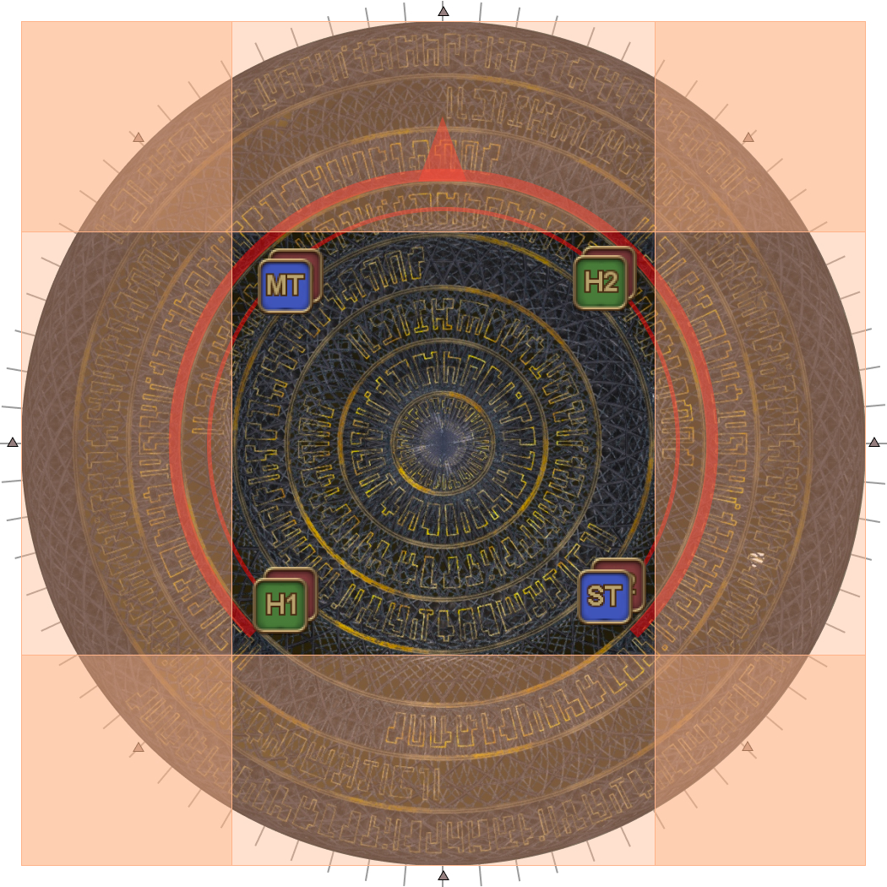
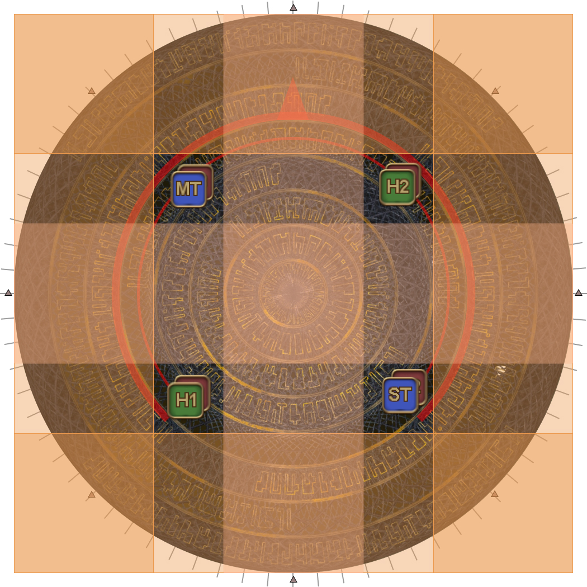
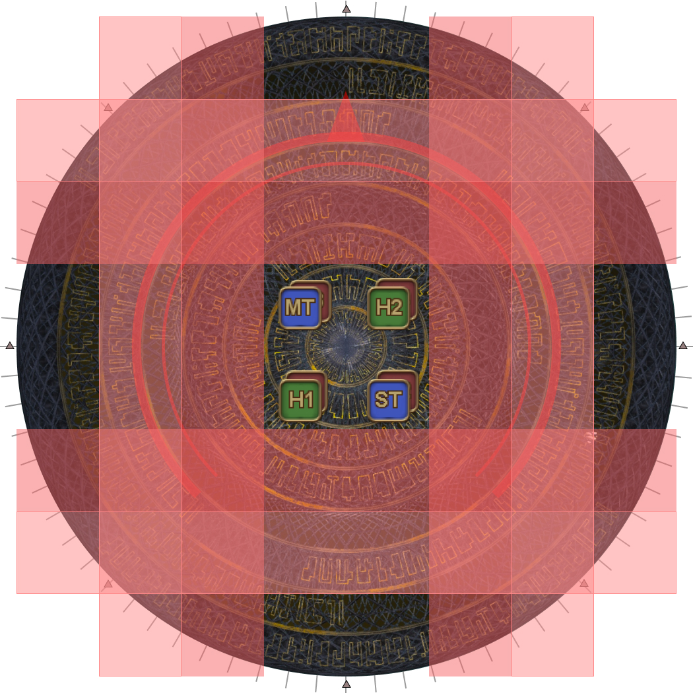
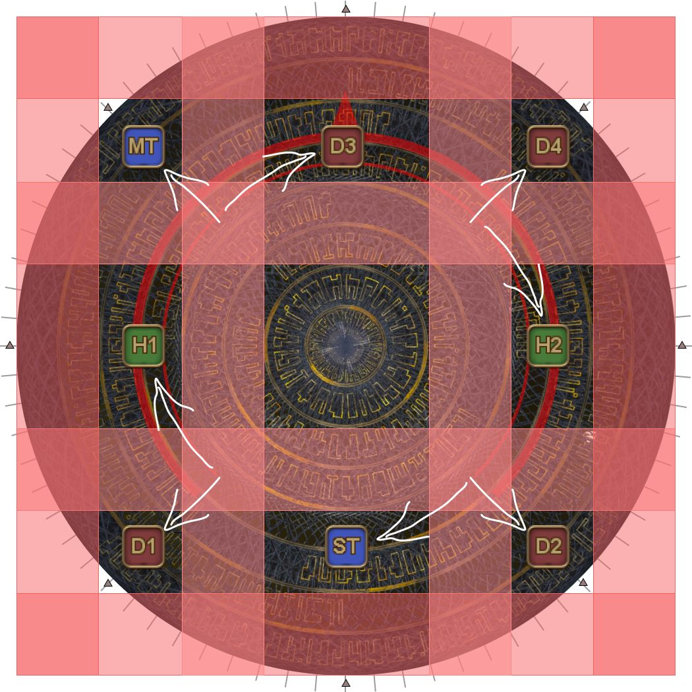
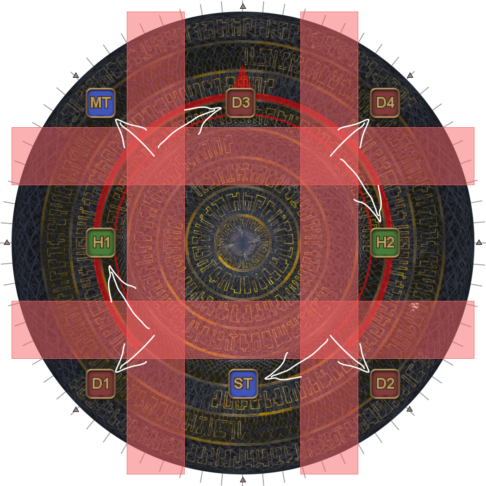
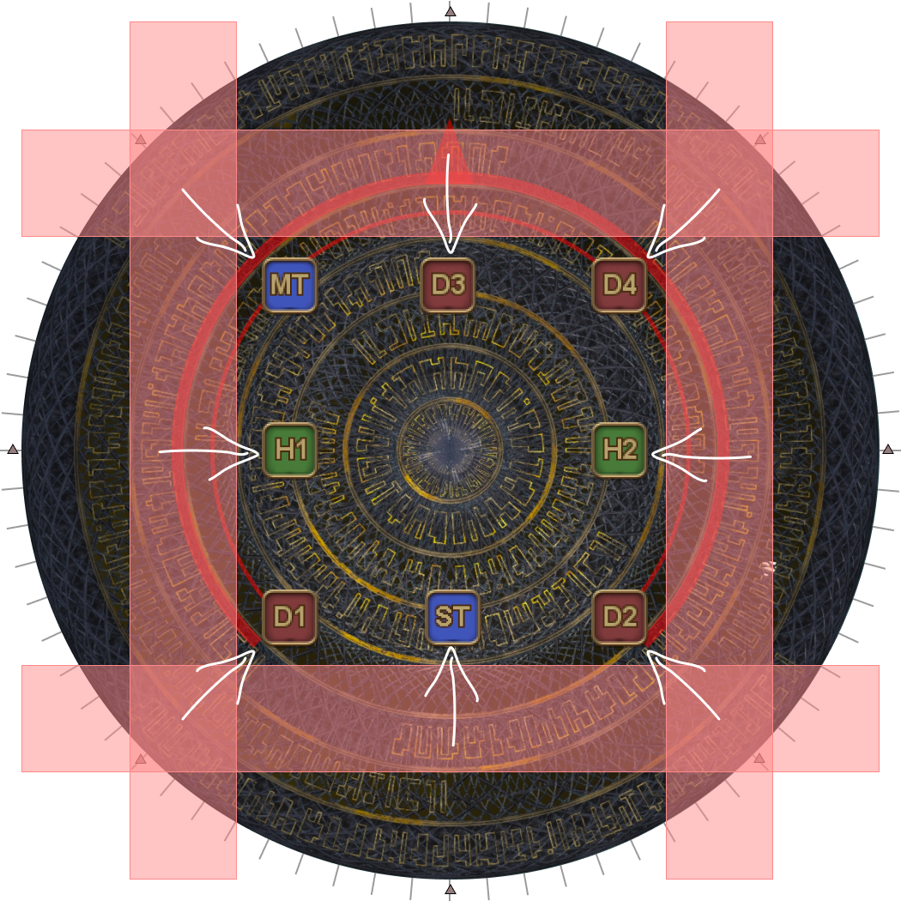
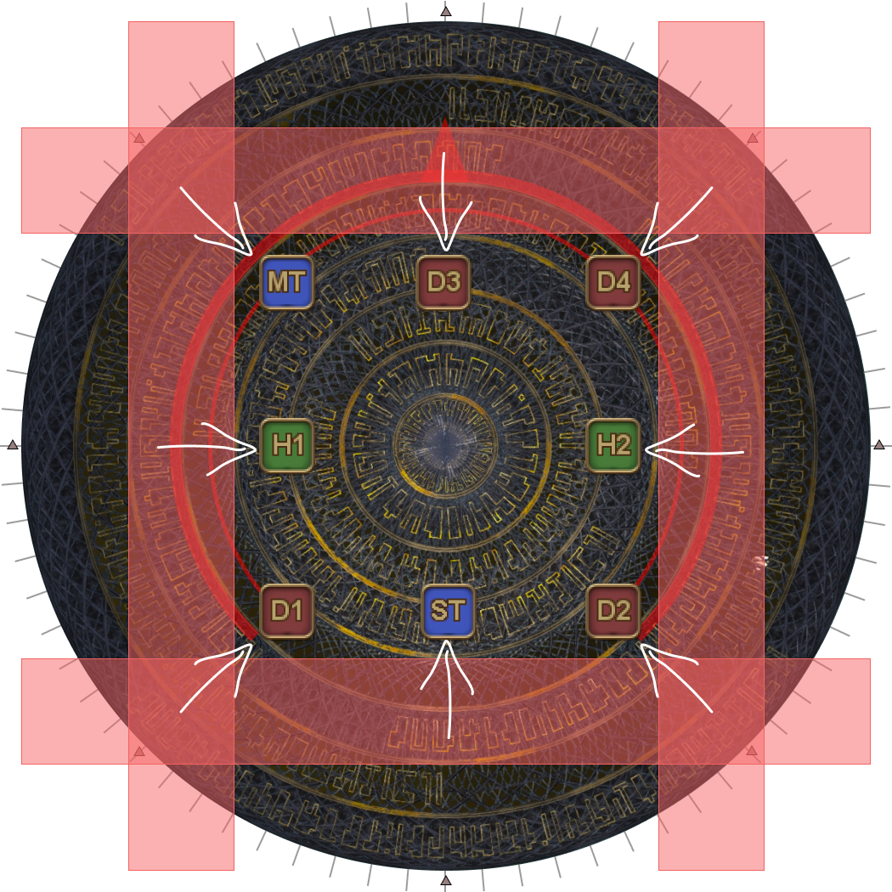
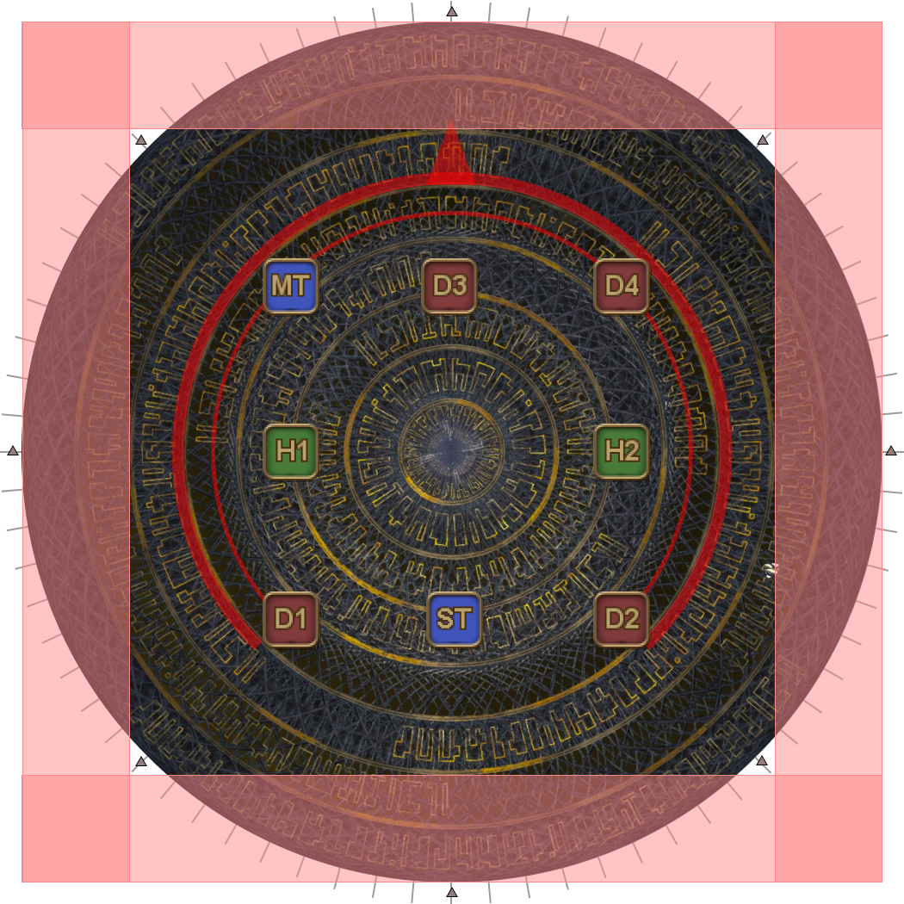
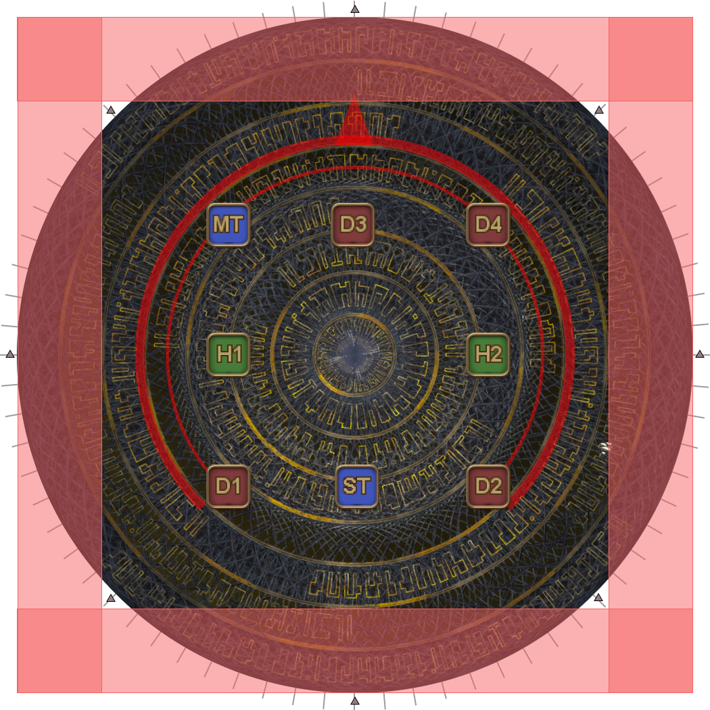
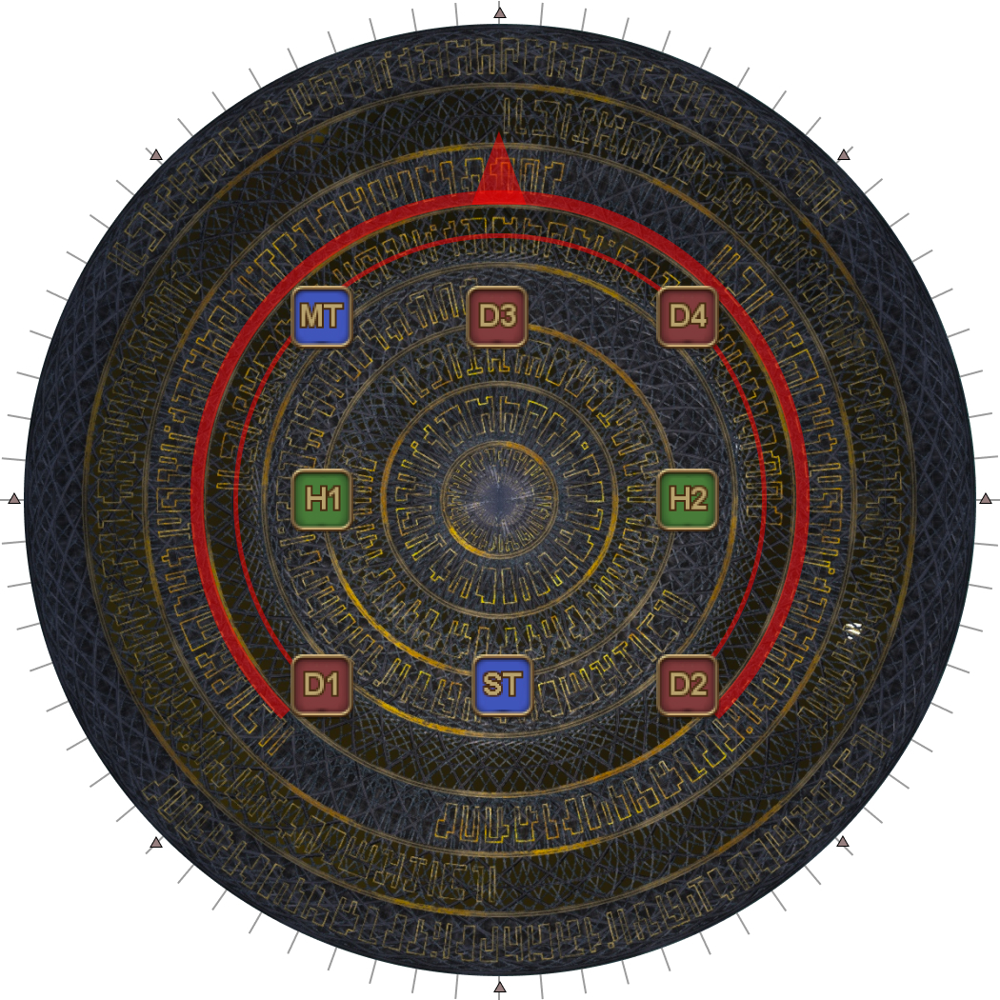

# Alpha Omega

<b>UNDER CONSTRUCTION!</b>

## Mitigations

This phase requires planning out and coordinating mitigations. One such mitigation plan is:

<table>
  <tr>
    <td><b>Cosmo Memory</b></td>
    <td>
MT Reprisal, MT 90s, H2 shields, H2 30s, ST LB3, D1
</td>
  </tr>
  <tr>
    <td><b>Cosmo Dive #1</b></td>
    <td>ST Reprisal, ST 90s, H1 120s, H2 shields, H2 30s, D4</td>
  </tr>
  <tr>
    <td><b>Wave Cannon #1</b></td>
    <td>MT Reprisal, H2 shields, H2 30s, H2 120s, D2, D3</td>
  </tr>
  <tr>
    <td><b>Wave Cannon #2</b></td>
    <td>
MT 90s, ST Reprisal, H2 shields*, H2 30s, H2 120s, D1

<em>* Expedient/Holos vs Consolation/Panhaima</em>
</td>
  </tr>
  <tr>
    <td><b>Cosmo Dive #2</b></td>
    <td>
MT Reprisal, ST 90s, H2 shields, H2 30s*, D4

<em>* Expedient/Holos vs Consolation/Panhaima</em>
</td>
  </tr>
  <tr>
    <td><b>Cosmo Meteor</b></td>
    <td>ST Reprisal, H1 120s, H2 shields, H2 30s, D2, D3</td>
  </tr>
</table>

The above mitigation plan was made in the *absence* of jobs that provide more than one sort of mitigation such as PLD's Passage of Arms, AST's Collective Unconsciousness, MCH's Dismantle, or RDM's Magick Barrier.

## Cosmo Memory

Cosmo Memory is a Tank LB3 check- its damage *still* needs to be mitigated in addition to the Tank LB3.

## Cosmo Arrow

Alpha Omega's version of the ranged LB3 fires two sets of line AoEs that travel sideways with each hit.

How the party dodges these is determined by which set of AoEs appeared first.

<table>
  <th colspan="2" style="text-align:center">Inside first</th>
  <th colspan="2" style="text-align:center">Outside first</th>
  <tr>
    <td width="20%">
<b>1.</b> Inside telegraphs appear.
</td>
    <td width="30%"></td>
    <td width="20%">
<b>1.</b> Outside telegraphs appear.
</td>
    <td></td>
  </tr>
  <tr>
    <td>
<b>2.</b> Outside telegraphs appear.
</td>
    <td></td>
    <td>
<b>2.</b> Inside telegraphs appear.
</td>
    <td></td>
  </tr>
  <tr>
    <td>
<b>3.</b> Inside AoEs resolve.
</td>
    <td></td>
    <td>
<b>3.</b> Outside AoEs resolve.
</td>
    <td></td>
  </tr>
  <tr>
    <td>
<b>4.</b> Dodge AoEs.

      <ol>
        <li><b>In</b></li>
        <li style="color:grey">Wait</li>
        <li style="color:grey">Out</li>
        <li style="color:grey">Wait</li>
        <li style="color:grey">Out (spread)</li>
        <li style="color:grey">In</li>
      </ol>
    </td>
    <td></td>
    <td>
<b>4.</b> Dodge AoEs.

      <ol>
        <li><b>Out</b></li>
        <li style="color:grey">Wait</li>
        <li style="color:grey">In</li>
        <li style="color:grey">Out (spread)</li>
        <li style="color:grey">In</li>
      </ol>
    </td>
    <td></td>
  </tr>
  <tr>
    <td>
<b>5.</b> Dodge AoEs.

      <ol>
        <li style="color:grey">In</li>
        <li><b>Wait</b></li>
        <li style="color:grey">Out</li>
        <li style="color:grey">Wait</li>
        <li style="color:grey">Out (spread)</li>
        <li style="color:grey">In</li>
      </ol>
    </td>
    <td></td>
    <td>
<b>5.</b> Dodge AoEs.

      <ol>
        <li style="color:grey">Out</li>
        <li><b>Wait</b></li>
        <li style="color:grey">In</li>
        <li style="color:grey">Out (spread)</li>
        <li style="color:grey">In</li>
      </ol>
    </td>
    <td></td>
  </tr>
  <tr>
    <td>
<b>6.</b> Dodge AoEs.

      <ol>
        <li style="color:grey">In</li>
        <li style="color:grey">Wait</li>
        <li><b>Out</b></li>
        <li style="color:grey">Wait</li>
        <li style="color:grey">Out (spread)</li>
        <li style="color:grey">In</li>
      </ol>
    </td>
    <td></td>
    <td>
<b>6.</b> Dodge AoEs.

      <ol>
        <li style="color:grey">Out</li>
        <li style="color:grey">Wait</li>
        <li><b>In</b></li>
        <li style="color:grey">Out (spread)</li>
        <li style="color:grey">In</li>
      </ol>
    </td>
    <td></td>
  </tr>
  <tr>
    <td>
<b>7.</b> Dodge AoEs.

      <ol>
        <li style="color:grey">In</li>
        <li style="color:grey">Wait</li>
        <li style="color:grey">Out</li>
        <li><b>Wait</b></li>
        <li style="color:grey">Out (spread)</li>
        <li style="color:grey">In</li>
      </ol>
    </td>
    <td></td>
    <td>
<b>7.</b> Dodge AoEs.

      <ol>
        <li style="color:grey">Out</li>
        <li style="color:grey">Wait</li>
        <li style="color:grey">In</li>
        <li><b>Out (spread)</b></li>
        <li style="color:grey">In</li>
      </ol>
    </td>
    <td></td>
  </tr>
  <tr>
    <td>
<b>8.</b> Dodge AoEs.

      <ol>
        <li style="color:grey">In</li>
        <li style="color:grey">Wait</li>
        <li style="color:grey">Out</li>
        <li style="color:grey">Wait</li>
        <li><b>Out (spread)</b></li>
        <li style="color:grey">In</li>
      </ol>
    </td>
    <td></td>
    <td>
<b>8.</b> Dodge AoEs.

      <ol>
        <li style="color:grey">Out</li>
        <li style="color:grey">Wait</li>
        <li style="color:grey">In</li>
        <li style="color:grey">Out (spread)</li>
        <li><b>In</b></li>
      </ol>
    </td>
    <td></td>
  </tr>
  <tr>
    <td>
<b>9.</b> Dodge AoEs.

      <ol>
        <li style="color:grey">In</li>
        <li style="color:grey">Wait</li>
        <li style="color:grey">Out</li>
        <li style="color:grey">Wait</li>
        <li style="color:grey">Out (spread)</li>
        <li><b>In</b></li>
      </ol>
    </td>
    <td></td>
    <td>
<b>9.</b> Last AoEs.

      <ol>
        <li style="color:grey">Out</li>
        <li style="color:grey">Wait</li>
        <li style="color:grey">In</li>
        <li style="color:grey">Out (spread)</li>
        <li style="color:grey">In</li>
      </ol>
    </td>
    <td></td>
  </tr>
  <tr>
    <td>
<b>10.</b> Last AoEs.

      <ol>
        <li style="color:grey">In</li>
        <li style="color:grey">Wait</li>
        <li style="color:grey">Out</li>
        <li style="color:grey">Wait</li>
        <li style="color:grey">Out (spread)</li>
        <li style="color:grey">In</li>
      </ol>
    </td>
    <td></td>
    <td>
<b>10.</b> Nothing to do!

      <ol>
        <li style="color:grey">Out</li>
        <li style="color:grey">Wait</li>
        <li style="color:grey">In</li>
        <li style="color:grey">Out (spread)</li>
        <li style="color:grey">In</li>
      </ol>
    </td>
    <td></td>
  </tr>
</table>