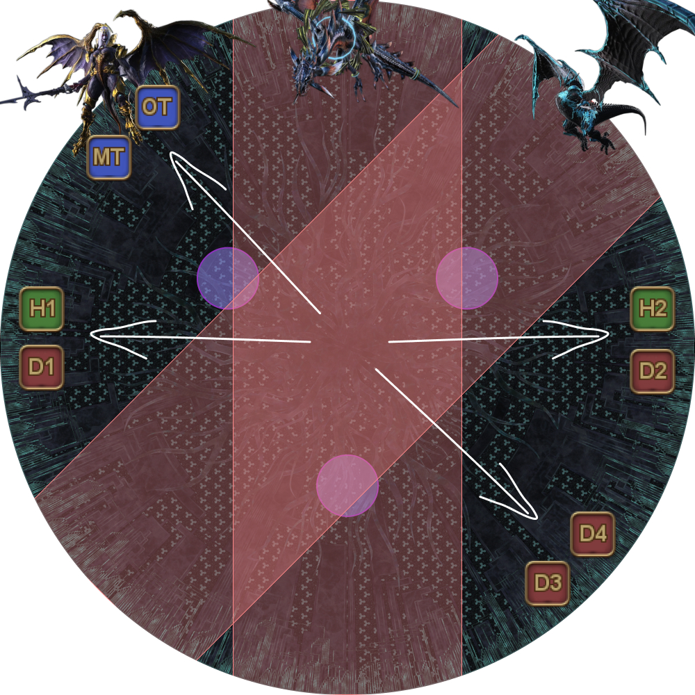
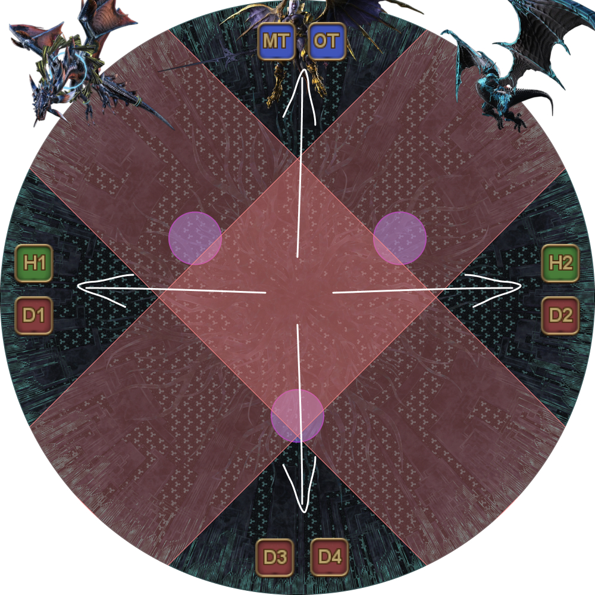
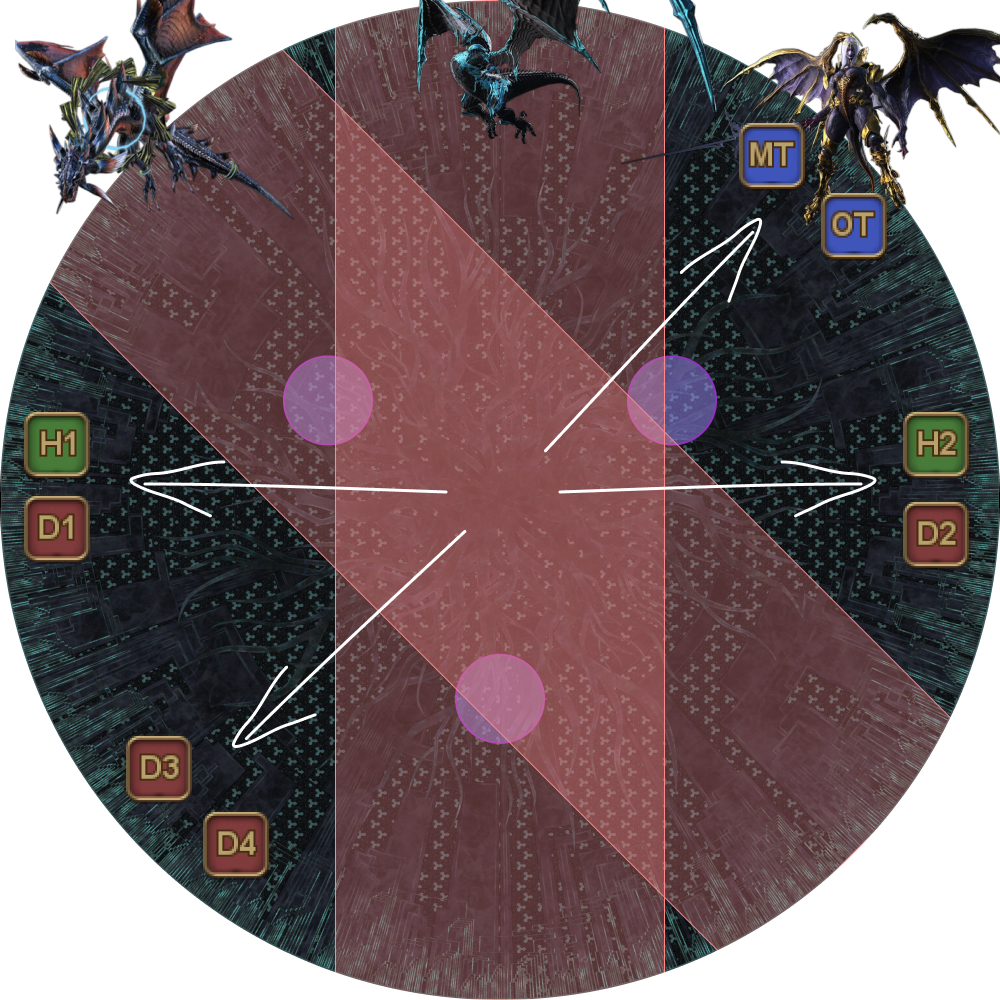
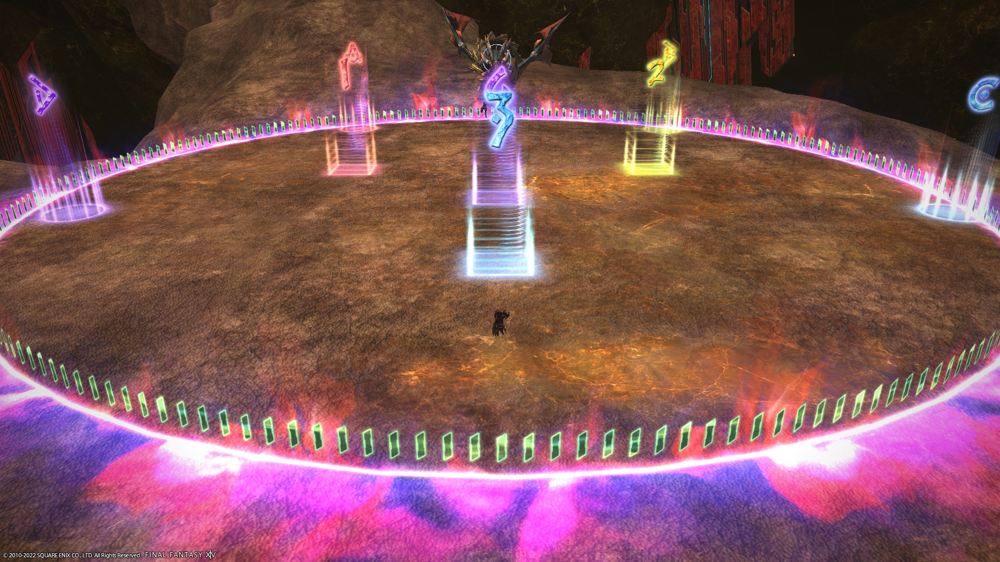

# The Unending Coil of Bahamut (Ultimate)

PF largely follows [Clees' UCoB guide](http://clees.me/guides/ucob/) with a few differences:

- Neurolinks are placed in an inverted triangle.
- Blackfire Trio towers are flipped for tanks and healers (healers take the tower closer to the Megaflare stack).
- Heavensfall Trio spread positions are different (both tanks always go towards Nael, both ranged always opposite Nael).
<table>
  <tr>
    <td></td>
    <td></td>
    <td></td>
  </tr>
</table>

- Tenstrike Trio is done with one safe spot (the south marker) instead of two.

### BiS Notes

- Any gear at or above **i470** will have their substats capped.
- Relic weapons will have their substats capped at **127**.
- The lowest potions you can use and still get maximum benefits are **HQ Grade 3 Tinctures**.

## English

```

```

## Japanese

```

```

## Markers

**Twintania:**
- `123`: Neurolink positions.
- `3`: Stack position for transition to Nael.

**Nael:**
- `3`: Stack position for transition to Bahamut.
- `4`: Stack position for Thermionic Beam, Fire tethers.

**Bahamut Prime:**
- The `ABCD` markers are for Earthshakers in Tenstrike Trio.
- `123`: Spawn positions for bosses during Fellruin Trio. Knockback boundary for Heavensfall Trio.
- `3`: Safe spot for Tenstrike Trio. It should be a square for players to communicate their second Earthshaker positions.
- `4`: Stack point at the start of Blackfire Trio and the end of Heavensfall Trio. It is also used to see whether Bahamut is on a cardinal or intercardinal position during Grand Octet (edge = cardinal, corner = intercardinal).

**Golden Bahamut:**
- `3`: Where tanks will stack for the first Akh Morn in Golden Bahamut.


<details markdown=block>
<summary>XIVLauncher WaymarkPresetPlugin positions</summary>

```json
{
  "Name":"UCoB",
  "MapID":280,
  "A":{"X":-11.472,"Y":0.0,"Z":-16.383,"ID":0,"Active":true},
  "B":{"X":11.47153,"Y":0.0,"Z":-16.383,"ID":1,"Active":true},
  "C":{"X":19.31852,"Y":0.0,"Z":5.176381,"ID":2,"Active":true},
  "D":{"X":-19.319,"Y":0.0,"Z":5.176,"ID":3,"Active":true},
  "One":{"X":-7.57,"Y":0.0,"Z":-4.38,"ID":4,"Active":true},
  "Two":{"X":7.57,"Y":0.0,"Z":-4.38,"ID":5,"Active":true},
  "Three":{"X":0.0,"Y":0.0,"Z":8.75,"ID":6,"Active":true},
  "Four":{"X":0.0,"Y":0.0,"Z":0.0,"ID":7,"Active":true}
}
```

</details>

## Resources

[**Nael divebombs**](https://freehaha.github.io/nael-dive/)