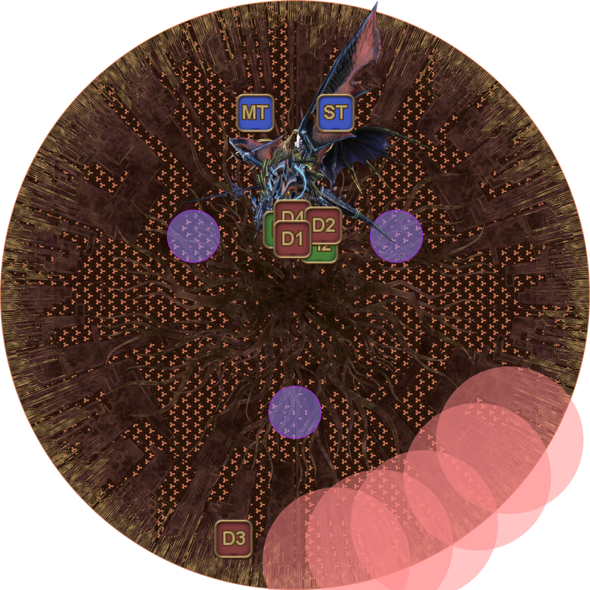
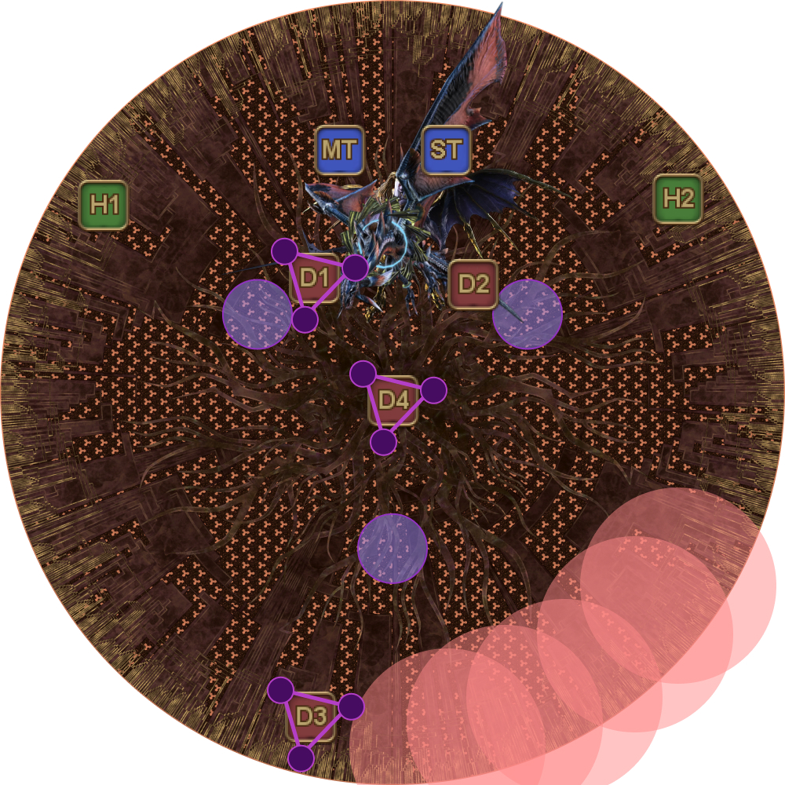
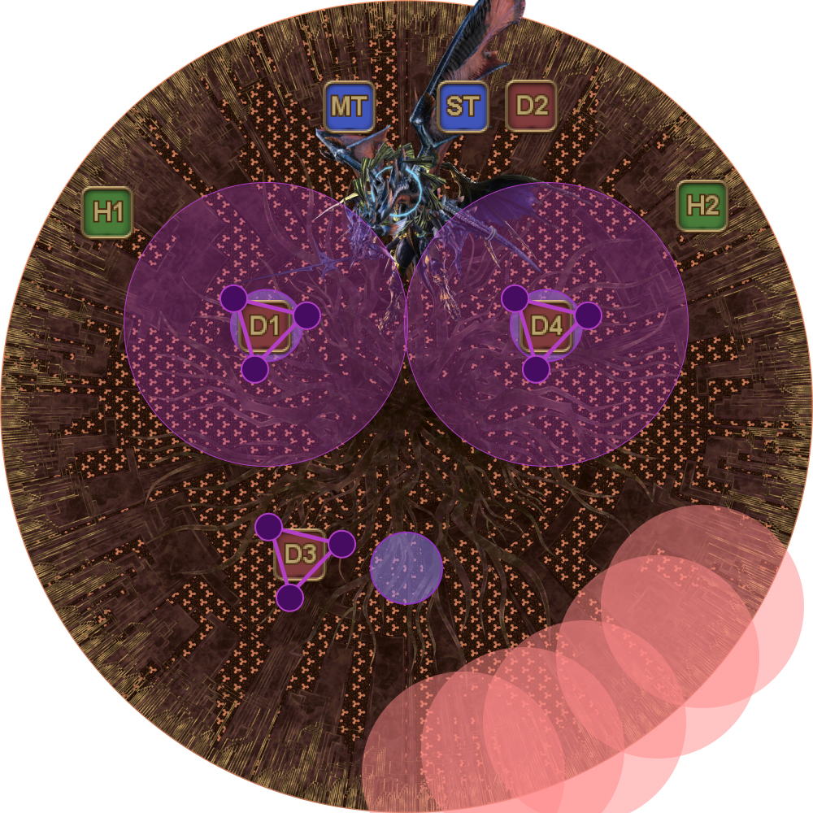
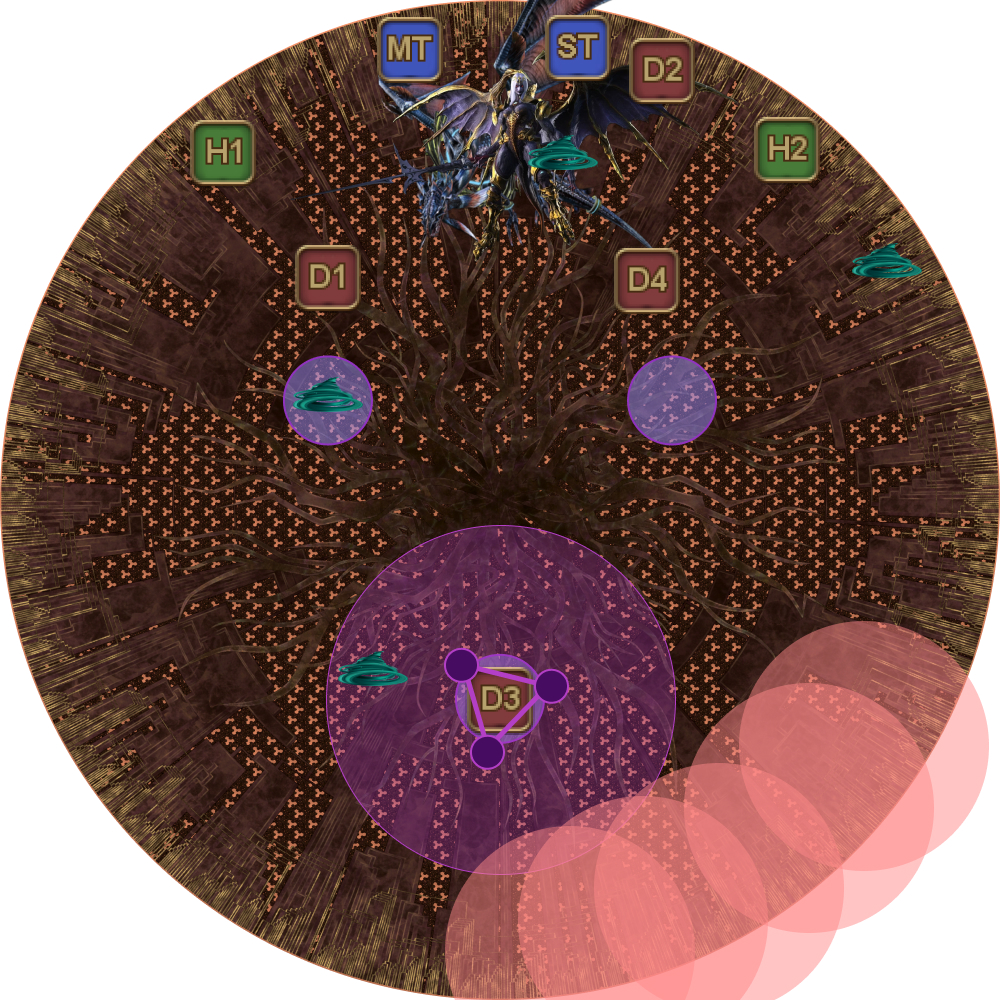
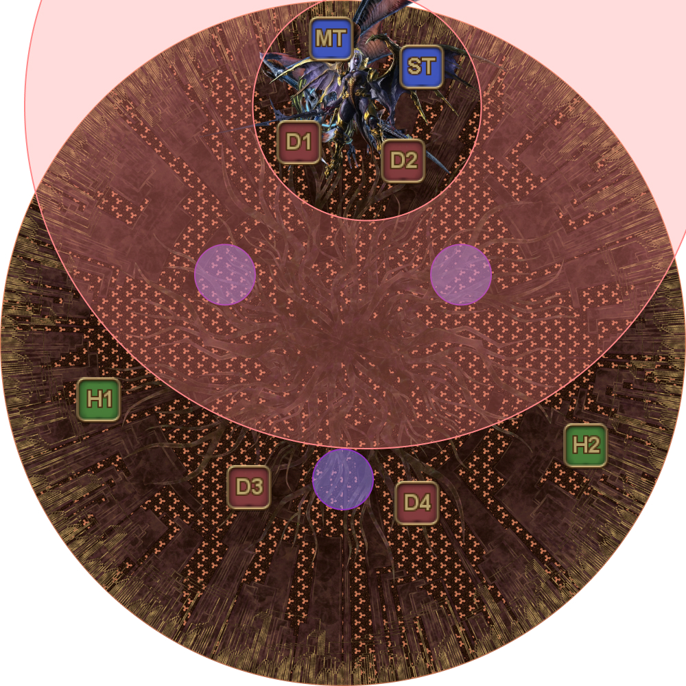
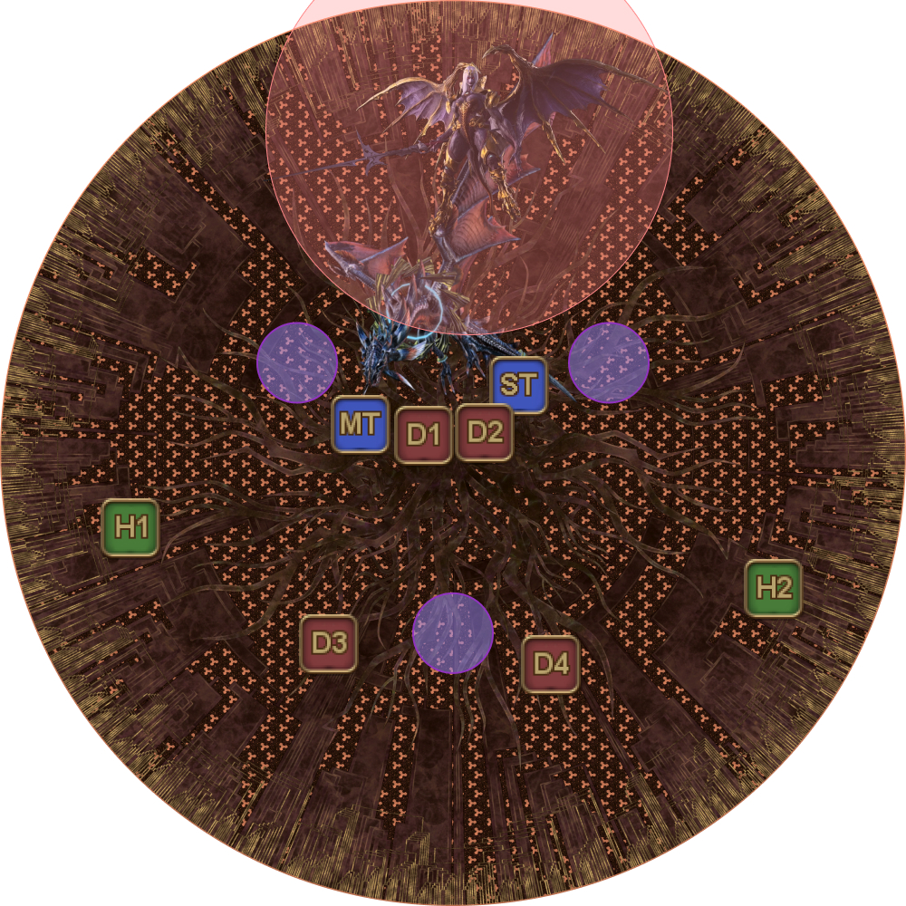
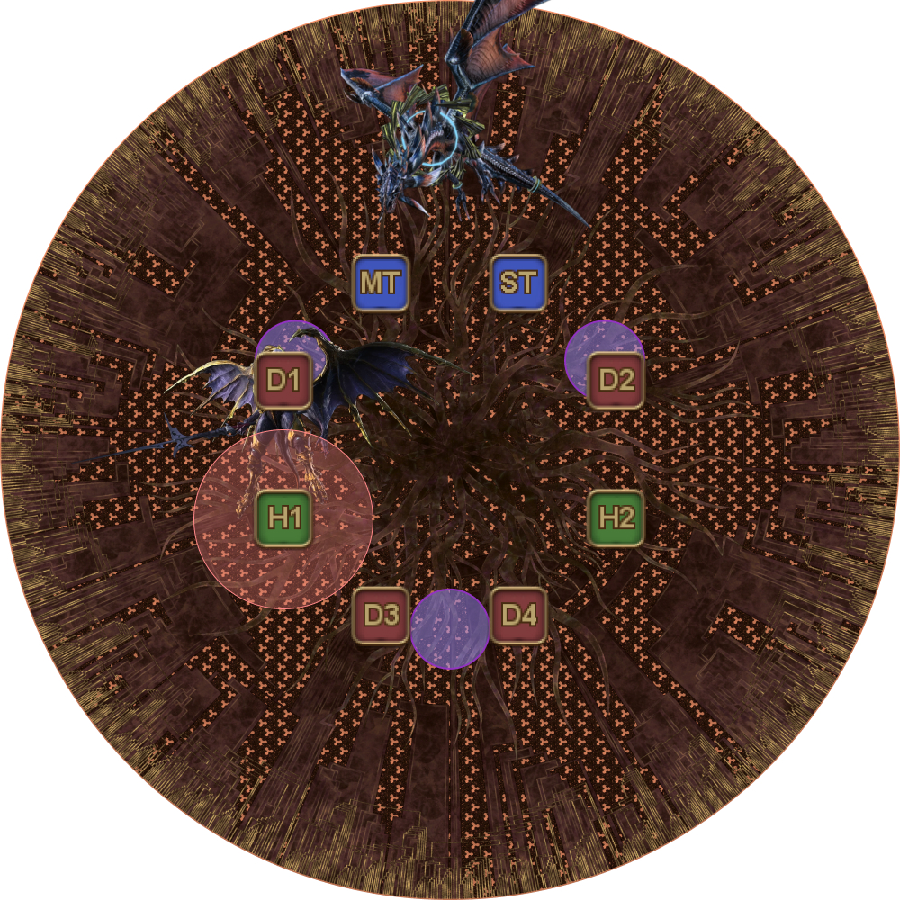
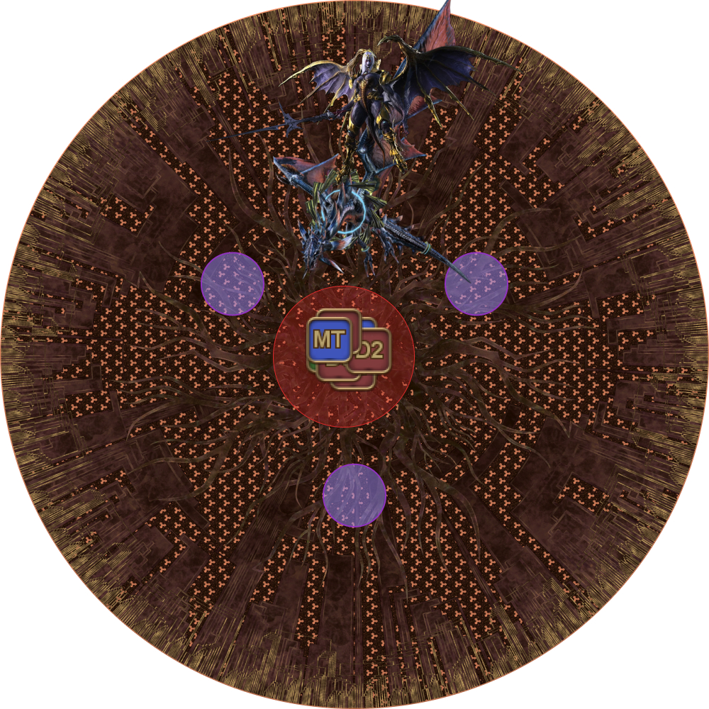
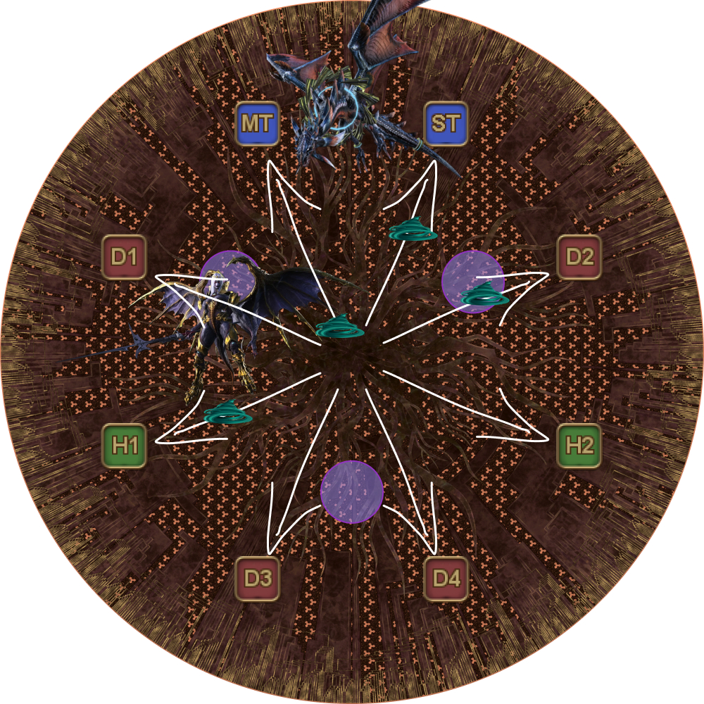
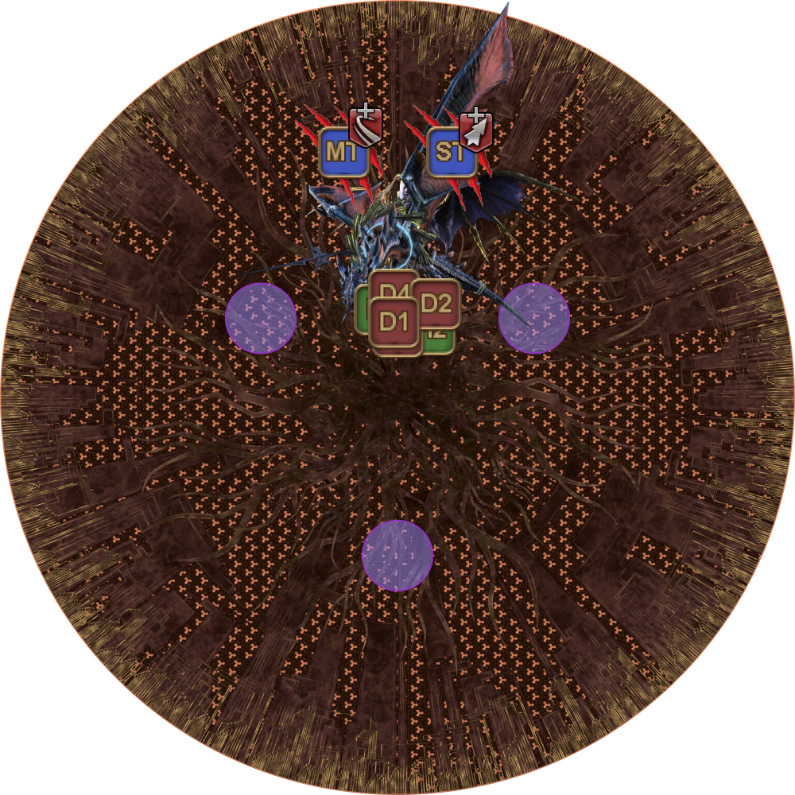

# Twintania + Nael deus Darnus

Commonly referred to as the "adds phase", this phase can be intimidating at first, but it's actually **less** chaotic compared to Nael's phase near the start of the fight.

This phase is essentially a loop repeated twice:

1. Plummet/Bahamut's Claw
2. Liquid Hell
3. Hatches → Twisters
4. Nael's line → Twisters
5. Megaflare → Death Sentence/Ravensbeak *(this swaps order on the second loop)*

There are four possible quotes Nael will use in this phase. Note that the first mechanic will always be either Lunar Dynamo, or Iron Chariot.

This is important, because Nael will always start with the opposite mechanic in the second loop.

<table>
  <tr>
    <td>From <b>hallowed moon</b> I <b>descend</b>, upon <b>burning</b> earth to tread!</td>
    <td>
Lunar Dynamo → Raven's Dive → Thermionic Beam

<em>In → Spread → Stack</em>
</td>
  </tr>
  <tr>
    <td>From <b>hallowed moon</b> I bare <b>iron</b>, in my <b>descent</b> to wield!</td>
    <td>
Lunar Dynamo → Iron Chariot → Raven's Dive

<em>In → Out → Spread</em>
</td>
  </tr>
  <tr>
    <td>Unbending <b>iron</b>, take <b>fire</b> and <b>descend</b>!</td>
    <td>
Iron Chariot → Thermionic Beam → Raven's Dive

<em>Out → Stack → Spread</em>
</td>
  </tr>
  <tr>
    <td>Unbending <b>iron</b>, <b>descend</b> with <b>fiery</b> edge!</td>
    <td>
Iron Chariot → Raven's Dive → Thermionic Beam

<em>Out → Spread → Stack</em>
</td>
  </tr>
</table>

<table>
  <tr>
    <td width="50%">
<b>1.</b> The two bosses spawn north.

Bring the bosses down, keeping Twintania near the two front Neurolinks.
<ul><li><b>MT:</b> Take Twintania.</li><li><b>ST:</b> Take Nael.</li></ul>
The two bosses will open with their mini-tankbusters, Plummet and Bahamut's Claw.

Make sure to point Twintania's Plummet away from the party.
</td>
    <td></td>
  </tr>
  <tr>
    <td>
<b>2.</b> Twintania will then cast five rounds of Liquid Hell that is baited by a random player past a certain distance.
<ul><li><b>D3:</b> Bait the Liquid Hells.</li><li><b>All other players:</b> Stay near Twintania to avoid accidentally taking a Liquid Hell.</li></ul></td>
    <td></td>
  </tr>
  <tr>
    <td>
<b>3.</b> Twintania targets three random DPS with Hatches.

The base positions are as follows:

    <ul>
      <li><b>D1:</b> Top-left Neurolink.</li>
      <li><b>D2:</b> Top-right Neurolink.</li>
      <li><b>D3:</b> Bottom Neurolink.</li>
      <li><b>D4:</b> Flex player (start center).</li>
    </ul>
    
Since one random DPS will not be targeted for Hatch, D4 will adjust to accommodate for that player.
<ul><li><b>If D4 does not have Hatch:</b> D4 goes to the edge of the arena.</li><li><b>If D4 has Hatch:</b> Find the player that is not targeted, and take over that player's position. That player then goes to the edge of the arena.</li></ul><em>(In this example, D2 is not targeted for Hatch, so D4 will go to the top-right Neurolink.)</em></td>
    <td></td>
  </tr>
  <tr>
    <td>
<b>4.</b> Hatches move to players and Twintania starts casting Twister.
<ul><li><b>If you are in one of the front Neurolinks:</b> Resolve Hatch first, then move out for Twister.</li><li><b>If you are in the back Neurolink:</b> Bait Twister outside the Neurolink first, then resolve Hatch.</li></ul></td>
    <td></td>
  </tr>
  <tr>
    <td>
<b>5.</b> Twisters resolve.

The player at the back then enters their Neurolink to resolve Hatch.
</td>
    <td></td>
  </tr>
  <tr>
    <td>
<b>6.</b> Nael then does a random line.

The first mechanic will always be either Lunar Dynamo or Iron Chariot.
</td>
    <td></td>
  </tr>
</table>

Nael's lines will include a combination of Lunar Dynamo, Iron Chariot, Raven's Dive, and Thermionic Beam.

Note that because Nael is at the edge of the arena, ranged players can outrange the Lunar Dynamo.

<table>
  <tr>
    <td width="50%">
<em>Lunar Dynamo (In or outrange)</em>
</td>
    <td>
<em>Iron Chariot (Out)</em>
</td>
  </tr>
  <tr>
    <td>
<em>Raven's Dive (Spread)</em>
</td>
    <td>
<em>Thermionic Beam (Stack)</em>
</td>
  </tr>
</table>

<b>Note:</b> Be careful of lines that involve Raven's Dive into Thermionic Beam. A <em>very</em> common cause of wipes here is not having everyone stack together in time.

<table>
  <tr>
    <td width="50%">
<b>7.</b> Finally, after Nael's lines are finished, Twintania casts Twister.

Spread out in the same directions as the Raven's Dive spread.
</td>
    <td></td>
  </tr>
  <tr>
    <td>
<b>8.</b> Carefully gather together back in the center of the arena, watching for Twisters <em>especially on Neurolinks</em>.

Nael will cast Megaflare, followed by the two bosses's major tankbusters (Death Sentence and Ravensclaw).

The vulnerabilities inflicted by these tankbusters enforce a tank swap; Provoke <em>but do not Shirk</em>.

The tanks will swap positions from here instead of the bosses (i.e: Twintania stays "west" and Nael stays "east")
</td>
    <td></td>
  </tr>
</table>

The loop then repeats from Plummet/Bahamut's Claw.

The second loop has the following differences from the first:

- If Nael started with Lunar Dynamo the first time around, she will start with Iron Chariot in the second iteration (and vice-versa).
- Megaflare comes before the tank swap in the first loop, but the tank swap comes first in the second loop.

Twintania and Nael must be killed at the same time. If either one of them dies, the other casts Twin Fury/White Fury- a 3-second cast that refills their HP to full.

To help with this, caster LB or ranged LB when both their HP is low.