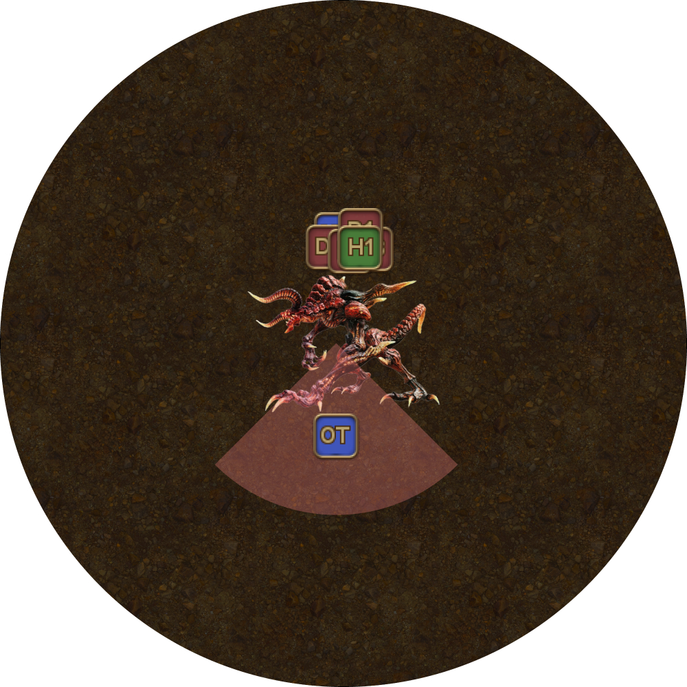
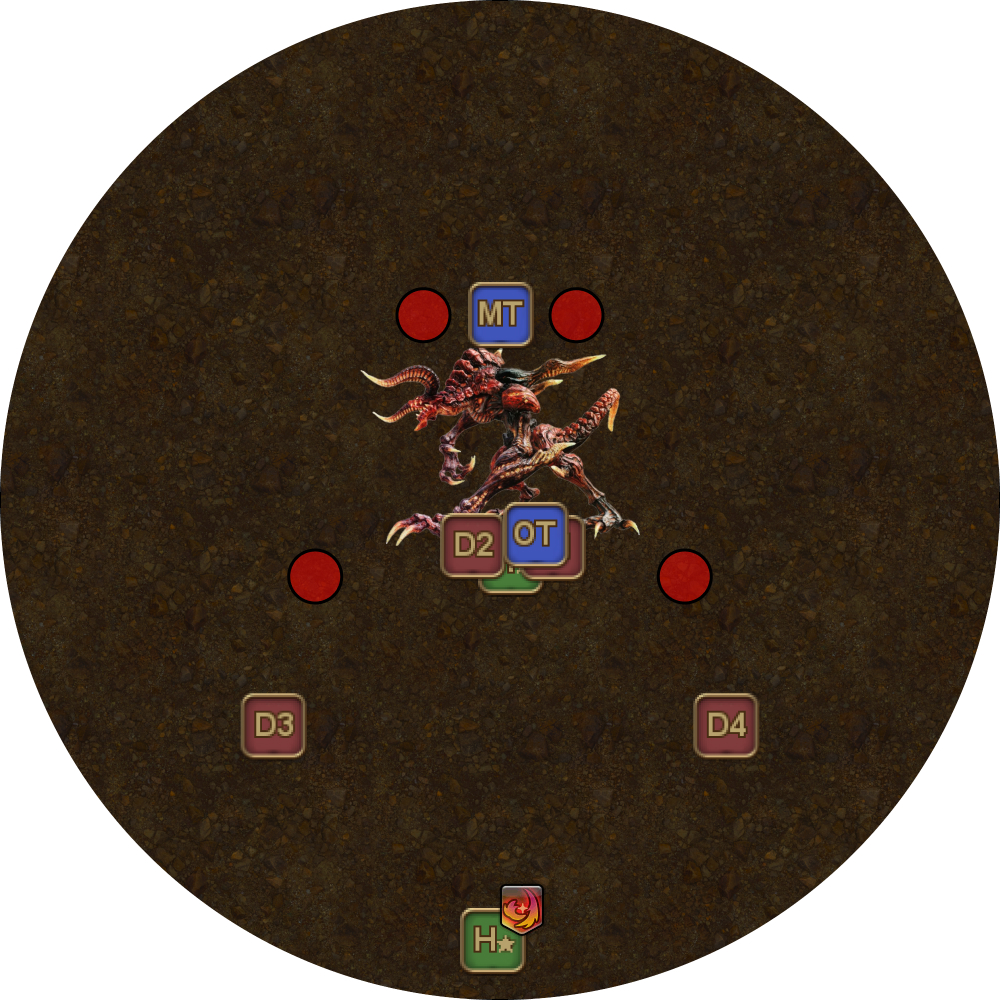
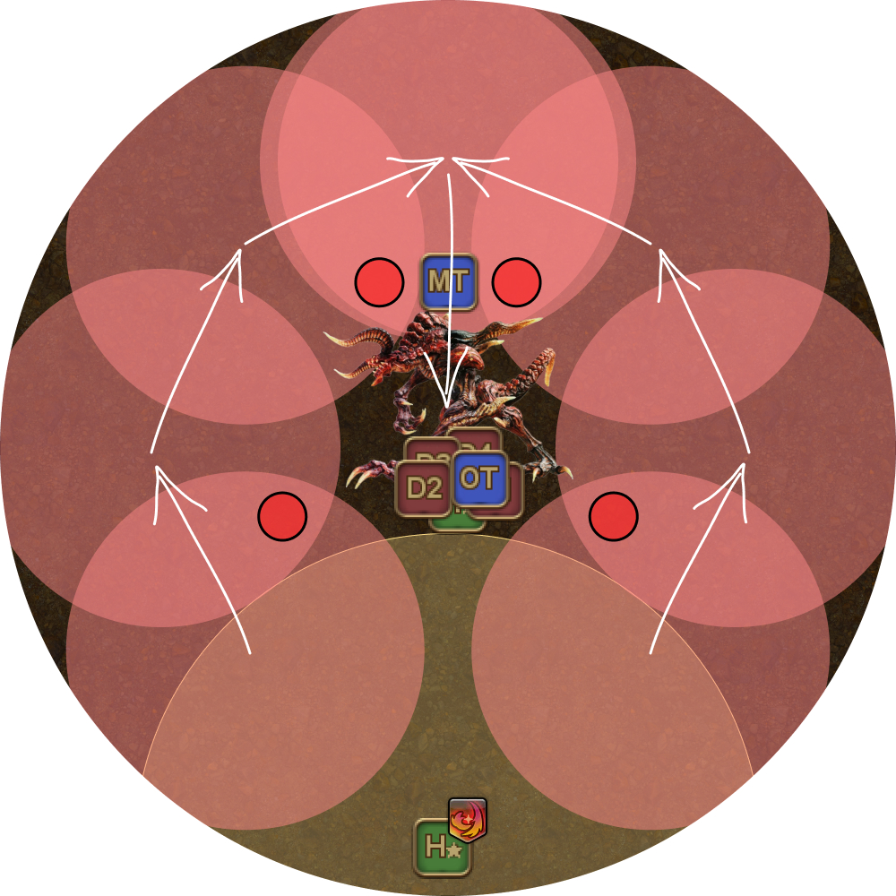
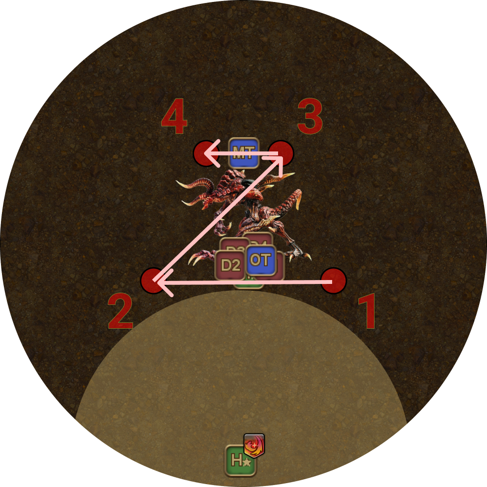

# Ifrit

## Summary

<table>
  <tr><td><b>Infernal Nails</b></td><td>Reverse-Z</td></tr>
  <tr><td><b>Beyond Limits</b></td><td>Caster</td></tr>
</table>

## Waking Ifrit

Infernal Nails can be hit by baited Violent Eruptions. When a Nail is hit by an Eruption, it gains a stack (to up two) and increases in size.

Each stack it receives does the following:

* Lowers the damage taken by about 10%.
* Increases the raid-wide damage dealt when the nail is destroyed.

**Ifrit gains a stack of "Aetherically Charged" when an Infernal Nail with two stacks is destroyed.**

The following mechanics will also change when Ifrit is woken:

<table>
  <tr>
    <th></th>
    <th>Normal</th>
    <th>Woken</th>
  </tr>
  <tr>
    <td>Crimson Cyclone</td>
    <td>Straight-line dash.</td>
    <td>Straight-line dash, <b>followed by a cross-shaped AoE 45 degrees to the dash</b>.</td>
  </tr>
  <tr>
    <td>Flaming Crush</td>
    <td>Split damage.</td>
    <td>
Split damage that <b>also afflicts a heavy "Accursed Flame" DoT</b> whose duration decreases as more players are hit.

This should be shared by <b>at least 6 players</b> for minimum impact.
</td>
  </tr>
</table>

The **ST** will take hate at the start of the fight.

<table>
  <tr>
    <td>
<b>1.</b> Have the <b>ST</b> tank Ifrit facing south, with the party North.

Ifrit will open with Hellfire (heavy raid damage), and shortly follow up with a Vulcan Burst.

Vulcan Burst is a large knockback, just under half the arena. However, the knockback can be nullified by Arm's Length/Surecast, or by sufficient shields as the knockback only applies if the player actually takes damage.

H2's shields will nullify Vulcan Burst's damage, <b>unless H2 is weakened.</b>
</td>
	<td></td>
  </tr>
  <tr>
    <td>
<b>2.</b> Ifrit will then use three Incinerates in a row. Incinerate is a conal tankbuster that also applies a Fire Resistance Down debuff on anyone hit.

Have the ST invuln all three Incinerates.

<em>(The "proper way" to do this would be to tank swap twice, once between each Incinerate)</em>.

Once all three Incinerates are done, the MT Provokes and takes over.
</td>
	<td></td>
  </tr>
</table>

## Infernal Nails

This is Ifrit's major mechanic, and where we will wake Ifrit.

<table>
  <tr>
    <td>
<b>3.</b> 
</td>
	<td></td>
  </tr>
  <tr>
    <td>
<b>4.</b> 
</td>
	<td></td>
  </tr>
</table>