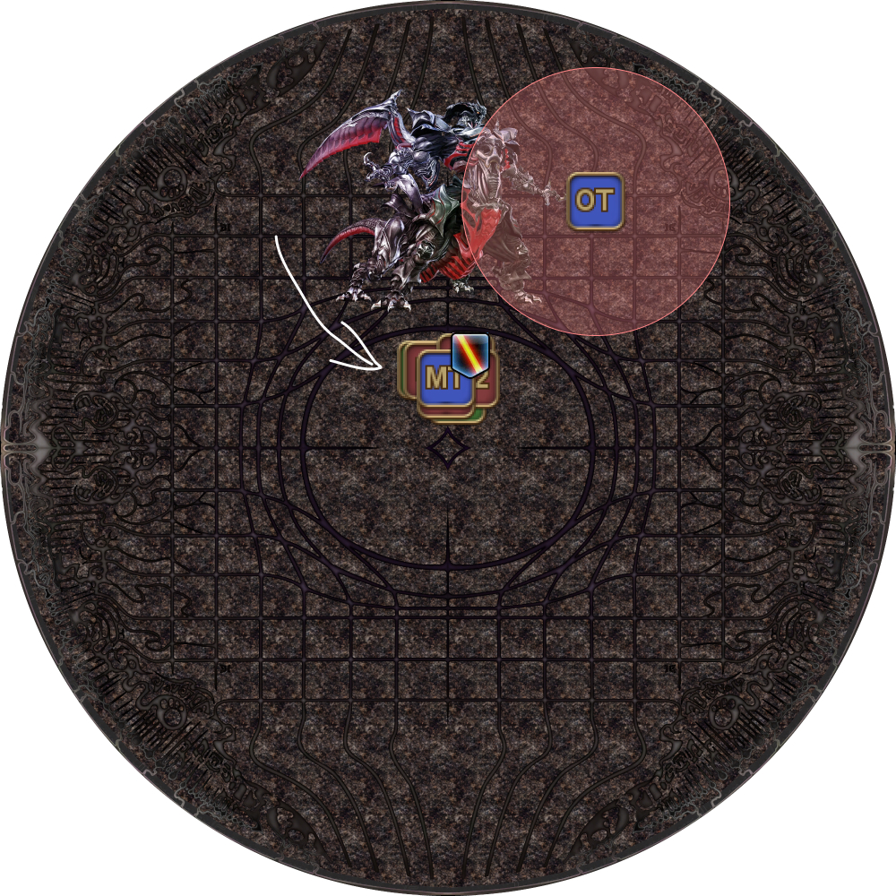
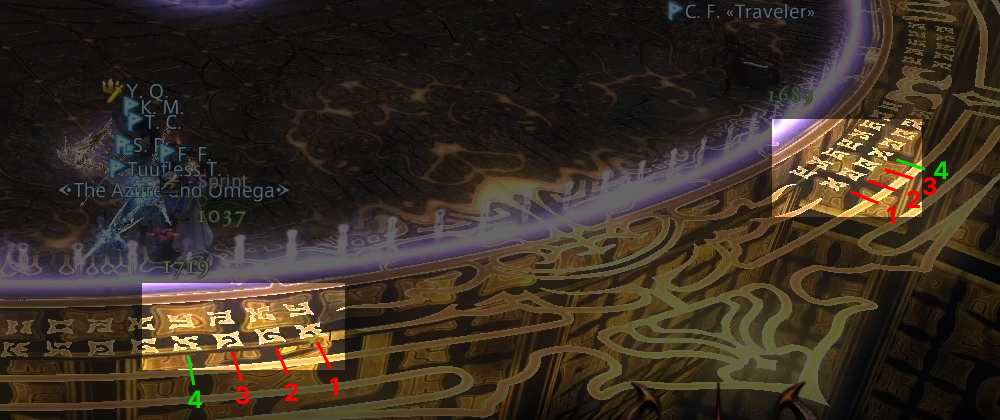
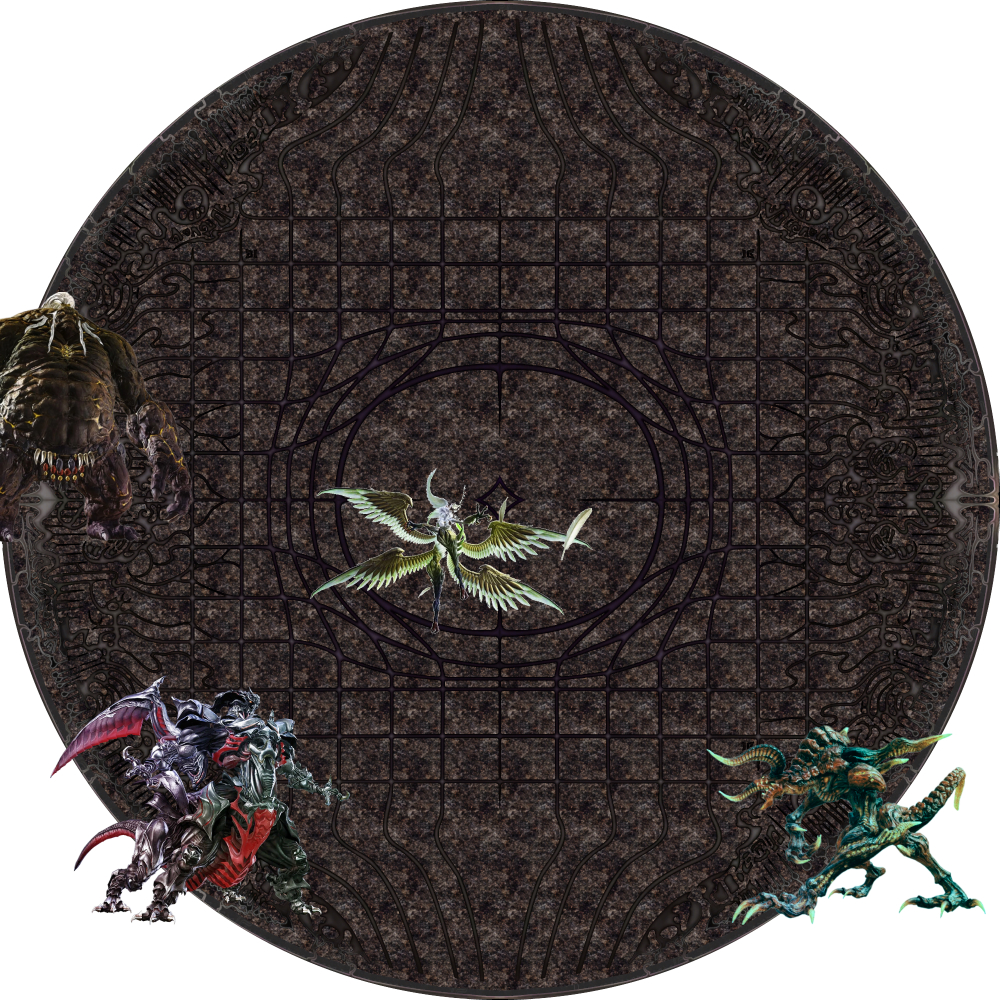
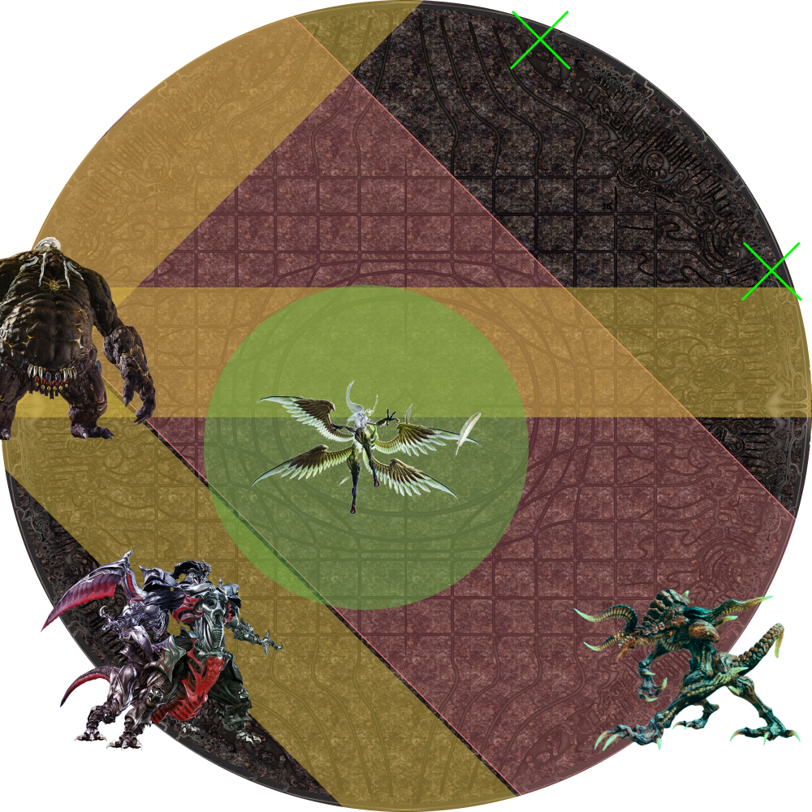
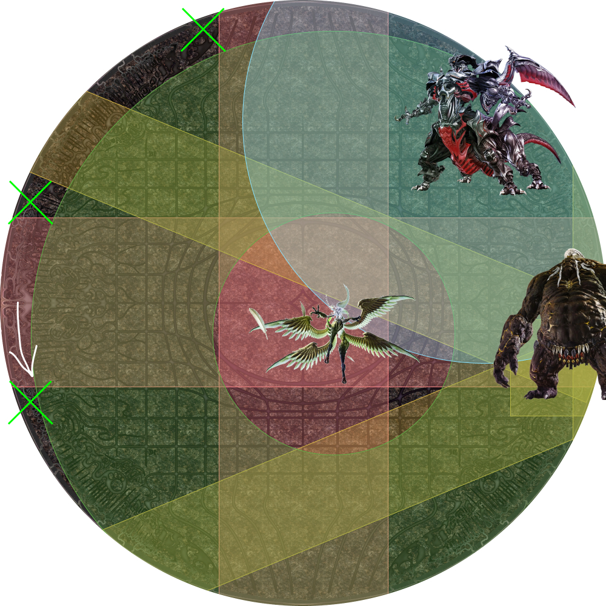

# Ultimate Predation

Ultima Weapon now shows up for the party to take down.

There are four main "blocks" in Ultima Weapon's timeline, that culminates in a signature mechanic, the first of which is Ultimate Predation.

## Ultima Aether

When the fight resumes, there will now be a new "Ultima Aether" gauge that serves as a timer to Ultima's enrage. When the gauge reaches 100, Ultima begins its enrage sequence.

Ultima Aether is built:

- When Ultima Weapon performs certain actions.
- When players get hit by Aetheroplasm (green) orbs.
- **When a player dies.**

This last point is particularly noteworthy, as player deaths effectively bring the enrage forward in addition to weakness.

## Pre-Predation

Ultima opens with a Tank Purge (raid-wide AoE). During this time, the two tanks should establish themselves as the top two players in hate.

In particular, the MT should be first in aggro, while the ST should be second. There is not a lot of time to do this, so be careful that the ST doesn't accidentally take hate from the MT.

<table>
  <tr>
    <td>
<b>1.</b> Ultima applies Vicious Aetheroplasm in a small AoE around the player who is highest in hate (which should be the MT).

<ul><li><b>MT:</b> Split away from the party as anyone nearby will also get a Vicious Aetheroplasm debuff.</li></ul>
</td>
	<td></td>
  </tr>
  <tr>
    <td>
<b>2.</b> Ultima Weapon then turns to the player who is second in hate (which should be the ST) and targets them for Homing Lasers, which is a heavy AoE tankbuster.

<ul><li><b>MT:</b> After receiving the Vicious Aetheroplasm debuff, stack with the party.</li></ul>
</td>
	<td></td>
  </tr>
  <tr>
    <td>
<b>3.</b> The Vicious Aetheroplasm debuff expires, dealing split damage shared by the party.
</td>
	<td></td>
  </tr>
</table>

## Ultimate Predation

This is the first "Trio" combo of mechanics you'll see.

Remember that all the primals have been woken, so they will all do the Woken versions of their mechanics.

- **Garuda**: Spawns in a random quadrant, slightly offset diagonally from the center.
- **Ifrit**: Spawns in a random intercardinal position.
- **Titan**: Spawns in a random cardinal, shifted slightly left or right.
- **Ultima**: Spawns in a random intercardinal position.

Because of Garuda's Wicked Wheel → Wicked Tornado combo, only the quadrant diagonally opposite Garuda will be safe to resolve this mechanic.

To dodge all the other Primals' mechanics, one easy trick is to observe there are "rune" marks that line the outside of the arena.

**Four runes from a cardinal direction** will dodge Ifrit's and Titan's second set of mechanics, which just leaves Garuda and Ultima to manage:

Resolve Ultimate Predation as follows:

1. Move to the quadrant diagonally opposite Garuda.
2. Be away from Titan.
3. Move away from Ultima.

<table>
  <tr>
    <td>
<b>1.</b> Ultima Weapon disappears and will reappear with all the Primals.

Identify Garuda, and move to the quadrant diagonally opposite.
</td>
	<td></td>
  </tr>
  <tr>
    <td>
<b>2.</b> First set of AoEs resolve.

<em>(Green crosses mark the 4th rune.)</em>
</td>
	<td></td>
  </tr>
  <tr>
    <td>
<b>3.</b> Second set of AoEs resolve.

<em>(Green crosses mark the 4th rune.)</em>
</td>
	<td></td>
  </tr>
  <tr>
    <td>
<b>4.</b> The bosses then disappear, ending the mechanic.

<em>(Bait and dodge Feather Rains)</em>
</td>
	<td></td>
  </tr>
</table>

<b>[Additional Example] - 3 safe spots</b>

<table>
  <tr>
    <td>
<b>1.</b> Ultima Weapon disappears and will reappear with all the Primals.

Identify Garuda, and move to the quadrant diagonally opposite.
</td>
	<td></td>
  </tr>
  <tr>
    <td>
<b>2.</b> First set of AoEs resolve.

<em>(Green crosses mark the 4th rune.)</em>
</td>
	<td></td>
  </tr>
  <tr>
    <td>
<b>3.</b> Second set of AoEs resolve. Notice Ultima's position eliminates one of the four positions.

<em>(Green crosses mark the 4th rune.)</em>
</td>
	<td></td>
  </tr>
  <tr>
    <td>
<b>4.</b> The bosses then disappear, ending the mechanic.

<em>(Bait and dodge Feather Rains)</em>
</td>
	<td></td>
  </tr>
</table>

## Rebuilding LB3

The party will need to rebuild an LB3 by the end of Ultimate Suppression in order to survive the second Ultima cast towards the end of the fight.

However, because the party's relative damage is much higher now compared to release, it's likely that the party will push Ultimate Suppression early.

The problem is that there now isn't enough time to rebuild LB3, leading to a wipe at Ultima. Hence, there may be a need to intentionally build LB, especially as the party gets more and more familiar.

### How LB is built

LB is built if someone in the party takes lethal damage, but is saved by shields and mitigations.

The following methods take advantage of this by intentionally "killing" the party, but saving them through shields and mitigations.

### Method 1: Not healing Ultima

This method involves **not** healing the party after the Tank LB3 that keeps the party alive after the first Ultima.

The goal is to keep the party's HP low enough that they would die to the opening Tank Purge at the start of Ultima Weapon, but shields and mitigations keep them alive.

- Keep the party's HP below 16k (how much damage Tank Purge deals).
- The lower the party's HP, the more mitigations you will need to survive.
- Try not to debuff Ultima Weapon (Feint, Addle, Reprisal) if possible. Doing so **lowers** Ultima Weapon's outgoing damage, which may lead to the party surviving the raw damage instead (and not build LB as a result).



### Method 2: Super-shielding Ultimate Predation

This method involves layering on multiple mitigations on the party (~5 mitigations) and *intentionally* dodging into the cardinal positions in Predation.

This gets the entire party hit with Ifrit's afterburn, which builds the LB gauge.